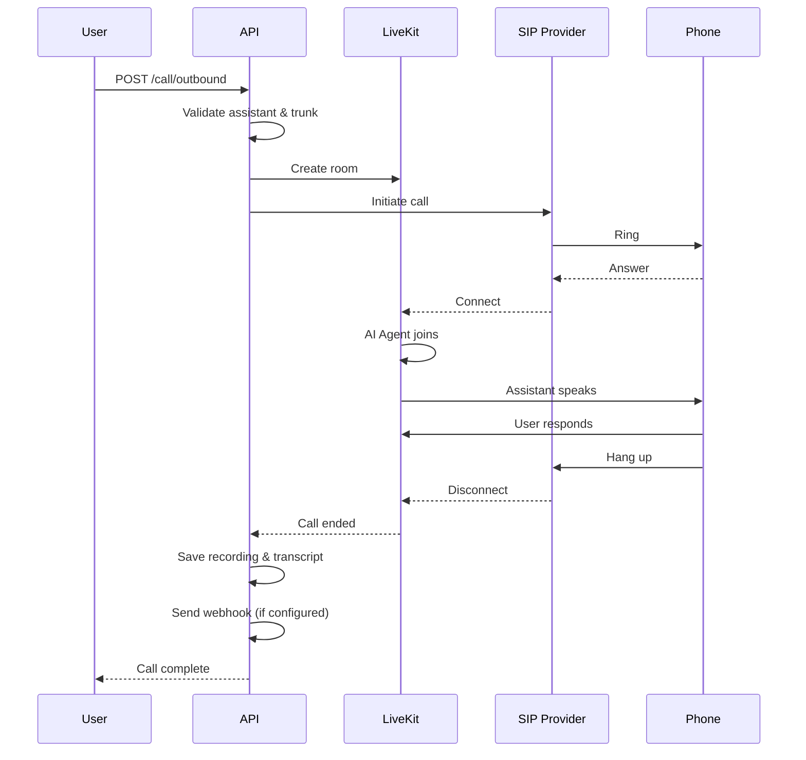

# Outbound Calls

This section covers how to trigger outbound calls using your configured assistants and SIP trunks.

## Overview

Outbound calls allow your AI assistants to call phone numbers. When triggered, the system initiates a call via your configured SIP trunk and connects the AI assistant to the recipient.

## Trigger Outbound Call

Initiate a call from an assistant to a phone number.

- **URL**: `/call/outbound`
- **Method**: `POST`
- **Headers**: `x-api-key: <your_api_key>`
- **Content-Type**: `application/json`

### Request Body

| Field | Type | Required | Description |
| :--- | :--- | :--- | :--- |
| `assistant_id` | string | Yes | The ID of the assistant to use (UUID format). |
| `trunk_id` | string | Yes | The ID of the SIP trunk to use (format: `ST_...`). |
| `to_number` | string | Yes | The phone number to call in E.164 format (e.g., `+15550100000`). |
| `call_service` | string | Yes | The telephony provider. One of: `twilio`, `exotel`. |
| `metadata` | object | No | Optional metadata to pass to the call session. Used for placeholder replacement in prompts. |

### Metadata and Placeholders

The `metadata` object can contain any key-value pairs. These values are used to replace placeholders in the assistant's prompt and start instruction.

**Example:**

If your assistant has:
```json
{
  "assistant_prompt": "Hello {{name}}, you're calling from {{company}}.",
  "assistant_start_instruction": "Hi {{name}}, this is {{agent_name}} speaking."
}
```

Then your metadata should be:
```json
{
  "metadata": {
    "name": "John Doe",
    "company": "Acme Corp",
    "agent_name": "Sarah"
  }
}
```

### Response Schema

| Field | Type | Description |
| :--- | :--- | :--- |
| `success` | boolean | Indicates if the operation was successful. |
| `message` | string | Human-readable success message. |
| `data` | object | Contains call initiation details. |
| `data.room_name` | string | The LiveKit room name for this call. |
| `data.agent_dispatch` | object | LiveKit agent dispatch details. |
| `data.participant` | object | LiveKit participant details. |

### HTTP Status Codes

| Code | Description |
| :--- | :--- |
| 200 | Success - Call triggered successfully. |
| 400 | Bad Request - Invalid input data or missing required fields. |
| 401 | Unauthorized - Invalid or missing API key. |
| 404 | Not Found - Assistant or trunk not found. |
| 500 | Server Error - Internal server error during call initiation. |

### Example: Basic Outbound Call

```bash
curl -X POST "http://localhost:8000/call/outbound" \
     -H "Content-Type: application/json" \
     -H "x-api-key: <your_api_key>" \
     -d '{
           "assistant_id": "550e8400-e29b-41d4-a716-446655440000",
           "trunk_id": "ST_a1b2c3d4e5f6...",
           "to_number": "+15550200000",
           "call_service": "twilio"
         }'
```

**Response:**

```json
{
  "success": true,
  "message": "Outbound call triggered successfully",
  "data": {
    "room_name": "550e8400-e29b-41d4-a716-446655440000_abc123",
    "agent_dispatch": {
      "id": "agent_123",
      "state": "JOINING"
    },
    "participant": {
      "sid": "PA_xxx",
      "identity": "phone-+15550200000"
    }
  }
}
```

### Example: With Metadata

```bash
curl -X POST "http://localhost:8000/call/outbound" \
     -H "Content-Type: application/json" \
     -H "x-api-key: <your_api_key>" \
     -d '{
           "assistant_id": "550e8400-e29b-41d4-a716-446655440000",
           "trunk_id": "ST_a1b2c3d4e5f6...",
           "to_number": "+15550200000",
           "call_service": "twilio",
           "metadata": {
             "name": "John Doe",
             "customer_id": "12345",
             "campaign_id": "summer_sale_2024"
           }
         }'
```

---

## Call Flow

When you trigger an outbound call, the following happens:

1. **Validation**: System validates the assistant, trunk, and phone number
2. **Room Creation**: A LiveKit room is created with a unique name
3. **Call Initiation**: The call is initiated via your SIP trunk provider
4. **Agent Connection**: The AI assistant joins the room
5. **Conversation**: The assistant speaks and listens according to its configuration
6. **Call End**: When the user hangs up or the assistant ends the call
7. **Webhook**: If configured, a POST request is sent to `assistant_end_call_url`
8. **Recording**: Call recording is saved to AWS S3 (if configured)
9. **Transcript**: Conversation transcript is saved to MongoDB



---

## End Call Webhook

If the assistant has `assistant_end_call_url` configured, a POST request is sent when the call ends.

### Webhook Request

```http
POST /your-webhook-endpoint HTTP/1.1
Content-Type: application/json

{
  "success": true,
  "message": "Call details fetched successfully",
  "data": {
    "room_name": "550e8400-e29b-41d4-a716-446655440000_abc123",
    "assistant_id": "550e8400-e29b-41d4-a716-446655440000",
    "assistant_name": "Support Agent",
    "to_number": "+15550200000",
    "from_number": "+15550100000",
    "recording_path": "https://your-bucket.s3.us-east-1.amazonaws.com/recordings/call_abc123.ogg",
    "transcripts": [
      {
        "speaker": "agent",
        "text": "Hello John, how can I help you today?",
        "timestamp": "2024-01-15T10:00:01.000Z"
      },
      {
        "speaker": "user",
        "text": "I need help with my order.",
        "timestamp": "2024-01-15T10:00:05.000Z"
      },
      {
        "speaker": "agent",
        "text": "I'd be happy to help. What's your order number?",
        "timestamp": "2024-01-15T10:00:08.000Z"
      }
    ],
    "started_at": "2024-01-15T10:00:00.000Z",
    "ended_at": "2024-01-15T10:05:30.000Z",
    "call_duration_minutes": 5.5,
    "metadata": {
      "name": "John Doe",
      "customer_id": "12345"
    }
  }
}
```

### Webhook Payload Schema

| Field | Type | Description |
| :--- | :--- | :--- |
| `success` | boolean | Always `true` for webhook notifications. |
| `message` | string | Status message. |
| `data` | object | Complete call details. |
| `data.room_name` | string | The LiveKit room name. |
| `data.assistant_id` | string | ID of the assistant used. |
| `data.assistant_name` | string | Name of the assistant. |
| `data.to_number` | string | Phone number that was called. |
| `data.from_number` | string | Caller ID used (if available). |
| `data.recording_path` | string | S3 URL of the call recording (if enabled). |
| `data.transcripts` | array | List of conversation messages. |
| `data.transcripts[].speaker` | string | Who spoke (`agent` or `user`). |
| `data.transcripts[].text` | string | The transcribed text. |
| `data.transcripts[].timestamp` | string | ISO 8601 timestamp. |
| `data.started_at` | string | Call start time (ISO 8601). |
| `data.ended_at` | string | Call end time (ISO 8601). |
| `data.call_duration_minutes` | number | Total call duration in minutes. |
| `data.metadata` | object | Metadata passed during call initiation. |

### Webhook Response

Your webhook endpoint should return a `200 OK` response. The response body is not processed.

```http
HTTP/1.1 200 OK
Content-Type: application/json

{"received": true}
```

!!! warning "Important"

    - Webhooks are sent **after** the call ends and recording/transcript are saved
    - If the webhook fails (non-2xx response), the system will retry up to 3 times
    - Ensure your webhook endpoint responds quickly (< 5 seconds)
    - Store the `room_name` to correlate with call initiation

---

## Call Status Tracking

The `room_name` returned in the response is your unique identifier for the call. You can use this to:

1. **Query call details** from your database (if you store them)
2. **Correlate webhook** notifications with the original call
3. **Monitor active calls** via LiveKit APIs

### Room Name Format

```
{assistant_id}_{unique_suffix}
```

Example: `550e8400-e29b-41d4-a716-446655440000_abc123def456`

---

## Best Practices

### Phone Number Formatting

Always use E.164 format:
- ✅ `+15550100000` (US number)
- ✅ `+911234567890` (India number)
- ❌ `555-010-0000` (missing country code)
- ❌ `(555) 010-0000` (parentheses and spaces)

### Rate Limiting

Be aware of your SIP provider's rate limits:
- **Twilio**: Varies by account type
- **Exotel**: Check your plan limits

### Metadata Usage

Use metadata for:
- Customer identification
- Campaign tracking
- Context for the assistant
- Post-call analytics

### Error Handling

Common errors and how to handle them:

| Error | Cause | Solution |
| :--- | :--- | :--- |
| `400` Invalid number | Wrong format | Ensure E.164 format |
| `404` Assistant not found | Wrong ID | Verify assistant exists and is active |
| `404` Trunk not found | Wrong ID | Verify trunk exists and belongs to user |
| `500` Provider error | SIP provider issue | Check provider status and credentials |

---

## Next Steps

After triggering a call:

1. **Store the room_name** for future reference
2. **Listen for webhook** at your configured endpoint (if set)
3. **Check call recording** in your S3 bucket (if enabled)
4. **Analyze transcripts** for quality assurance
