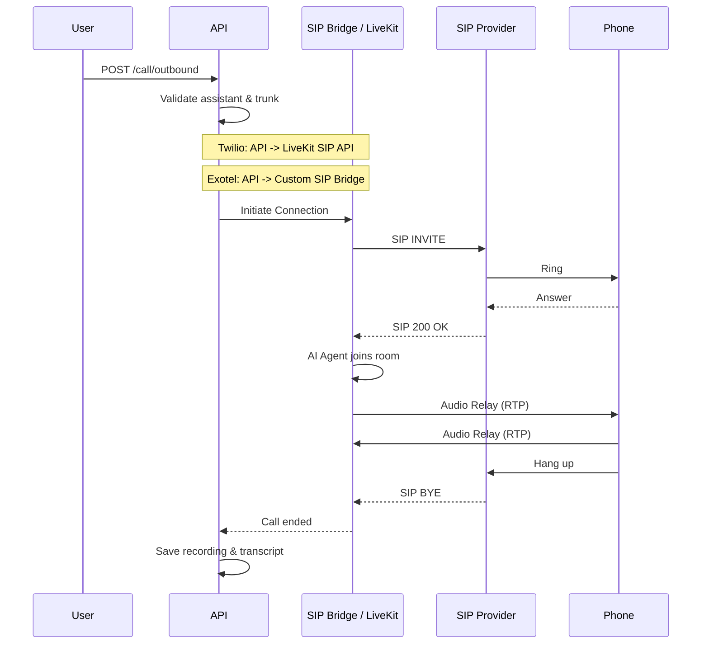

# Call Flow

When you trigger an outbound call, the flow differs slightly based on the provider:

### Twilio Flow (Managed SIP)

1. **Validation**: System validates the assistant, trunk, and phone number.
2. **Room Creation**: A LiveKit room is created.
3. **SIP Participant**: API calls LiveKit's SIP API to create a participant.
4. **Twilio Connection**: LiveKit connects directly to Twilio.
5. **Agent Connection**: The AI assistant joins the room.

### Exotel Flow (Custom Bridge)

1. **Validation**: System validates the assistant, trunk, and phone number.
2. **Room Creation**: A LiveKit room is created.
3. **Custom Bridge**: API starts a background task running the `custom_sip_reach` bridge.
4. **Exotel Connection**: The bridge connects to Exotel via SIP/TCP.
5. **RTP Relay**: The bridge relays media between Exotel and the LiveKit room.
6. **Agent Connection**: The AI assistant joins the room.

