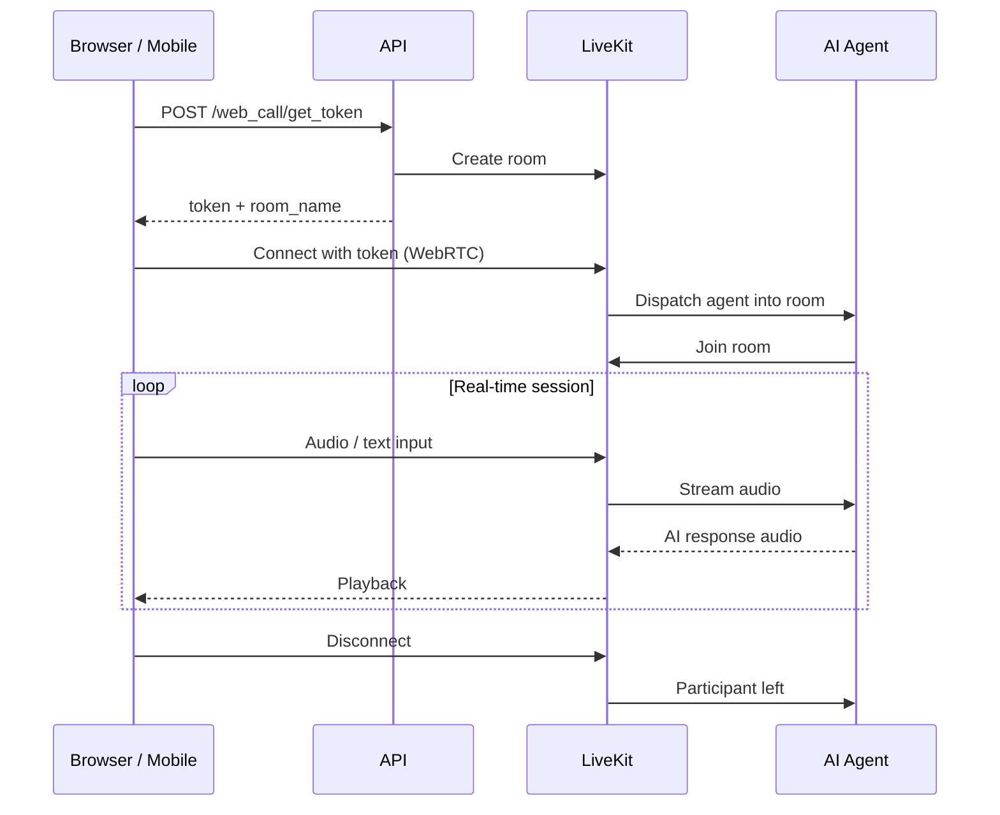
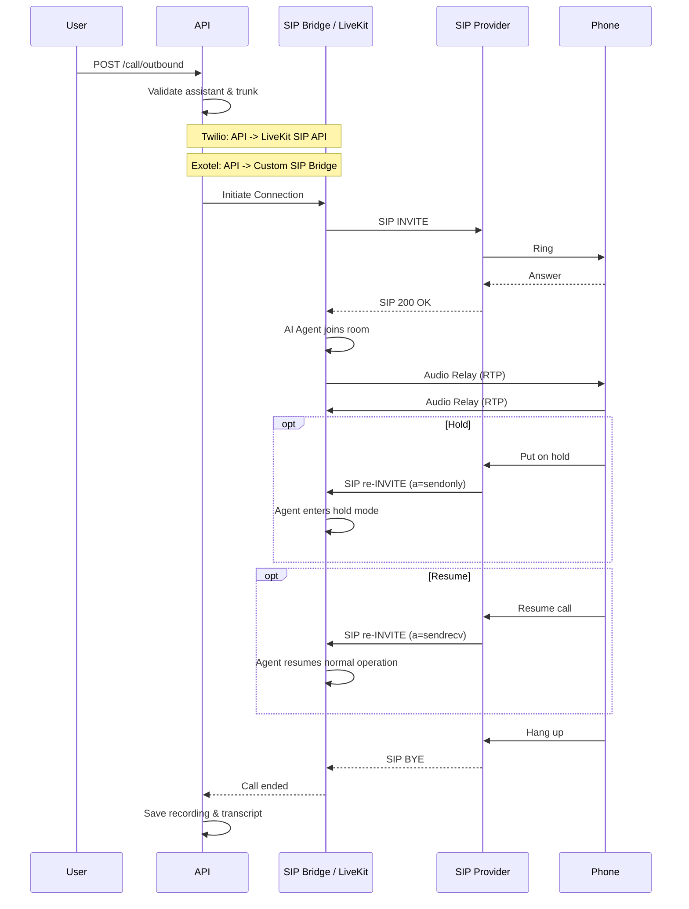

# Call Flow

There are three distinct call flows depending on the integration type.

## Web Call Flow

Web calls use WebRTC directly. No SIP trunk is involved.

1. **Token Request**: Client calls `POST /web_call/get_token` with an `assistant_id`.
2. **Room Creation**: API creates a LiveKit room and returns a participant token.
3. **Client Connects**: The browser or mobile app connects to LiveKit using the token.
4. **Agent Joins**: The AI assistant joins the room automatically.
5. **Real-time Session**: Audio and optional text input are exchanged in the room until disconnection.

```mermaid
sequenceDiagram
    participant Client as Browser / Mobile
    participant API
    participant LK as LiveKit
    participant Agent as AI Agent

    Client->>API: POST /web_call/get_token
    API->>LK: Create room
    API-->>Client: token + room_name
    Client->>LK: Connect with token (WebRTC)
    LK->>Agent: Dispatch agent into room
    Agent->>LK: Join room
    loop Real-time session
        Client->>LK: Audio / text input
        LK->>Agent: Stream audio
        Agent-->>LK: AI response audio
        LK-->>Client: Playback
    end
    Client->>LK: Disconnect
    LK->>Agent: Participant left
```

---

## Outbound SIP Call Flows

When you trigger an outbound call, the flow differs based on the provider.

### Twilio Flow (Managed SIP)

1. **Validation**: System validates the assistant, trunk, and phone number.
2. **Room Creation**: A LiveKit room is created.
3. **SIP Participant**: API calls LiveKit's SIP API to create a participant.
4. **Twilio Connection**: LiveKit connects directly to Twilio.
5. **Agent Connection**: The AI assistant joins the room.

### Exotel Flow (Custom Bridge)

1. **Validation**: System validates the assistant, trunk, and phone number.
2. **Room Creation**: A LiveKit room is created.
3. **Custom Bridge**: API starts a background task running the `custom_sip_reach` bridge.
4. **Exotel Connection**: The bridge connects to Exotel via SIP/TCP.
5. **RTP Relay**: The bridge relays media between Exotel and the LiveKit room.
6. **Agent Connection**: The AI assistant joins the room and waits for bridge readiness before speaking.

### Exotel Runtime Gating

- The assistant waits for the bridge `call_answered` event before sending the start instruction.
- After readiness is confirmed, start-instruction delivery works in both runtime modes:
  - `pipeline` mode: opening response is generated through the pipeline path.
  - `realtime` mode: opening response is generated through the realtime conversation path.
- Runtime activity (assistant speech-side behavior and transcript processing) is held until readiness is confirmed.
- Recording starts through a managed retry flow after readiness for Exotel outbound calls.

### Hold & Resume (Exotel)

- When the remote party puts the call on hold, Exotel sends a SIP re-INVITE with `a=sendonly` or `a=inactive` in the SDP.
- The bridge detects this instantly and publishes a `call_hold` event to the LiveKit room.
- The agent session activates hold mode:
  - Silence watchdog stops (no reprompts during hold music)
  - Filler word controller stops (no backchannel during hold)
  - Any in-progress agent speech is interrupted
  - Transcript processing is suppressed
- On resume, the bridge publishes `call_resume` and the agent returns to normal operation.

```mermaid
sequenceDiagram
    participant User
    participant API
    participant Bridge as SIP Bridge / LiveKit
    participant Provider as SIP Provider
    participant Phone

    User->>API: POST /call/outbound
    API->>API: Validate assistant & trunk
    Note over API,Bridge: Twilio: API -> LiveKit SIP API
    Note over API,Bridge: Exotel: API -> Custom SIP Bridge
    API->>Bridge: Initiate Connection
    Bridge->>Provider: SIP INVITE
    Provider->>Phone: Ring
    Phone-->>Provider: Answer
    Provider-->>Bridge: SIP 200 OK
    Bridge->>Bridge: AI Agent joins room
    Bridge->>Phone: Audio Relay (RTP)
    Phone->>Bridge: Audio Relay (RTP)
    opt Hold
        Phone->>Provider: Put on hold
        Provider->>Bridge: SIP re-INVITE (a=sendonly)
        Bridge->>Bridge: Agent enters hold mode
    end
    opt Resume
        Phone->>Provider: Resume call
        Provider->>Bridge: SIP re-INVITE (a=sendrecv)
        Bridge->>Bridge: Agent resumes normal operation
    end
    Phone->>Provider: Hang up
    Provider-->>Bridge: SIP BYE
    Bridge-->>API: Call ended
    API->>API: Save recording & transcript
```
