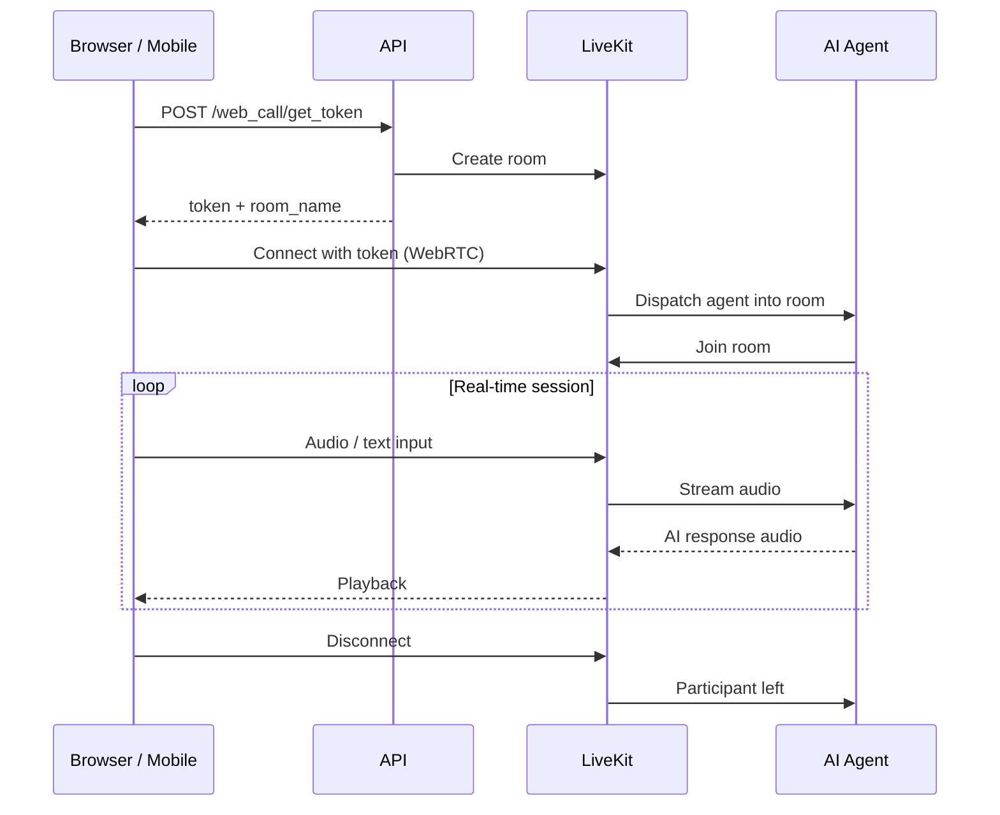
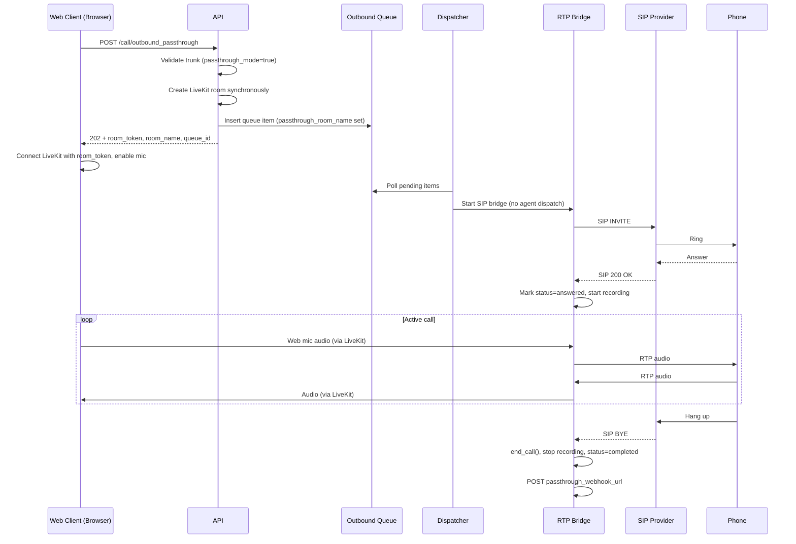
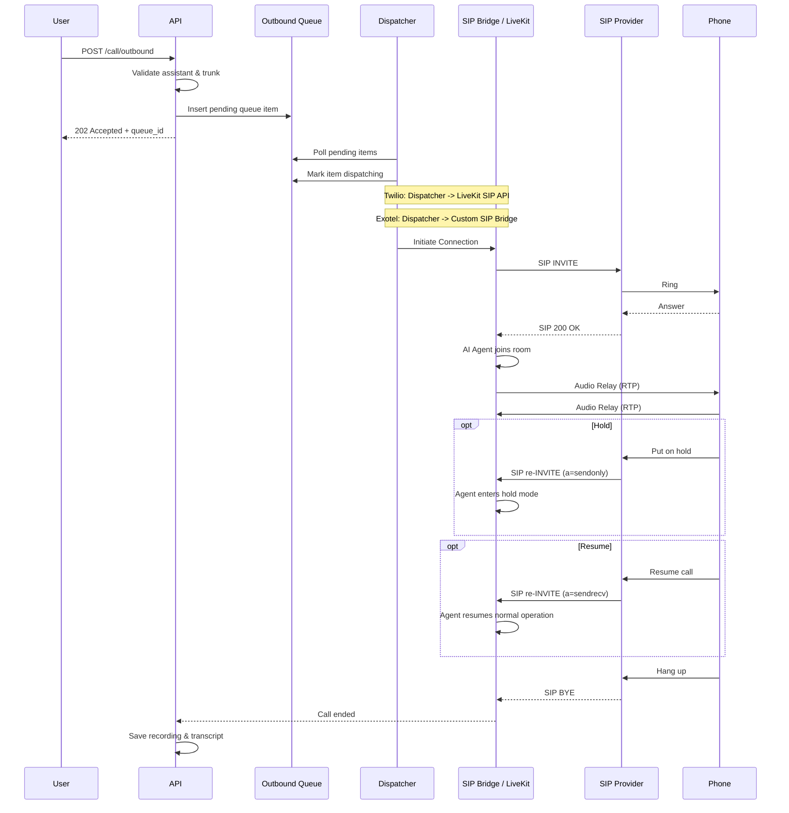

# Call Flow

There are four distinct call flows depending on the integration type.

## Web Call Flow

Web calls use WebRTC directly. No SIP trunk is involved.

1. **Token Request**: Client calls `POST /web_call/get_token` with an `assistant_id`. Optional `"text_only": true` switches the session to a pure text chatbot (no mic, no TTS, no recording).
2. **Room Creation**: API creates a LiveKit room and returns a participant token.
3. **Client Connects**: The browser or mobile app connects to LiveKit using the token.
4. **Agent Joins**: The AI assistant joins the room automatically.
5. **Real-time Session**: Audio and optional text input are exchanged in the room until disconnection. In text-only mode, the LLM emits replies on the `lk.chat` topic instead of synthesized audio.

```mermaid
sequenceDiagram
    participant Client as Browser / Mobile
    participant API
    participant LK as LiveKit
    participant Agent as AI Agent

    Client->>API: POST /web_call/get_token
    API->>LK: Create room
    API-->>Client: token + room_name
    Client->>LK: Connect with token (WebRTC)
    LK->>Agent: Dispatch agent into room
    Agent->>LK: Join room
    loop Real-time session
        Client->>LK: Audio / text input
        LK->>Agent: Stream audio
        Agent-->>LK: AI response audio
        LK-->>Client: Playback
    end
    Client->>LK: Disconnect
    LK->>Agent: Participant left
```

---

## Outbound SIP Call Flows

When you trigger an outbound call, the flow differs based on the provider.

### Shared Queue + Dispatcher Flow

1. **Validation**: System validates the assistant, trunk, and phone number.
2. **Queue Insert**: API writes a `pending` item into `outbound_call_queue`.
3. **Immediate Ack**: API returns `202 Accepted` with a `queue_id`.
4. **Dispatcher Poll**: Background dispatcher checks available capacity.
5. **Slot Reservation**: Dispatcher marks the item `dispatching`.
6. **Provider Dispatch**: Dispatcher creates the room, dispatches the agent, and starts the provider-specific call path.
7. **Queue Finalization**: Queue item becomes `dispatched` on success or returns to `pending` / `failed` on retryable or permanent error.

### Twilio Flow (Managed SIP)

1. **Queued Request**: Request enters the outbound queue.
2. **Room Creation**: Dispatcher creates a LiveKit room.
3. **Call Record Init**: Dispatcher creates the initial call record with `initiated` status.
4. **SIP Participant**: Dispatcher calls LiveKit's SIP API to create a participant.
5. **Twilio Connection**: LiveKit connects directly to Twilio.
6. **Agent Connection**: The AI assistant joins the room.

### Exotel Flow (Custom Bridge)

1. **Queued Request**: Request enters the outbound queue.
2. **Room Creation**: Dispatcher creates a LiveKit room.
3. **Call Record Init**: Dispatcher creates the initial call record with `initiated` status.
4. **Custom Bridge**: Dispatcher starts a background task running the `custom_sip_reach` bridge.
5. **Exotel Connection**: The bridge connects to Exotel via SIP/TCP.
6. **RTP Relay**: The bridge relays media between Exotel and the LiveKit room.
7. **Agent Connection**: The AI assistant joins the room and waits for bridge readiness before speaking.

### Dispatcher Capacity Rules

- The dispatcher only starts new work when active sessions are below the configured limit.
- Current defaults are `12` active outbound jobs (`MAX_CONCURRENT_JOBS`), a `2` second polling interval, and `3` retry attempts before permanent failure.
- The worker also advertises reduced intake at higher CPU load (`load_threshold=0.65`), which complements the queue by preventing uncontrolled fan-out.

### Exotel Runtime Gating

- The assistant waits for the bridge `call_answered` event before sending the start instruction.
- After readiness is confirmed, start-instruction delivery works in both runtime modes:
  - `pipeline` mode: opening response is generated through the pipeline path.
  - `realtime` mode: opening response is generated through the realtime conversation path.
- Runtime activity (assistant speech-side behavior and transcript processing) is held until readiness is confirmed.
- Recording starts through a managed retry flow after readiness for Exotel outbound calls.

### Hold & Resume (Exotel)

- When the remote party puts the call on hold, Exotel sends a SIP re-INVITE with `a=sendonly` or `a=inactive` in the SDP.
- The bridge detects this instantly and publishes a `call_hold` event to the LiveKit room.
- The agent session activates hold mode:
  - Silence watchdog stops (no reprompts during hold music)
  - Filler word controller stops (no backchannel during hold)
  - Any in-progress agent speech is interrupted
  - Transcript processing is suppressed
- On resume, the bridge publishes `call_resume` and the agent returns to normal operation.

---

## Passthrough Call Flow (Web ↔ SIP, No AI Agent)

Passthrough mode bridges a human web user directly to a phone caller over SIP. No AI agent is dispatched — no STT, LLM, or TTS runs.

**Key difference from normal outbound:** the LiveKit room is created synchronously in the API response so the web client gets a token immediately. The SIP dial happens in the background via the same dispatcher queue.

1. **Request**: Client calls `POST /call/outbound_passthrough` with `trunk_id` and `to_number`.
2. **Synchronous Room**: API creates LiveKit room and returns `room_token` + `room_name` immediately.
3. **Web Connect**: Web client connects to LiveKit with `room_token` and publishes mic audio.
4. **Queue**: API inserts queue item with the pre-created `room_name`.
5. **Dispatch**: Dispatcher skips agent dispatch — starts SIP bridge only.
6. **SIP Answer**: Once answered, audio flows bidirectionally: web mic ↔ RTP bridge ↔ SIP ↔ mobile.
7. **Recording**: Starts after SIP answer (no session.py required).
8. **End**: Bridge exits → `end_call()` marks record `completed`, stops recording, fires webhook.

```mermaid
sequenceDiagram
    participant WebClient as Web Client (Browser)
    participant API
    participant Queue as Outbound Queue
    participant Dispatcher
    participant Bridge as RTP Bridge
    participant Provider as SIP Provider
    participant Phone

    WebClient->>API: POST /call/outbound_passthrough
    API->>API: Validate trunk (passthrough_mode=true)
    API->>API: Create LiveKit room synchronously
    API->>Queue: Insert queue item (passthrough_room_name set)
    API-->>WebClient: 202 + room_token, room_name, queue_id
    WebClient->>WebClient: Connect LiveKit with room_token, enable mic

    Dispatcher->>Queue: Poll pending items
    Dispatcher->>Bridge: Start SIP bridge (no agent dispatch)
    Bridge->>Provider: SIP INVITE
    Provider->>Phone: Ring
    Phone-->>Provider: Answer
    Provider-->>Bridge: SIP 200 OK
    Bridge->>Bridge: Mark status=answered, start recording
    loop Active call
        WebClient->>Bridge: Web mic audio (via LiveKit)
        Bridge->>Phone: RTP audio
        Phone->>Bridge: RTP audio
        Bridge->>WebClient: Audio (via LiveKit)
    end
    Phone->>Provider: Hang up
    Provider-->>Bridge: SIP BYE
    Bridge->>Bridge: end_call(), stop recording, status=completed
    Bridge->>Bridge: POST passthrough_webhook_url
```

For the full implementation guide including code examples, see [Passthrough Calls](passthrough.md).

---

### AI Outbound Call — Summary Diagram

```mermaid
sequenceDiagram
    participant User
    participant API
    participant Queue as Outbound Queue
    participant Dispatcher
    participant Bridge as SIP Bridge / LiveKit
    participant Provider as SIP Provider
    participant Phone

    User->>API: POST /call/outbound
    API->>API: Validate assistant & trunk
    API->>Queue: Insert pending queue item
    API-->>User: 202 Accepted + queue_id
    Dispatcher->>Queue: Poll pending items
    Dispatcher->>Queue: Mark item dispatching
    Note over Dispatcher,Bridge: Twilio: Dispatcher -> LiveKit SIP API
    Note over Dispatcher,Bridge: Exotel: Dispatcher -> Custom SIP Bridge
    Dispatcher->>Bridge: Initiate Connection
    Bridge->>Provider: SIP INVITE
    Provider->>Phone: Ring
    Phone-->>Provider: Answer
    Provider-->>Bridge: SIP 200 OK
    Bridge->>Bridge: AI Agent joins room
    Bridge->>Phone: Audio Relay (RTP)
    Phone->>Bridge: Audio Relay (RTP)
    opt Hold
        Phone->>Provider: Put on hold
        Provider->>Bridge: SIP re-INVITE (a=sendonly)
        Bridge->>Bridge: Agent enters hold mode
    end
    opt Resume
        Phone->>Provider: Resume call
        Provider->>Bridge: SIP re-INVITE (a=sendrecv)
        Bridge->>Bridge: Agent resumes normal operation
    end
    Phone->>Provider: Hang up
    Provider-->>Bridge: SIP BYE
    Bridge-->>API: Call ended
    API->>API: Save recording & transcript
```
