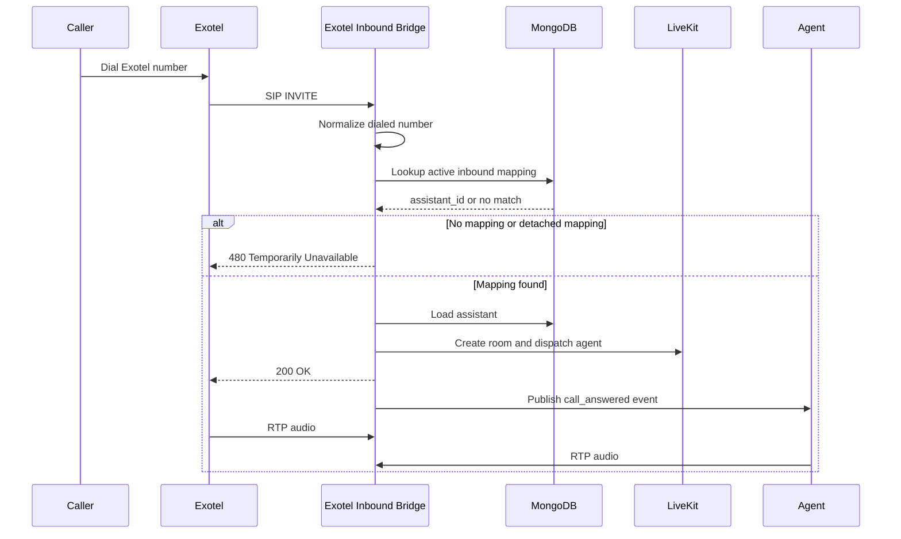

# Inbound Call Flow

Inbound calling currently uses the custom Exotel SIP bridge.

## Routing Steps

1. Exotel sends a SIP `INVITE` to the custom inbound bridge.
2. The bridge reads the dialed number from the SIP `To` header.
3. The number is normalized with the same formatter used by the `/inbound` API.
4. The bridge looks up an active `InboundSIP` mapping by `phone_number_normalized`.
5. If the mapping is missing or detached, the bridge returns `480 Temporarily Unavailable`.
6. If the mapped assistant is inactive or missing, the bridge also returns `480 Temporarily Unavailable`.
7. When routing succeeds, the bridge creates a LiveKit room, dispatches the assistant, and connects RTP audio.

## Dispatch Metadata

The bridge creates the LiveKit dispatch with these metadata keys:

| Key | Value |
| :--- | :--- |
| `call_type` | `inbound` |
| `service` | `exotel` |
| `assistant_id` | Assistant selected from the mapping |
| `assistant_name` | Assistant display name |
| `inbound_number` | Normalized dialed number |
| `caller_number` | Parsed caller number from the SIP `From` header |

## Runtime Notes

- A `200 OK` SIP response is sent only after LiveKit room setup and RTP bridge startup succeed.
- The bridge waits briefly after room connection, then publishes a `call_answered` event on the `sip_bridge_events` topic so the agent can start speaking after the media path is ready.
- If room creation or dispatch setup fails, the bridge returns `500 Internal Server Error`.
- Active call shutdown is driven by SIP `BYE`, LiveKit disconnect, or RTP silence timeout.

