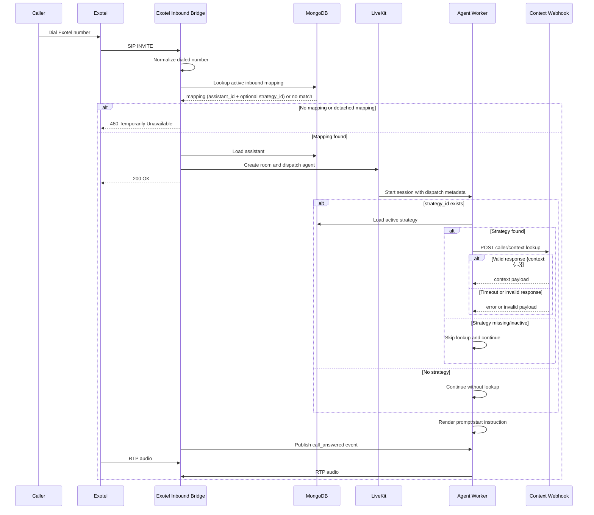

# Inbound Call Flow

Inbound calling currently uses the custom Exotel SIP bridge.

## Routing Steps

1. Exotel sends a SIP `INVITE` to the custom inbound bridge.
2. The bridge reads the dialed number from the SIP `To` header.
3. The number is normalized with the same formatter used by the `/inbound` API.
4. The bridge looks up an active `InboundSIP` mapping by `phone_number_normalized`.
5. If the mapping is missing or detached, the bridge returns `480 Temporarily Unavailable`.
6. The bridge loads the assistant from `assistant_id` on the mapping.
7. If the mapped assistant is inactive or missing, the bridge returns `480 Temporarily Unavailable`.
8. If the global concurrency cap (`MAX_CONCURRENT_JOBS`) is reached, the bridge returns `486 Busy Here`. Inbound calls share the same slot pool as outbound calls.
9. When routing succeeds, the bridge creates a LiveKit room, dispatches the assistant, and connects RTP audio.
10. The agent session optionally runs inbound context lookup before rendering prompt templates.

## Dispatch Metadata

The bridge creates the LiveKit dispatch with these metadata keys:

| Key | Value |
| :--- | :--- |
| `call_type` | `inbound` |
| `service` | `exotel` |
| `assistant_id` | Assistant selected from the mapping |
| `assistant_name` | Assistant display name |
| `inbound_id` | Inbound mapping identifier |
| `inbound_context_strategy_id` | Optional strategy attached to the mapping |
| `inbound_number` | Normalized dialed number |
| `caller_number` | Parsed caller number from the SIP `From` header |

## Agent Prompt Rendering Phase

After dispatch, the worker loads metadata and renders:

- `assistant_prompt`
- `assistant_start_instruction`

Render inputs are:

- Existing top-level metadata keys.
- `call.*` namespace containing the call metadata.
- Optional `context.*` namespace when inbound context lookup succeeds.

## Optional Strategy and Fallback Behavior

If `inbound_context_strategy_id` is not present:

- No lookup is attempted.
- Prompt rendering continues using call metadata only.

If `inbound_context_strategy_id` is present:

- The worker tries to load the strategy and call the configured webhook.
- The webhook must return JSON with a top-level `context` object.
- Full request/response contract is documented in [Inbound Context Strategies](../inbound-context-strategy/index.md#webhook-request-payload).

If strategy loading or webhook lookup fails:

- Timeout, HTTP error, invalid JSON, invalid payload shape, missing URL, or inactive strategy all fall back to default prompt behavior.
- The call continues and the assistant still starts.
- An `inbound_context_lookup` activity log is written for attempted lookups.

## Runtime Notes

- A `200 OK` SIP response is sent only after LiveKit room setup and RTP bridge startup succeed.
- The bridge waits briefly after room connection, then publishes a `call_answered` event on the `sip_bridge_events` topic so the agent can start speaking after the media path is ready.
- If room creation, call record initialization, or dispatch setup fails, the bridge returns `500 Internal Server Error` and releases the reserved slot.
- Active call shutdown is driven by SIP `BYE`, LiveKit disconnect, or RTP silence timeout.
- On API server startup, every inbound `CallRecord` left in `initiated`/`answered` from a previous (crashed) process is force-failed with reason `"Marked failed on server startup — agent process no longer running"`. This frees concurrency slots that would otherwise stay reserved by dead calls.

