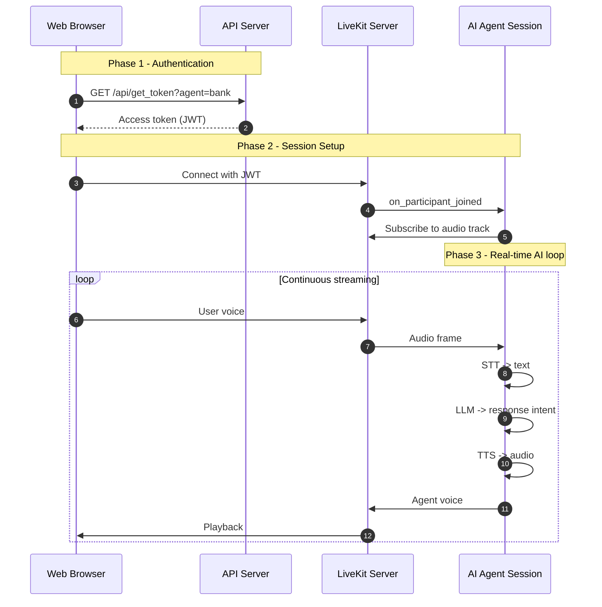
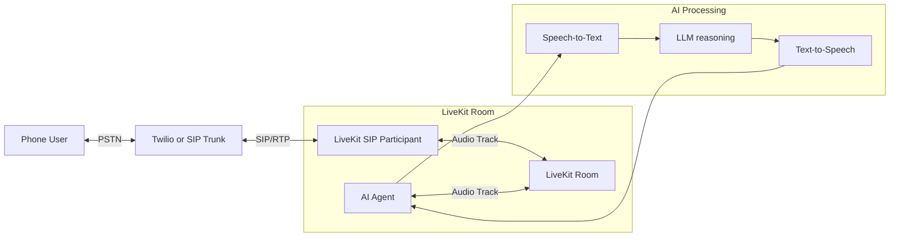
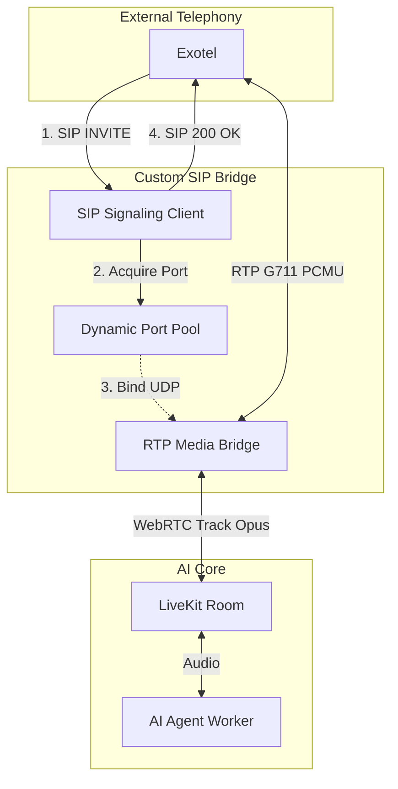

# LiveKit Architecture

## Overview

This page describes how AI agents integrate with web clients, managed SIP providers, and custom SIP bridges.

## Web Integration

This flow shows how a web client authenticates, joins LiveKit, and exchanges audio with an AI agent session.

```mermaid
sequenceDiagram
    autonumber
    participant Web as Web Browser
    participant API as API Server
    participant LK as LiveKit Server
    participant Agent as AI Agent Session

    Note over Web, API: Phase 1 - Authentication
    Web->>API: GET /api/get_token?agent=bank
    API-->>Web: Access token (JWT)

    Note over Web, Agent: Phase 2 - Session Setup
    Web->>LK: Connect with JWT
    LK->>Agent: on_participant_joined
    Agent->>LK: Subscribe to audio track

    Note over Agent: Phase 3 - Real-time AI loop
    loop Continuous streaming
        Web->>LK: User voice
        LK->>Agent: Audio frame
        Agent->>Agent: STT -> text
        Agent->>Agent: LLM -> response intent
        Agent->>Agent: TTS -> audio
        Agent->>LK: Agent voice
        LK->>Web: Playback
    end
```

## Managed SIP Integration

This is the standard LiveKit SIP participant flow for providers such as Twilio.

```mermaid
graph LR
    User[Phone User] <-->|PSTN| Twilio[Twilio or SIP Trunk]
    Twilio <-->|SIP/RTP| LKSIP[LiveKit SIP Participant]

    subgraph LiveKit Room
        LKSIP <-->|Audio Track| LK[LiveKit Room]
        Agent[AI Agent] <-->|Audio Track| LK
    end

    subgraph AI Processing
        Agent --> STT[Speech-to-Text]
        STT --> LLM[LLM reasoning]
        LLM --> TTS[Text-to-Speech]
        TTS --> Agent
    end
```

## Custom SIP Reach (Exotel)

For Exotel custom SIP reach, a dedicated bridge handles SIP signaling, RTP relay, and LiveKit room connectivity.

```mermaid
graph TD
    subgraph External Telephony
        Exo[Exotel]
    end

    subgraph Custom SIP Bridge
        SIP[SIP Signaling Client]
        RTP[RTP Media Bridge]
        Port[Dynamic Port Pool]
    end

    subgraph AI Core
        LKR[LiveKit Room]
        Agent[AI Agent Worker]
    end

    Exo -->|1. SIP INVITE| SIP
    SIP -->|2. Acquire Port| Port
    Port -.->|3. Bind UDP| RTP
    SIP -->|4. SIP 200 OK| Exo

    Exo <-->|RTP G711 PCMU| RTP
    RTP <-->|WebRTC Track Opus| LKR
    LKR <-->|Audio| Agent
```

## Inbound Routing (Exotel)

Inbound Exotel calls do not use managed LiveKit SIP participants. The bridge receives `INVITE`, normalizes the number, resolves mapping in MongoDB, creates a room, and dispatches the mapped assistant.

### Inbound Components

- `/inbound` routes manage `inbound_sip` mappings.
- MongoDB stores normalized inbound numbers, provider config, and `assistant_id` mappings.
- Inbound bridge handles SIP signaling, RTP relay, and room setup.
- LiveKit dispatch metadata includes inbound and caller numbers for worker context.

### Inbound Call Sequence

```mermaid
sequenceDiagram
    autonumber
    participant Caller as Caller
    participant Exotel as Exotel
    participant Bridge as Inbound Bridge
    participant DB as MongoDB
    participant LK as LiveKit
    participant Agent as AI Agent

    Caller->>Exotel: Dial inbound number
    Exotel->>Bridge: SIP INVITE
    Bridge->>Bridge: Normalize dialed number
    Bridge->>DB: Lookup active inbound mapping
    DB-->>Bridge: Mapping with assistant_id
    Bridge->>DB: Load active assistant
    Bridge->>LK: Create room
    Bridge->>LK: Create dispatch metadata
    Bridge-->>Exotel: SIP 200 OK
    Exotel<-->>Bridge: RTP audio
    Bridge<-->>LK: Audio relay
    LK<-->>Agent: Real-time session
```

### Inbound Failure Paths

- No active mapping or detached mapping returns `480 Temporarily Unavailable`.
- Missing or inactive assistant returns `480 Temporarily Unavailable`.
- Room creation or dispatch failure returns `500 Internal Server Error`.
- Call teardown is handled by SIP `BYE`, LiveKit disconnect, or RTP timeout.
