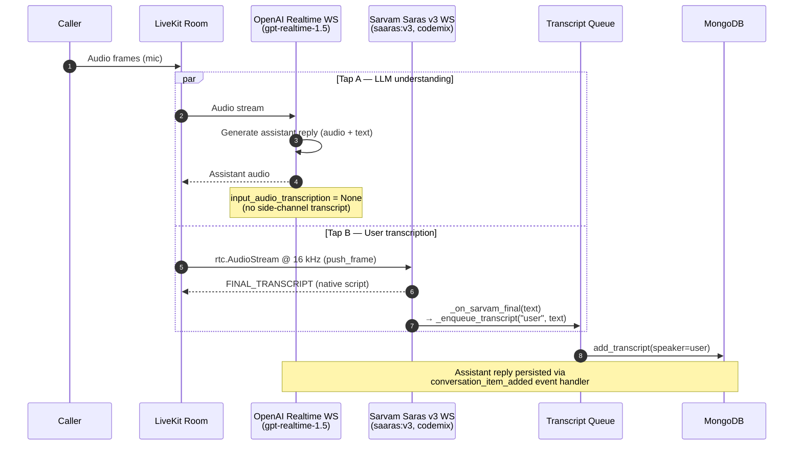
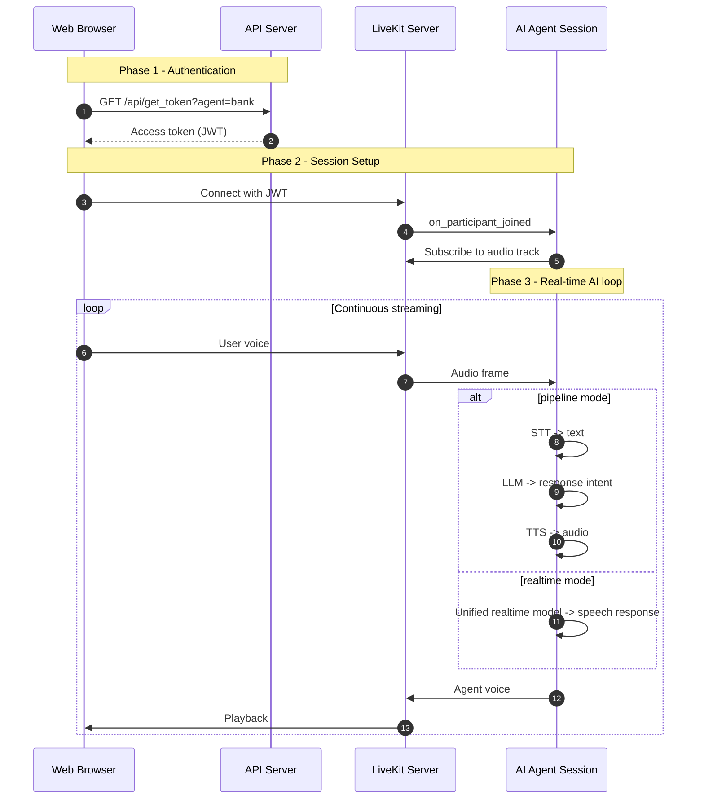
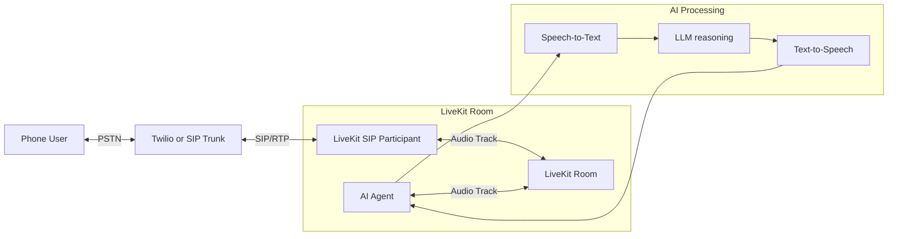
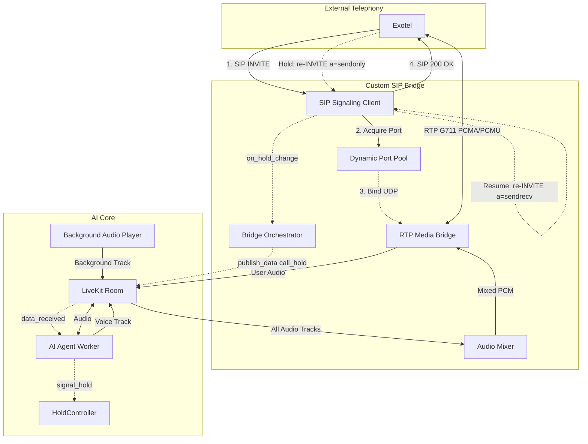
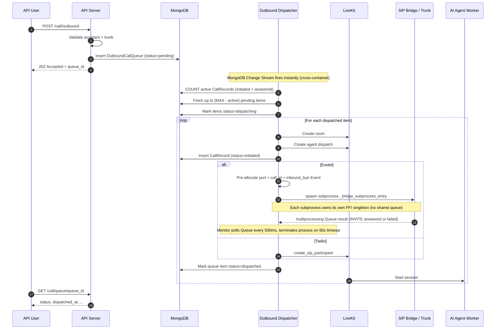
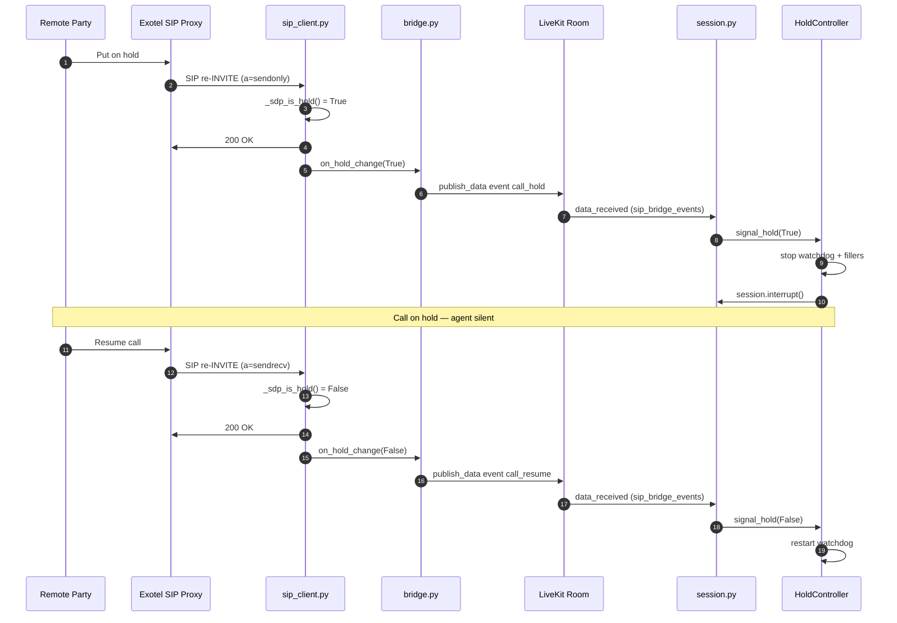
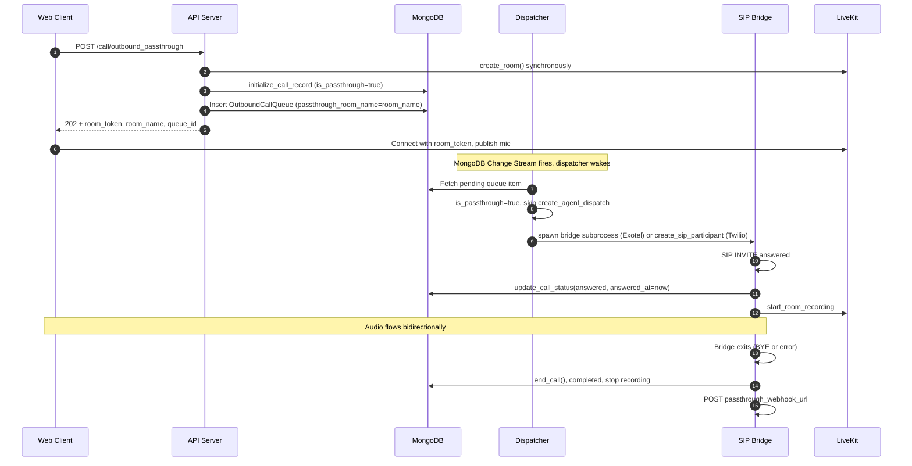
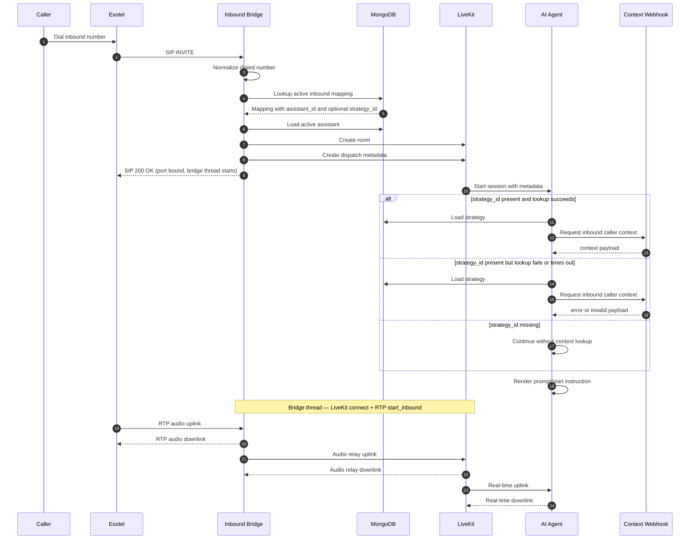

# LiveKit Architecture

## Overview

This page describes how AI agents integrate with web clients, managed SIP providers, and custom SIP bridges.

## API Startup Services

When the FastAPI app starts, it initializes MongoDB and conditionally starts two long-running background services:

- **Exotel inbound SIP listener** — listens for incoming SIP INVITE/BYE from Exotel on boot (controlled by `ENABLE_SIP_LISTENER` env var, default `true`)
- **Outbound call dispatcher** — event-driven loop that drains the outbound call queue (controlled by `ENABLE_DISPATCHER` env var, default `true`)

In **single-container / dev** mode both services run inside the API process. In **production Docker** deployments a dedicated `sip_dispatcher` container runs `sip_dispatcher_run.py`, which owns both services exclusively. The `api` container sets `ENABLE_SIP_LISTENER=false` and `ENABLE_DISPATCHER=false` so it can scale to multiple Gunicorn workers without SIP port conflicts or duplicate dispatchers.

Outbound request acceptance and outbound call execution are fully decoupled. The API enqueues calls and returns immediately; the dispatcher handles pacing and retry independently.

### Two-Server Deployment Roles

For horizontal scaling without Kubernetes, run containers by role:

- **Server A (control plane):** `api` + `sip_dispatcher`
- **Server B (capacity node):** `agent`
- Optional: run extra `agent` on Server A if CPU headroom exists

The project `docker-compose.yml` uses service profiles:

- `control` profile: `api`, `sip_dispatcher`
- `agent` profile: `agent`

Dockerfile mode mapping:

- `control` deploys use `docker/Dockerfile.control`
- `agent` deploys use `docker/Dockerfile.agent`
- `full` deploys force all services to use the original `Dockerfile`

Commands:

```bash
# Server A
docker compose --profile control up -d --build

# Server B
docker compose --profile agent up -d --build

# Single host full stack (original Dockerfile)
./deploy.sh full
```

Critical singleton rule: only one `sip_dispatcher` instance should run across all servers.

## Assistant Runtime Modes

There are three runtime paths for assistant speech generation:

- `pipeline` mode (`assistant_llm_mode="pipeline"`):
  - Input audio -> Sarvam/OpenAI STT plugin -> text LLM -> external TTS plugin -> output audio
- `realtime` mode with provider `openai` (half-cascade):
  - Input audio -> OpenAI `gpt-realtime-1.5` (audio-in LLM) -> text -> external TTS plugin -> output audio
  - User transcription runs **in parallel** via Sarvam Saras v3 (default) — see [Sarvam Parallel STT](#sarvam-parallel-user-transcription) below.
- `realtime` mode with provider `gemini` (full realtime):
  - Input audio -> Gemini realtime model (STT + LLM + TTS) -> output audio

All modes share the same room orchestration, call lifecycle, transcript flow, and tool execution framework.
All modes also support assistant-first openings when `speaks_first=true`, using `assistant_start_instruction` as the opening response text.

## Latency & Cost Reduction

Two techniques reduce latency and token cost in `pipeline` mode with OpenAI Realtime STT/LLM.

### LLM Context Truncation

**Problem.** The OpenAI Realtime API accumulates the full conversation history in a `RemoteChatContext` on its server-side session. By default there is no cap — a 2-minute call can accumulate 55,000+ tokens. This drives up both cost (billed per token) and TTFT (the model must attend to a longer context every turn).

**Solution.** `RealtimeTruncationRetentionRatio` (OpenAI Realtime API parameter) is configured on every `RealtimeModel` session:

```python
truncation=RealtimeTruncationRetentionRatio(
    type="retention_ratio",
    retention_ratio=0.75,
    token_limits=TokenLimits(post_instructions=8000),
)
```

- `post_instructions=8000` — hard cap on context tokens *after* the system prompt.
- `retention_ratio=0.75` — when the cap is hit, the model retains the most recent 75% of turns and discards the oldest 25%.

**Observed impact.** Token count dropped from ~55,000 to ~7,300 on a 2-minute call — an 87% reduction.

### Sarvam TTS WebSocket Keepalive

**Problem.** Sarvam TTS uses a WebSocket connection pool (`ConnectionPool`, `max_session_duration=3600`). However, the Sarvam server closes idle TCP connections after ~5 seconds of inactivity. Without intervention, every turn that has a gap longer than 5 seconds triggers a full TCP reconnect and Sarvam session handshake before audio synthesis can start — adding 300–800 ms of latency before the first audio frame.

**Solution.** `maintain_sarvam_connection` is spawned as a call-lifetime background task immediately after the participant joins (Sarvam assistants only):

```python
if isinstance(tts, sarvam_plugin.TTS):
    asyncio.create_task(maintain_sarvam_connection(tts, _sarvam_stop))
```

The function (`src/core/agents/tts/factory.py`):

1. Forces a fresh TCP connection at call start (`tts._pool.invalidate()` + `get()`).
2. Enters a loop that wakes every 3 seconds:
   - **Skips ping** if `current_ws not in tts._pool._available` — TTS is actively using the connection and must not be interrupted.
   - **Sends a WebSocket ping** to reset the server-side idle timer.
   - **Reconnects** if the server has already closed the connection (`current_ws.closed` or ping failure).
3. Exits cleanly when `_sarvam_stop` event is set at call teardown.

**Observed impact.** The reconnect log line now appears once at call start instead of between every turn.

### Sarvam Parallel User Transcription

**Problem.** In OpenAI half-cascade realtime mode (`assistant_llm_mode="realtime"`, `provider="openai"`), the `input_audio_transcription` side channel uses `gpt-4o-transcribe`. On Indic mixed / code-switched speech (Hindi-English-Tamil-Urdu in one call) this model:

- Switches scripts mid-utterance (Devanagari → Tamil → Arabic → Spanish)
- Romanises words instead of using the speaker's native script
- Hallucinates entire phrases on noisy phone audio

Direct fix by swapping the transcription model is **not possible** — `input_audio_transcription.model` is a closed whitelist controlled server-side by OpenAI (`whisper-1`, `gpt-4o-transcribe`, `gpt-4o-mini-transcribe`, `gpt-4o-transcribe-diarize`). The field accepts no URL, callback, or third-party endpoint.

**Solution.** Run **Sarvam Saras v3** (`saaras:v3`, `codemix` mode, `language="unknown"`) as a parallel audio tap from the LiveKit room. Sarvam is trained on Indic + code-switched speech and outputs each word in its correct native script. The OpenAI Realtime LLM continues to consume the audio directly for understanding and reply generation — only the persisted user transcript is overridden.

Configured per assistant via `assistant_interaction_config.user_stt_provider`:

| Value | Effect |
|-------|--------|
| `sarvam` (default) | Sarvam parallel tap writes user transcripts. OpenAI `input_audio_transcription` disabled (`None`). |
| `openai` | Legacy behaviour: OpenAI's `gpt-4o-transcribe` writes user transcripts. No Sarvam tap. |

**Data flow per utterance:**


```mermaid
sequenceDiagram
    autonumber
    participant Caller
    participant LK as LiveKit Room
    participant OAI as OpenAI Realtime WS<br/>(gpt-realtime-1.5)
    participant Sarvam as Sarvam Saras v3 WS<br/>(saaras:v3, codemix)
    participant TQ as Transcript Queue
    participant DB as MongoDB

    Caller->>LK: Audio frames (mic)
    par Tap A — LLM understanding
        LK->>OAI: Audio stream
        OAI->>OAI: Generate assistant reply (audio + text)
        OAI-->>LK: Assistant audio
        Note over OAI: input_audio_transcription = None<br/>(no side-channel transcript)
    and Tap B — User transcription
        LK->>Sarvam: rtc.AudioStream @ 16 kHz (push_frame)
        Sarvam-->>LK: FINAL_TRANSCRIPT (native script)
        Sarvam->>TQ: _on_sarvam_final(text)<br/>→ _enqueue_transcript("user", text)
    end
    TQ->>DB: add_transcript(speaker=user)
    Note over OAI,DB: Assistant reply persisted via<br/>conversation_item_added event handler
```

**Implementation details:**

- Module: `src/core/agents/stt/sarvam_parallel.py` — `run_sarvam_parallel_stt(...)` coroutine.
- Spawned once after `wait_for_participant()` returns, scoped to the caller's identity. Late-binds if the audio track was already published.
- Stop signal: re-uses the existing `_sarvam_stop = asyncio.Event()` that already gates the Sarvam TTS keepalive — both exit on the same teardown.
- Frame pump: `rtc.AudioStream(track, sample_rate=16000, num_channels=1)` upsamples 8 kHz G.711 phone audio in-process; frames pushed via `stream.push_frame(frame)`.
- Duplicate-write guard: `conversation_item_added` short-circuits when `event.item.role == "user" and _use_sarvam_stt`, so OpenAI's empty / stale user item never reaches the DB.
- Shared transcript helper: `_enqueue_transcript(speaker, text)` queues the DB write — used by both the Sarvam callback and the OpenAI assistant-role path. Single source of truth for the `add_transcript` call shape.
- Silence watchdog: Sarvam's `on_final` callback calls `silence_watchdog.on_user_message()` to reset the reprompt timer, preserving parity with the OpenAI-only path.

**Scope of fix.** Only the persisted user transcript is corrected. The OpenAI Realtime LLM still consumes raw audio embeddings — if the LLM itself misunderstands Indic input, the assistant reply will reflect that. To fix LLM understanding as well, switch the assistant to `pipeline` mode (Sarvam STT feeds a text LLM) or to `realtime` + `gemini`.

---

## Web Integration

This flow shows how a web client authenticates, joins LiveKit, and exchanges audio with an AI agent session.


```mermaid
sequenceDiagram
    autonumber
    participant Web as Web Browser
    participant API as API Server
    participant LK as LiveKit Server
    participant Agent as AI Agent Session

    Note over Web, API: Phase 1 - Authentication
    Web->>API: GET /api/get_token?agent=bank
    API-->>Web: Access token (JWT)

    Note over Web, Agent: Phase 2 - Session Setup
    Web->>LK: Connect with JWT
    LK->>Agent: on_participant_joined
    Agent->>LK: Subscribe to audio track

    Note over Agent: Phase 3 - Real-time AI loop
    loop Continuous streaming
        Web->>LK: User voice
        LK->>Agent: Audio frame
        alt pipeline mode
            Agent->>Agent: STT -> text
            Agent->>Agent: LLM -> response intent
            Agent->>Agent: TTS -> audio
        else realtime mode
            Agent->>Agent: Unified realtime model -> speech response
        end
        Agent->>LK: Agent voice
        LK->>Web: Playback
    end
```

## Managed SIP Integration

This is the standard LiveKit SIP participant flow for providers such as Twilio.


```mermaid
graph LR
    User[Phone User] <-->|PSTN| Twilio[Twilio or SIP Trunk]
    Twilio <-->|SIP/RTP| LKSIP[LiveKit SIP Participant]

    subgraph LiveKit Room
        LKSIP <-->|Audio Track| LK[LiveKit Room]
        Agent[AI Agent] <-->|Audio Track| LK
    end

    subgraph AI Processing
        Agent --> STT[Speech-to-Text]
        STT --> LLM[LLM reasoning]
        LLM --> TTS[Text-to-Speech]
        TTS --> Agent
    end
```

## Custom SIP Reach (Exotel)

For Exotel custom SIP reach, a dedicated bridge handles SIP signaling, RTP relay, and LiveKit room connectivity.

### Bridge Concurrency Model

#### v1 — Thread-per-bridge (historical)

Each concurrent call ran in its own OS thread with a dedicated `asyncio.run()` event loop. This isolated asyncio scheduling across calls but did **not** isolate the native audio queue.

The LiveKit Python SDK uses a process-wide Rust FFI singleton (`livekit-ffi`) with a single internal frame queue. All `rtc.AudioStream` objects in all threads competed for the same native queue. Under load (>5–8 concurrent calls), the queue saturated, causing:

- `native audio stream queue overflow; dropped N queued frames` warnings
- `signal client closed: "ping timeout"` reconnect cycles
- `signal_event taking too much time` stalls
- `Bridge task cancelled after timeout` / `TX=0` on outbound calls

```
FastAPI process (single PID)
├── Thread: bridge-out-A  → rtc.AudioStream ──┐
├── Thread: bridge-out-B  → rtc.AudioStream ──┤── shared FFI queue ← OVERFLOW at scale
└── Thread: bridge-out-C  → rtc.AudioStream ──┘
```

#### v2 — Process-per-bridge (current)

Each outbound bridge runs in its own **OS process** spawned with `multiprocessing.get_context("spawn")`. Each process loads its own copy of the Rust FFI shared library — a completely separate native queue with no contention.

```
FastAPI process (PID 1234)
├── Process: bridge-out-A (PID 1235) → rtc.AudioStream → own FFI queue ✓
├── Process: bridge-out-B (PID 1236) → rtc.AudioStream → own FFI queue ✓
└── Process: bridge-out-C (PID 1237) → rtc.AudioStream → own FFI queue ✓
```

**Memory profile**: `spawn` starts a fresh Python interpreter per process (~30–50 MB new pages each). At 100 concurrent outbound calls, total bridge memory is ~3–5 GB. This is a known trade-off vs. the thread model's near-zero overhead.

**Why `spawn` not `fork`**: forking from inside an asyncio event loop is unsafe (inherited locks, stale loop state). `spawn` starts a clean interpreter with no inherited asyncio state. All arguments passed to the subprocess must be picklable (`str`, `dict`, `multiprocessing.Queue`, `multiprocessing.synchronize.Event` all are).

**Inbound bridges** still use `threading.Thread` (lower concurrent volume; typically 1–5 simultaneous inbound calls). The same FFI pressure does not arise at that scale.


```mermaid
graph TD
    subgraph External Telephony
        Exo[Exotel]
    end

    subgraph Custom SIP Bridge
        SIP[SIP Signaling Client]
        RTP[RTP Media Bridge]
        Mixer[Audio Mixer]
        Port[Dynamic Port Pool]
        Bridge[Bridge Orchestrator]
    end

    subgraph AI Core
        LKR[LiveKit Room]
        Agent[AI Agent Worker]
        BG[Background Audio Player]
        HC[HoldController]
    end

    Exo -->|1. SIP INVITE| SIP
    SIP -->|2. Acquire Port| Port
    Port -.->|3. Bind UDP| RTP
    SIP -->|4. SIP 200 OK| Exo
    Exo -.->|Hold: re-INVITE a=sendonly| SIP
    SIP -.->|Resume: re-INVITE a=sendrecv| SIP
    SIP -.->|on_hold_change| Bridge
    Bridge -.->|publish_data call_hold| LKR
    LKR -.->|data_received| Agent
    Agent -.->|signal_hold| HC

    Exo <-->|RTP G711 PCMA/PCMU| RTP
    Agent -->|Voice Track| LKR
    BG -->|Background Track| LKR
    LKR -->|All Audio Tracks| Mixer
    Mixer -->|Mixed PCM| RTP
    RTP -->|User Audio| LKR
    LKR <-->|Audio| Agent
```

### Outbound Exotel Lifecycle

- `POST /call/outbound` validates the request, inserts to `outbound_call_queue`, and returns `202 Accepted` with a `queue_id`. No LiveKit room is created at this point.
- The event-driven dispatcher wakes immediately on enqueue and creates the LiveKit room + starts the SIP bridge when a capacity slot is available.
- Before spawning the bridge subprocess, the dispatcher pre-allocates three resources in the parent process:
    - **RTP port** — acquired from `PortPool`; subprocess uses the number directly; parent monitor releases it on exit.
    - **`call_id`** — UUID pre-generated so the parent can register the inbound BYE event before the subprocess starts.
    - **`inbound_bye` event** — `multiprocessing.synchronize.Event` (OS shared memory); registered with the inbound SIP listener in the parent; subprocess polls it to detect BYE arriving on a new TCP connection.
- SIP setup outcome (`200 OK` / failure / timeout) is resolved out-of-band via a `multiprocessing.Queue` written by the bridge subprocess and polled every 500 ms by the dispatcher's monitor coroutine; the caller can poll `GET /call/queue/{queue_id}` for status.

    !!! note "Historical: thread-based IPC"
        In v1 (thread-per-bridge), a `concurrent.futures.Future` was shared in-memory between the bridge thread and the monitor task. The monitor used `asyncio.wrap_future()` to await it. This worked because threads share the same process address space. With subprocess isolation (v2), `Future` cannot cross process boundaries; `multiprocessing.Queue` is used instead.

- On SIP setup timeout, the dispatcher calls `bridge_process.terminate()` (SIGTERM). The parent monitor's `finally` block always releases the pre-allocated port and unregisters the `call_id` regardless of how the subprocess exits.
- Agent speech and recording are gated by bridge `call_answered` signaling to avoid recording before answer.
- After readiness is confirmed, start-instruction delivery applies to both runtime modes (`pipeline` and `realtime`).
- Terminal status finalization and webhook emission are handled through a single lifecycle path to reduce duplicate or conflicting terminal updates.
- If SIP returns `200 OK` but no RTP ever arrives (`no_rtp_after_answer`), lifecycle final status is treated as `failed`.

## Outbound Queueing and Capacity Control

All outbound calls go through a persistent MongoDB queue before being dispatched to LiveKit. This prevents server overload when users trigger many calls simultaneously.

### Outbound Call Flow


```mermaid
sequenceDiagram
    autonumber
    participant User as API User
    participant API as API Server
    participant DB as MongoDB
    participant Disp as Outbound Dispatcher
    participant LK as LiveKit
    participant SIP as SIP Bridge / Trunk
    participant Agent as AI Agent Worker

    User->>API: POST /call/outbound
    API->>API: Validate assistant + trunk
    API->>DB: Insert OutboundCallQueue (status=pending)
    API-->>User: 202 Accepted + queue_id

    Note over Disp: MongoDB Change Stream fires instantly (cross-container)

    Disp->>DB: COUNT active CallRecords (initiated + answered)
    Disp->>DB: Fetch up to (MAX - active) pending items
    Disp->>DB: Mark items status=dispatching

    loop For each dispatched item
        Disp->>LK: Create room
        Disp->>LK: Create agent dispatch
        Disp->>DB: Insert CallRecord (status=initiated)
        alt Exotel
            Disp->>Disp: Pre-allocate port + call_id + inbound_bye Event
            Disp->>SIP: spawn subprocess _bridge_subprocess_entry
            Note over Disp,SIP: Each subprocess owns its own FFI singleton (no shared queue)
            SIP-->>Disp: multiprocessing Queue result (INVITE answered or failed)
            Note over Disp: Monitor polls Queue every 500ms, terminates process on 60s timeout
        else Twilio
            Disp->>LK: create_sip_participant
        end
        Disp->>DB: Mark queue item status=dispatched
        LK->>Agent: Start session
    end

    User->>API: GET /call/queue/queue_id
    API-->>User: status, dispatched_at, ...
```

### Queue States

| State | Meaning |
| :--- | :--- |
| `pending` | Waiting for a free slot |
| `dispatching` | Slot reserved — room creation in progress |
| `dispatched` | LiveKit room created and SIP bridge started |
| `failed` | All retry attempts exhausted |

### Capacity Model

Capacity is calculated as:

```
available_slots = MAX_CONCURRENT_JOBS(12 default) - active_sessions

active_sessions = COUNT(CallRecord where status IN ["initiated","answered"])
                + _dispatching_count  ← in-memory reservation for mid-dispatch calls
```

The `_dispatching_count` in-memory counter bridges the gap between "room creation started" and "CallRecord written to MongoDB" (~100ms window), preventing double-dispatch under any timing.

Inbound calls reserve from the same pool: the inbound bridge calls `try_reserve_slot()` after assistant resolution and rejects with SIP `486 Busy Here` if the cap is reached. The reservation is released either after the inbound `CallRecord` is persisted (so subsequent counts come from the DB) or on any failure between reservation and persistence.

### Crash Recovery

Two mechanisms keep the slot pool consistent across crashes:

1. **Server crash → startup cleanup.** On boot, `_fail_all_active_calls()` marks every `CallRecord` in `initiated`/`answered` (inbound and outbound) as `failed` with reason `"Marked failed on server startup — agent process no longer running"`. The in-memory `_dispatching_count` resets to `0` naturally with the new process.
2. **Worker crash mid-dispatch → per-tick recovery.** `_recover_stuck_dispatching()` runs on every dispatcher wake and resets outbound queue items left in `dispatching` longer than `STUCK_DISPATCHING_MINUTES` (5 min) back to `pending`, or to `failed` once `MAX_RETRIES` is reached. Inbound has no queue item; its slot is freed by the in-process try/except path or by the startup cleanup above.

On the agent worker side, `load_threshold=0.65` provides a secondary CPU-based guard: the worker stops accepting new jobs when average CPU exceeds 65%, protecting against inbound call bursts that bypass the queue.

### Retry Behaviour

Failed dispatches (SIP error, LiveKit API error, trunk inactive) are retried up to `3` times automatically. The item is reset to `pending` and re-queued on the next dispatcher wake. After 3 failures, status becomes `failed` with the last error stored in `last_error`.

### Event-Driven Design

The dispatcher uses MongoDB Change Streams for cross-container, zero-latency notification:

```
New call enqueued (any container)
    → Change Stream on outbound_call_queue fires instantly
    → dispatcher wakes, processes queue immediately

Call finishes (agent container)
    → Change Stream on call_records (terminal status) fires
    → dispatcher wakes, chains next pending call immediately

No calls for hours
    → dispatcher sleeps (0 CPU)
    → 30s fallback poll as safety net (catches missed events during stream restart)
    → returns to sleep if queue empty

Server restart with pending items in MongoDB
    → startup recovery: _process_pending() runs on boot
    → all pending calls from before restart are dispatched
```

Both Change Stream watchers auto-restart on error with 5s backoff. No new infrastructure needed — MongoDB Atlas always runs replica sets.

### Module Layout

```
src/services/outbound_dispatcher/
├── __init__.py      # re-exports outbound_dispatcher_loop
└── dispatcher.py    # constants, capacity helpers, Change Stream watchers, dispatch logic, loop

src/services/exotel/custom_sip_reach/
├── bridge.py              # run_bridge() coroutine + _bridge_subprocess_entry() (spawn target)
├── inbound_bridge.py      # inbound SIP → LiveKit bridge (thread-per-call, low volume)
├── inbound_listener.py    # TCP SIP listener; BYE/OPTIONS handler; call-id → Event registry
├── rtp_bridge.py          # UDP RTP ↔ LiveKit AudioStream/AudioSource
├── sip_client.py          # SIP INVITE/BYE/auth over TCP
├── port_pool.py           # Thread-safe UDP port allocator
└── config.py              # Env-var constants
```

**Key IPC boundary (v2):**

| Resource | Owner | How shared |
|---|---|---|
| RTP port number | Parent (PortPool) | Passed as `int` arg to subprocess |
| `call_id` | Parent (pre-generated UUID) | Passed as `str` arg; used in SipClient + inbound listener |
| `inbound_bye` | Parent (registered in listener) | `multiprocessing.synchronize.Event` — OS semaphore, visible across processes |
| SIP result | Subprocess | `multiprocessing.Queue.put()` → parent monitor polls |
| Port release | Parent monitor `finally` | Always runs regardless of subprocess exit reason |

Consumers import from the package root:

```python
from src.services.outbound_dispatcher import outbound_dispatcher_loop # sip_dispatcher_run.py
```

### Inbound RTP Audio Processing

Phone audio from PSTN arrives as **G.711 at 8 kHz**, narrow-band (300–3400 Hz). Feeding it raw to the STT model caused hallucinations — random scripts (Urdu, Hebrew) appearing in transcripts instead of the actual speech. The root causes were:

| Problem | Effect on STT |
|---------|---------------|
| `audioop.ratecv` linear interpolation (8 kHz → 48 kHz) | Creates aliasing harmonics every 8 kHz. STT sees a spectrally wrong signal and hallucinates. |
| Fixed 3× gain applied before resampling | Clips loud phone speech → heavy distortion → hallucination |
| No frequency filtering | DC offset + sub-bass hum from phone acoustics reaches STT as if it were speech |
| Bandpass upper cutoff at 3400 Hz (prior approach) | Redundant — `resample_poly` already low-passes at 4 kHz. The 4th-order IIR phase distortion near cutoffs made voices sound hollow/metallic. |
| `np.clip` hard-clipping after gain | Chops sample peaks → harmonic distortion → STT confused on loud speakers |
| Non-G.711 RTP payloads (PT=101 DTMF / RFC 2833) decoded blindly | Garbage PCM fed into the LiveKit pipeline → STT pollution |

The inbound decode pipeline in `rtp_bridge.py::_decode_rtp_payload` now processes each G.711 packet as follows:

```
RTP packet
    ↓  early-return if payload type is not PCMA (8) or PCMU (0)
    ↓  audioop.alaw2lin / ulaw2lin
raw PCM int16 at 8 kHz
    ↓  Butterworth high-pass (80 Hz, order 2, stateful sosfilt zi)
DC offset and sub-bass hum removed; full speech band preserved
    ↓  scipy.signal.resample_poly(samples, up=6, down=1)
PCM at 48 kHz — polyphase FIR handles low-pass anti-aliasing at 4 kHz
    ↓  np.tanh(samples × 1.5)
quiet phone speech boosted; peaks soft-clipped (no harmonic distortion)
    ↓
final PCM int16 at 48 kHz → LiveKit AudioSource → STT
```

**Why 80 Hz high-pass only (not bandpass)?** Male voice fundamental frequency is 80–150 Hz. The original 300 Hz lower cutoff was silently stripping the root pitch of male voices, leaving only harmonics — audible as a hollow "telephone" sound. The 3400 Hz upper cutoff is redundant because `resample_poly`'s internal Kaiser-windowed FIR already band-limits at 4 kHz (Nyquist of 8 kHz input). A 4th-order Butterworth bandpass also introduces non-linear group delay at both cutoff edges, smearing consonants in time. The 2nd-order high-pass at 80 Hz has minimal phase distortion and only removes content that is never speech.

**Why stateful filter (`sosfilt zi`)?** The IIR filter carries its state (`zi`) across consecutive RTP packets. Without this, the filter restarts with zero initial conditions on each 20ms packet, producing a transient click at every packet boundary — audible as 50 Hz buzz on the STT side.

**Why `resample_poly` over `audioop.ratecv`?** `ratecv` uses linear interpolation, which for a 6:1 upsample creates images of the 8 kHz signal at multiples of 8 kHz throughout the 48 kHz spectrum. `resample_poly` uses a polyphase Kaiser-windowed FIR to reconstruct the correct band-limited signal before upsampling — the output looks like true 48 kHz narrowband audio.

**Why `tanh` soft-clip instead of `np.clip`?** Hard clipping at ±1.0 chops peaks into square-wave-like edges, generating high-frequency harmonics that STT models interpret as fricative consonants. `tanh` rounds peaks smoothly, behaving as an analog-style soft limiter: quiet speech (under ~0.5) passes near-linearly, loud peaks compress without harmonic spray.

**Why no noise suppression in `rtp_bridge.py`?** An earlier experiment ran `webrtc_noise_gain.AudioProcessor` (Google's WebRTC NS) on inbound audio. It was removed because:

1. OpenAI Realtime's `gpt-realtime` model accepts an `input_audio_noise_reduction` setting that runs NS **inside the model**, trained on raw G.711 phone audio.
2. Pre-processing with WebRTC NS shifted the spectral signature OpenAI's `far_field` mode expects → STT accuracy degraded.
3. With AGC enabled, WebRTC AGC amplified the residual echo of the agent's own voice back into the room, triggering OpenAI's VAD as a false barge-in → the agent kept cutting itself off mid-sentence.

The current design lets the inbound bridge do only minimal, spectrum-preserving cleanup (DC removal, gain, soft-clip, resampling) and delegates all noise-reduction policy to OpenAI Realtime (see *STT Noise-Reduction Branching* below).

### Outbound RTP Audio Processing

Agent / TTS audio leaves LiveKit at 48 kHz and must be encoded to G.711 (8 kHz) for the PSTN. The outbound pipeline in `rtp_bridge.py::_send_frame`:

```
LiveKit AudioFrame (int16 PCM @ 48 kHz)
    ↓  np.tanh(samples × 0.7)
TTS soft-limited so loud peaks don't clip on the narrow-band SIP path
    ↓  scipy.signal.resample_poly(samples, up=1, down=6)
48 kHz → 8 kHz with built-in anti-aliasing FIR (no metallic artifacts)
    ↓  accumulate to 20 ms (320 bytes) per ptime=20 SDP
    ↓  audioop.lin2alaw / lin2ulaw
G.711 PCMA/PCMU payload (160 bytes)
    ↓  prepend RTP header, sendto(remote_addr)
RTP packet → Exotel → mobile phone
```

**Why `tanh × 0.7` on outbound?** TTS engines (OpenAI, ElevenLabs, Sarvam) normalise output close to 0 dBFS. Pumping that into G.711 causes companding-curve distortion at the loud edges and excessive perceived loudness vs. a normal phone call. The 0.7 scale leaves ~3 dB of headroom; `tanh` softly rounds anything that still approaches the rails.

**Why `resample_poly` instead of `audioop.ratecv` (downsample)?** Same reason as inbound: linear interpolation has no anti-aliasing — any TTS energy above 4 kHz folds back into the audible band as a metallic hiss on the caller's phone. Polyphase FIR low-passes at 4 kHz before decimation, so the caller hears a clean band-limited voice instead of an aliased one.

### STT Noise-Reduction Branching

In `session.py`, the OpenAI Realtime LLM is configured with `input_audio_noise_reduction` chosen based on the call origin:

| Call type | `input_audio_noise_reduction` | Rationale |
|-----------|-------------------------------|-----------|
| Web (`call_type == "web"`) | `near_field` | Browser mic is close to the speaker; default WebRTC-style NS profile applies. |
| Phone (Exotel SIP, all non-web `call_type`) | `far_field` | OpenAI's far-field model is trained on lossy PSTN / G.711 audio. Using `near_field` on phone calls degraded transcription. |

The same branching also prepends a short note to the STT prompt on phone calls ("Audio is from a live telephone call (G.711 narrowband, ~8 kHz, lossy). Expect static, line hum, codec artifacts...") so the transcription model is aware of the channel and refuses to fabricate words on unintelligible audio.

**Dependencies:** `scipy>=1.13.0`, `numpy>=1.26.0`. (`webrtc_noise_gain` is no longer used by the inbound pipeline; remove if not referenced elsewhere.)

### Hold & Resume Detection

When a party puts the call on hold, the platform detects it and suppresses all agent activity to prevent the agent from responding to hold music.

**Exotel (SIP re-INVITE — instant):**

1. Remote party sends a SIP re-INVITE with `a=sendonly` or `a=inactive` in the SDP body.
2. `sip_client.py` parses the SDP, detects the hold attribute, sends `200 OK`, and fires the `on_hold_change` callback.
3. `bridge.py` publishes a data packet (`{"event": "call_hold"}` or `{"event": "call_resume"}`) to the LiveKit room on topic `sip_bridge_events`.
4. `session.py` receives the event and activates `HoldController`, which:
   - Stops `SilenceWatchdogController` (no reprompts during hold)
   - Stops `FillerController` (no backchannel fillers during hold)
   - Calls `session.interrupt()` to kill any in-progress agent speech
5. On resume, the silence watchdog is restarted and normal agent behavior resumes.


```mermaid
sequenceDiagram
    autonumber
    participant Remote as Remote Party
    participant Exotel as Exotel SIP Proxy
    participant SIP as sip_client.py
    participant Bridge as bridge.py
    participant LK as LiveKit Room
    participant Session as session.py
    participant HC as HoldController

    Remote->>Exotel: Put on hold
    Exotel->>SIP: SIP re-INVITE (a=sendonly)
    SIP->>SIP: _sdp_is_hold() = True
    SIP->>Exotel: 200 OK
    SIP->>Bridge: on_hold_change(True)
    Bridge->>LK: publish_data event call_hold
    LK->>Session: data_received (sip_bridge_events)
    Session->>HC: signal_hold(True)
    HC->>HC: stop watchdog + fillers
    HC->>Session: session.interrupt()

    Note over Remote,HC: Call on hold — agent silent

    Remote->>Exotel: Resume call
    Exotel->>SIP: SIP re-INVITE (a=sendrecv)
    SIP->>SIP: _sdp_is_hold() = False
    SIP->>Exotel: 200 OK
    SIP->>Bridge: on_hold_change(False)
    Bridge->>LK: publish_data event call_resume
    LK->>Session: data_received (sip_bridge_events)
    Session->>HC: signal_hold(False)
    HC->>HC: restart watchdog
```

**Suppression during hold:**

Three event handlers check `hold_controller.is_on_hold` and suppress activity:

| Event | Behavior during hold |
| :--- | :--- |
| `conversation_item_added` | Returns early; interrupts assistant speech; no transcript saved |
| `user_state_changed` | Returns early; no filler/silence watchdog triggers |
| `agent_state_changed` | Calls `session.interrupt()` if agent starts speaking |

!!! note "Provider coverage"
    Hold detection via SIP re-INVITE works for **Exotel** calls only. Twilio and other providers do not currently have hold detection — the agent may respond to hold music if the call is placed on hold for extended periods.

## Passthrough Mode Architecture

Passthrough mode reuses the same outbound infrastructure but skips the AI agent entirely. A human web user's mic is bridged directly to the phone caller via SIP.

```
NORMAL AI OUTBOUND:
  Web/SIP ↔ RTP Bridge ↔ LiveKit Room ↔ AI Agent (STT → LLM → TTS)

PASSTHROUGH:
  Web User ↔ LiveKit Room ↔ RTP Bridge ↔ SIP ↔ Mobile
                 ↑
         No AI agent, no STT/LLM/TTS
```

### Key Differences from Normal Outbound

| Aspect | Normal AI Call | Passthrough Call |
| :----- | :------------- | :--------------- |
| Agent dispatch | `create_agent_dispatch()` called | Skipped entirely |
| Room creation | Dispatcher creates room | API endpoint creates room synchronously (web client needs token immediately) |
| Token returned | No token in API response | `room_token` returned in `POST /call/outbound_passthrough` response |
| Recording start | After bridge `call_answered` event in `session.py` | After SIP 200 OK in `_monitor_exotel_result` (Exotel) or after `create_sip_participant` (Twilio) |
| Call finalization | `session.py` calls `end_call()` | Dispatcher monitor calls `end_call()` after bridge exits |
| Transcript | STT produces full transcript | Always empty — no STT runs |
| Webhook trigger | `assistant_end_call_url` on assistant | `passthrough_webhook_url` on trunk |
| Analytics | Appears in all analytics endpoints | Excluded from `by-assistant`; use `GET /call/records?passthrough_only=true` |

### Passthrough Outbound Queue Flow


```mermaid
sequenceDiagram
    autonumber
    participant Client as Web Client
    participant API as API Server
    participant DB as MongoDB
    participant Disp as Dispatcher
    participant Bridge as SIP Bridge
    participant LK as LiveKit

    Client->>API: POST /call/outbound_passthrough
    API->>LK: create_room() synchronously
    API->>DB: initialize_call_record (is_passthrough=true)
    API->>DB: Insert OutboundCallQueue (passthrough_room_name=room_name)
    API-->>Client: 202 + room_token, room_name, queue_id
    Client->>LK: Connect with room_token, publish mic

    Note over Disp: MongoDB Change Stream fires, dispatcher wakes
    Disp->>DB: Fetch pending queue item
    Disp->>Disp: is_passthrough=true, skip create_agent_dispatch
    Disp->>Bridge: spawn bridge subprocess (Exotel) or create_sip_participant (Twilio)
    Bridge->>Bridge: SIP INVITE answered
    Bridge->>DB: update_call_status(answered, answered_at=now)
    Bridge->>LK: start_room_recording
    Note over Client,Bridge: Audio flows bidirectionally
    Bridge->>Bridge: Bridge exits (BYE or error)
    Bridge->>DB: end_call(), completed, stop recording
    Bridge->>Bridge: POST passthrough_webhook_url
```

### Audio Routing in Passthrough

The `rtp_bridge.py` component does not need changes for passthrough. Its `on_track_subscribed` handler generically subscribes to **any** participant's audio track and feeds it into the RTP mixer. When the web user publishes their mic track, the bridge automatically routes it to SIP — exactly the same as it would route an AI agent's audio track.

```
Web user's mic track
      ↓
LiveKit room (web participant)
      ↓
on_track_subscribed (rtp_bridge.py) — same generic handler, no passthrough-specific logic
      ↓
AudioMixer → G.711 RTP → Exotel/Twilio SIP → Mobile phone
```

The mobile phone's audio comes back the same way in reverse, appearing as an audio track from the SIP bridge participant that the web user's LiveKit SDK plays back automatically.

---

## Provider Support Matrix

| Provider | Inbound | Outbound | Implementation path |
| :--- | :--- | :--- | :--- |
| `exotel` | Supported | Supported | Custom SIP bridge (`custom_sip_reach`) |
| `twilio` | Not implemented yet | Supported | LiveKit managed SIP participant |

!!! note "Current support status"

    Twilio inbound is planned but currently unsupported.

## Inbound Routing (Exotel)

Inbound Exotel calls do not use managed LiveKit SIP participants. The bridge receives `INVITE`, normalizes the number, resolves mapping in MongoDB, creates a room, and dispatches the mapped assistant.

### Inbound Components

- `/inbound` routes manage `inbound_sip` mappings.
- `/inbound_context_strategy` routes manage reusable caller-context lookup strategies.
- MongoDB stores normalized inbound numbers, provider config, and `assistant_id` mappings.
- Inbound mappings can optionally store `inbound_context_strategy_id`.
- Inbound bridge handles SIP signaling, RTP relay, and room setup.
- LiveKit dispatch metadata includes inbound and caller numbers plus mapping/strategy identifiers.
- Agent worker can optionally resolve inbound context via strategy webhook before prompt rendering.

### Inbound Call Sequence


```mermaid
sequenceDiagram
    autonumber
    participant Caller as Caller
    participant Exotel as Exotel
    participant Bridge as Inbound Bridge
    participant DB as MongoDB
    participant LK as LiveKit
    participant Agent as AI Agent
    participant Webhook as Context Webhook

    Caller->>Exotel: Dial inbound number
    Exotel->>Bridge: SIP INVITE
    Bridge->>Bridge: Normalize dialed number
    Bridge->>DB: Lookup active inbound mapping
    DB-->>Bridge: Mapping with assistant_id and optional strategy_id
    Bridge->>DB: Load active assistant
    Bridge->>LK: Create room
    Bridge->>LK: Create dispatch metadata
    Bridge-->>Exotel: SIP 200 OK (port bound, bridge thread starts)
    LK->>Agent: Start session with metadata
    alt strategy_id present and lookup succeeds
        Agent->>DB: Load strategy
        Agent->>Webhook: Request inbound caller context
        Webhook-->>Agent: context payload
    else strategy_id present but lookup fails or times out
        Agent->>DB: Load strategy
        Agent->>Webhook: Request inbound caller context
        Webhook-->>Agent: error or invalid payload
    else strategy_id missing
        Agent->>Agent: Continue without context lookup
    end
    Agent->>Agent: Render prompt/start instruction
    Note over Bridge,LK: Bridge thread — LiveKit connect + RTP start_inbound
    Exotel->>Bridge: RTP audio uplink
    Bridge-->>Exotel: RTP audio downlink
    Bridge->>LK: Audio relay uplink
    LK-->>Bridge: Audio relay downlink
    LK->>Agent: Real-time uplink
    Agent-->>LK: Real-time downlink
```

### Inbound Failure Paths

- No active mapping or detached mapping returns `480 Temporarily Unavailable`.
- Missing or inactive assistant returns `480 Temporarily Unavailable`.
- Missing strategy attachment does not fail the call; context lookup is skipped.
- Strategy lookup failures (timeout/HTTP/payload issues) do not fail the call; worker falls back to default prompt behavior.
- Room creation or dispatch failure returns `500 Internal Server Error`.
- Call teardown is handled by SIP `BYE`, LiveKit disconnect, or RTP timeout.
