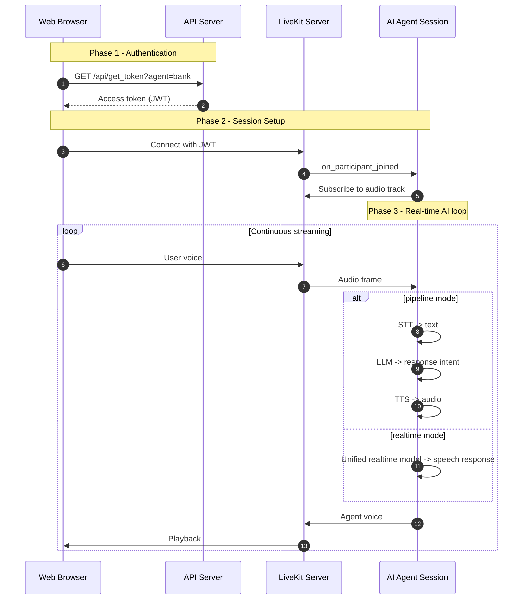
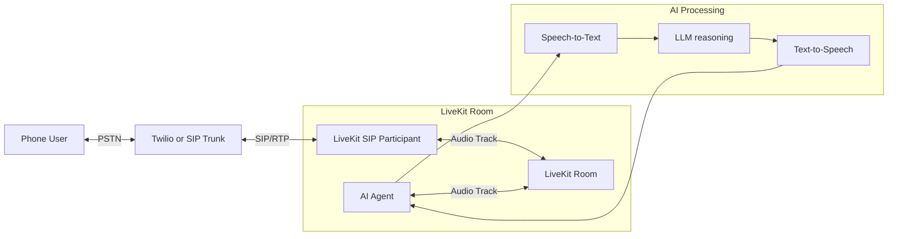
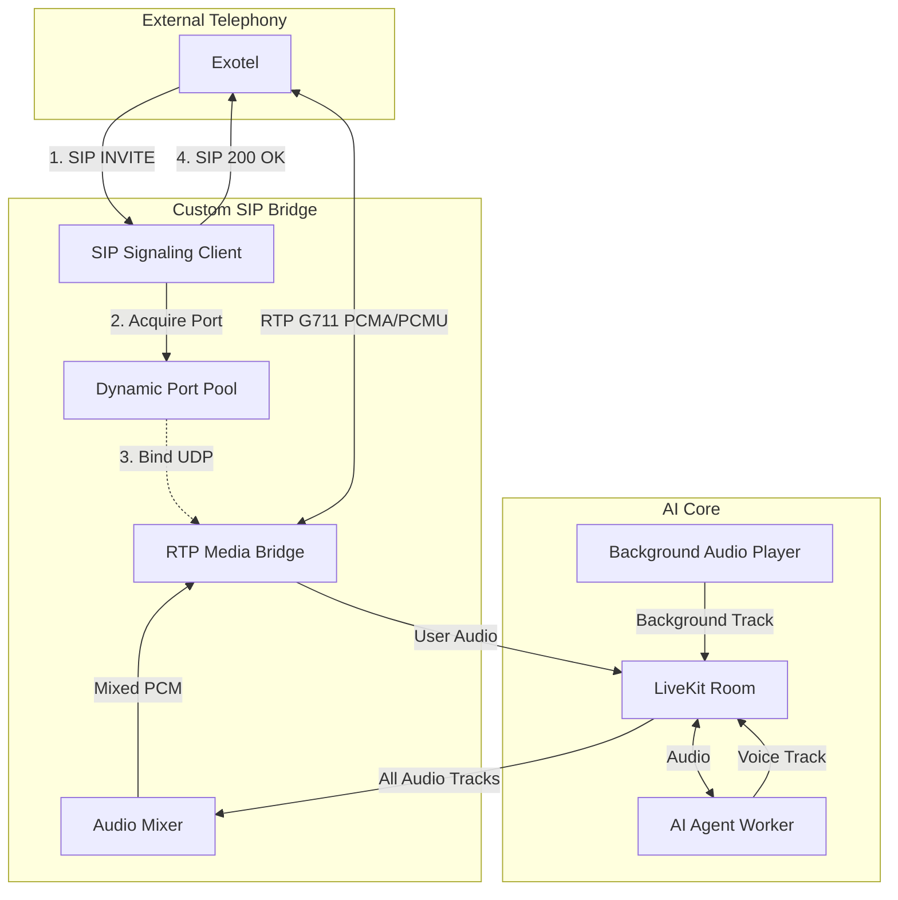
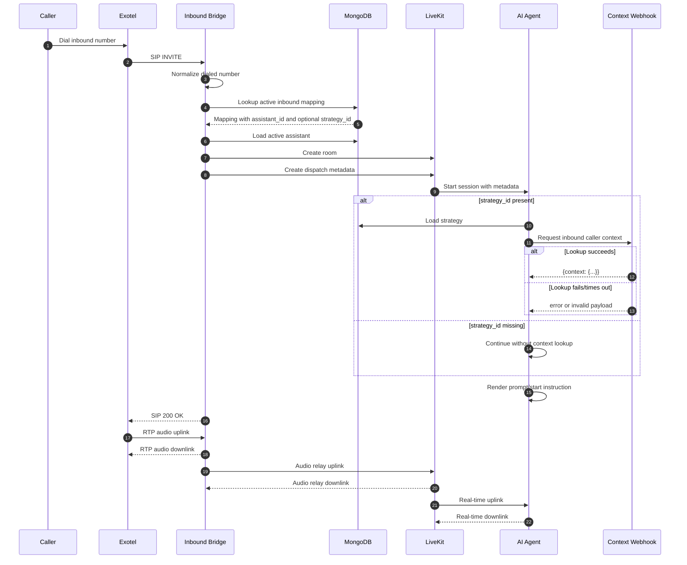

# LiveKit Architecture

## Overview

This page describes how AI agents integrate with web clients, managed SIP providers, and custom SIP bridges.

## Assistant Runtime Modes

There are two runtime paths for assistant speech generation:

- `pipeline` mode:
  - Input audio -> OpenAI realtime STT + LLM -> external TTS plugin -> output audio
- `realtime` mode:
  - Input audio -> Gemini realtime model (STT + LLM + TTS) -> output audio

Both modes share the same room orchestration, call lifecycle, transcript flow, and tool execution framework.
Both modes also support assistant-first openings when `speaks_first=true`, using `assistant_start_instruction` as the opening response text.

## Web Integration

This flow shows how a web client authenticates, joins LiveKit, and exchanges audio with an AI agent session.

```mermaid
sequenceDiagram
    autonumber
    participant Web as Web Browser
    participant API as API Server
    participant LK as LiveKit Server
    participant Agent as AI Agent Session

    Note over Web, API: Phase 1 - Authentication
    Web->>API: GET /api/get_token?agent=bank
    API-->>Web: Access token (JWT)

    Note over Web, Agent: Phase 2 - Session Setup
    Web->>LK: Connect with JWT
    LK->>Agent: on_participant_joined
    Agent->>LK: Subscribe to audio track

    Note over Agent: Phase 3 - Real-time AI loop
    loop Continuous streaming
        Web->>LK: User voice
        LK->>Agent: Audio frame
        alt pipeline mode
            Agent->>Agent: STT -> text
            Agent->>Agent: LLM -> response intent
            Agent->>Agent: TTS -> audio
        else realtime mode
            Agent->>Agent: Unified realtime model -> speech response
        end
        Agent->>LK: Agent voice
        LK->>Web: Playback
    end
```

## Managed SIP Integration

This is the standard LiveKit SIP participant flow for providers such as Twilio.

```mermaid
graph LR
    User[Phone User] <-->|PSTN| Twilio[Twilio or SIP Trunk]
    Twilio <-->|SIP/RTP| LKSIP[LiveKit SIP Participant]

    subgraph LiveKit Room
        LKSIP <-->|Audio Track| LK[LiveKit Room]
        Agent[AI Agent] <-->|Audio Track| LK
    end

    subgraph AI Processing
        Agent --> STT[Speech-to-Text]
        STT --> LLM[LLM reasoning]
        LLM --> TTS[Text-to-Speech]
        TTS --> Agent
    end
```

## Custom SIP Reach (Exotel)

For Exotel custom SIP reach, a dedicated bridge handles SIP signaling, RTP relay, and LiveKit room connectivity.

```mermaid
graph TD
    subgraph External Telephony
        Exo[Exotel]
    end

    subgraph Custom SIP Bridge
        SIP[SIP Signaling Client]
        RTP[RTP Media Bridge]
        Mixer[Audio Mixer]
        Port[Dynamic Port Pool]
    end

    subgraph AI Core
        LKR[LiveKit Room]
        Agent[AI Agent Worker]
        BG[Background Audio Player]
    end

    Exo -->|1. SIP INVITE| SIP
    SIP -->|2. Acquire Port| Port
    Port -.->|3. Bind UDP| RTP
    SIP -->|4. SIP 200 OK| Exo

    Exo <-->|RTP G711 PCMA/PCMU| RTP
    Agent -->|Voice Track| LKR
    BG -->|Background Track| LKR
    LKR -->|All Audio Tracks| Mixer
    Mixer -->|Mixed PCM| RTP
    RTP -->|User Audio| LKR
    LKR <-->|Audio| Agent
```

### Outbound Exotel Lifecycle

- API accepts Exotel outbound requests asynchronously and returns `202 Accepted` after dispatch/bridge startup.
- SIP setup outcome is resolved out-of-band; final call result is surfaced through end-call webhook payloads.
- Agent speech + recording are gated by bridge `call_answered` signaling to avoid recording before answer.
- After readiness is confirmed, start-instruction delivery applies to both runtime modes (`pipeline` and `realtime`).
- Terminal status finalization and webhook emission are handled through a single lifecycle path to reduce duplicate or conflicting terminal updates.
- If SIP returns `200 OK` but no RTP ever arrives (`no_rtp_after_answer`), lifecycle final status is treated as `failed`.

## Provider Support Matrix

| Provider | Inbound | Outbound | Implementation path |
| :--- | :--- | :--- | :--- |
| `exotel` | Supported | Supported | Custom SIP bridge (`custom_sip_reach`) |
| `twilio` | Not implemented yet | Supported | LiveKit managed SIP participant |

!!! note "Current support status"

    Twilio inbound is planned but currently unsupported.

## Inbound Routing (Exotel)

Inbound Exotel calls do not use managed LiveKit SIP participants. The bridge receives `INVITE`, normalizes the number, resolves mapping in MongoDB, creates a room, and dispatches the mapped assistant.

### Inbound Components

- `/inbound` routes manage `inbound_sip` mappings.
- `/inbound_context_strategy` routes manage reusable caller-context lookup strategies.
- MongoDB stores normalized inbound numbers, provider config, and `assistant_id` mappings.
- Inbound mappings can optionally store `inbound_context_strategy_id`.
- Inbound bridge handles SIP signaling, RTP relay, and room setup.
- LiveKit dispatch metadata includes inbound and caller numbers plus mapping/strategy identifiers.
- Agent worker can optionally resolve inbound context via strategy webhook before prompt rendering.

### Inbound Call Sequence

```mermaid
sequenceDiagram
    autonumber
    participant Caller as Caller
    participant Exotel as Exotel
    participant Bridge as Inbound Bridge
    participant DB as MongoDB
    participant LK as LiveKit
    participant Agent as AI Agent
    participant Webhook as Context Webhook

    Caller->>Exotel: Dial inbound number
    Exotel->>Bridge: SIP INVITE
    Bridge->>Bridge: Normalize dialed number
    Bridge->>DB: Lookup active inbound mapping
    DB-->>Bridge: Mapping with assistant_id and optional strategy_id
    Bridge->>DB: Load active assistant
    Bridge->>LK: Create room
    Bridge->>LK: Create dispatch metadata
    LK->>Agent: Start session with metadata
    alt strategy_id present
        Agent->>DB: Load strategy
        Agent->>Webhook: Request inbound caller context
        alt Lookup succeeds
            Webhook-->>Agent: {context: {...}}
        else Lookup fails/times out
            Webhook-->>Agent: error or invalid payload
        end
    else strategy_id missing
        Agent->>Agent: Continue without context lookup
    end
    Agent->>Agent: Render prompt/start instruction
    Bridge-->>Exotel: SIP 200 OK
    Exotel->>Bridge: RTP audio uplink
    Bridge-->>Exotel: RTP audio downlink
    Bridge->>LK: Audio relay uplink
    LK-->>Bridge: Audio relay downlink
    LK->>Agent: Real-time uplink
    Agent-->>LK: Real-time downlink
```

### Inbound Failure Paths

- No active mapping or detached mapping returns `480 Temporarily Unavailable`.
- Missing or inactive assistant returns `480 Temporarily Unavailable`.
- Missing strategy attachment does not fail the call; context lookup is skipped.
- Strategy lookup failures (timeout/HTTP/payload issues) do not fail the call; worker falls back to default prompt behavior.
- Room creation or dispatch failure returns `500 Internal Server Error`.
- Call teardown is handled by SIP `BYE`, LiveKit disconnect, or RTP timeout.
