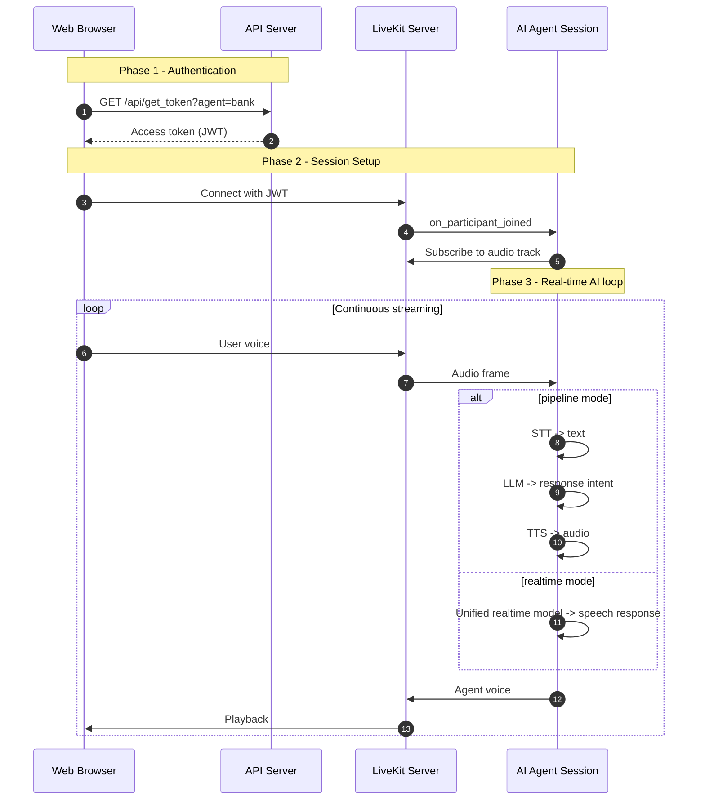
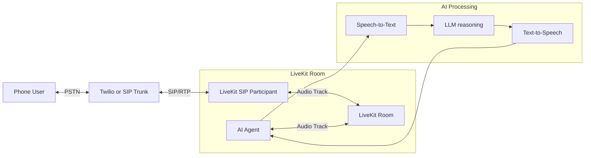
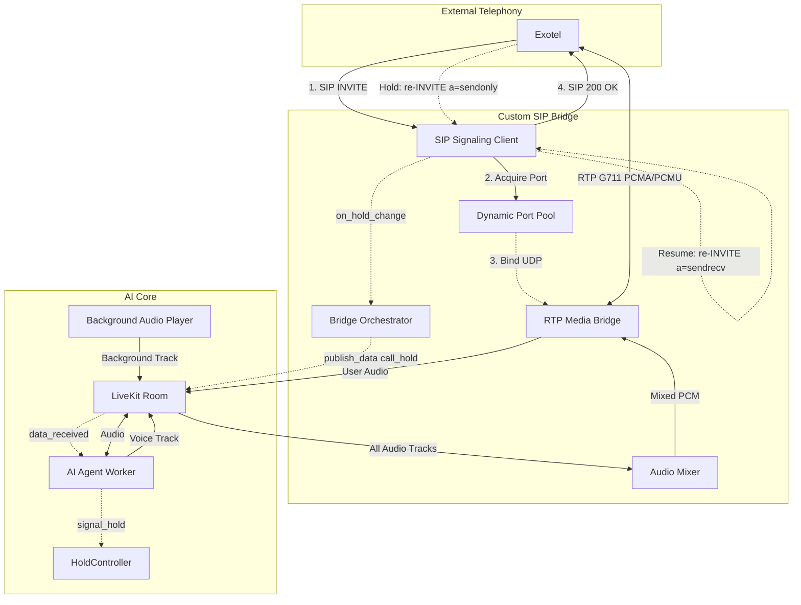
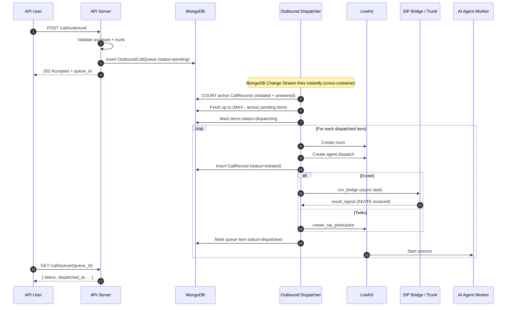
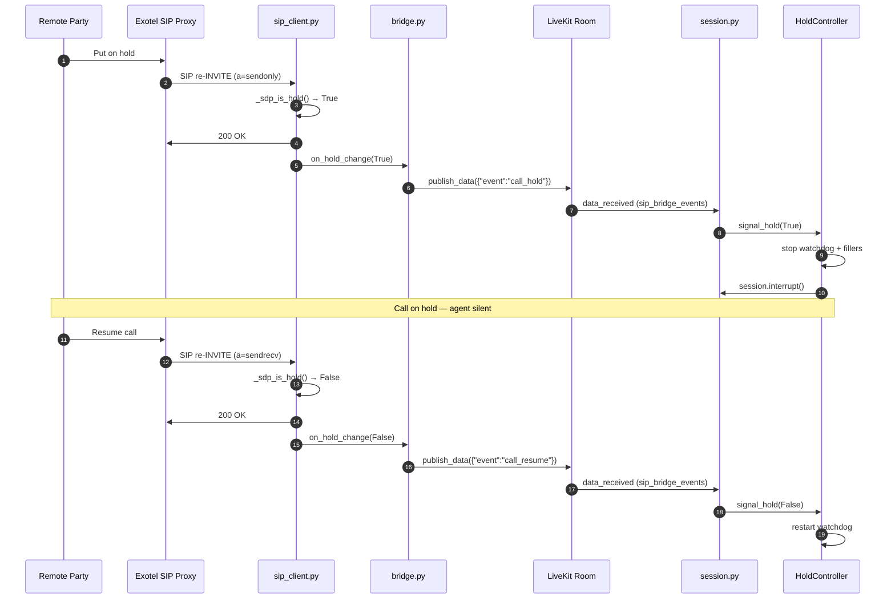
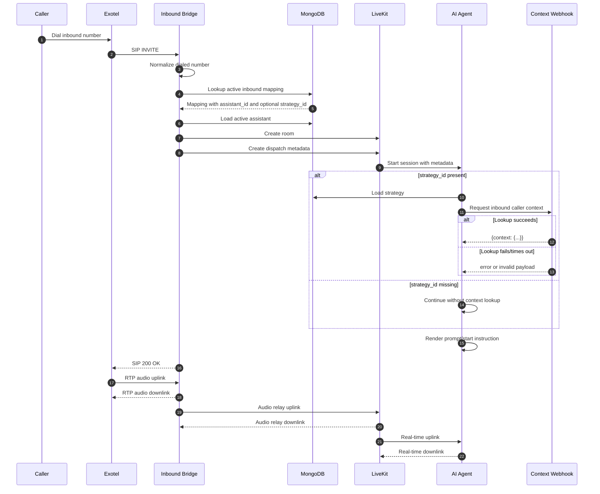

# LiveKit Architecture

## Overview

This page describes how AI agents integrate with web clients, managed SIP providers, and custom SIP bridges.

## API Startup Services

When the FastAPI app starts, it initializes MongoDB and conditionally starts two long-running background services:

- **Exotel inbound SIP listener** — listens for incoming SIP INVITE/BYE from Exotel on boot (controlled by `ENABLE_SIP_LISTENER` env var, default `true`)
- **Outbound call dispatcher** — event-driven loop that drains the outbound call queue (controlled by `ENABLE_DISPATCHER` env var, default `true`)

In **single-container / dev** mode both services run inside the API process. In **production Docker** deployments a dedicated `sip_dispatcher` container runs `sip_dispatcher_run.py`, which owns both services exclusively. The `api` container sets `ENABLE_SIP_LISTENER=false` and `ENABLE_DISPATCHER=false` so it can scale to multiple Gunicorn workers without SIP port conflicts or duplicate dispatchers.

Outbound request acceptance and outbound call execution are fully decoupled. The API enqueues calls and returns immediately; the dispatcher handles pacing and retry independently.

### Two-Server Deployment Roles

For horizontal scaling without Kubernetes, run containers by role:

- **Server A (control plane):** `api` + `sip_dispatcher`
- **Server B (capacity node):** `agent`
- Optional: run extra `agent` on Server A if CPU headroom exists

The project `docker-compose.yml` uses service profiles:

- `control` profile: `api`, `sip_dispatcher`
- `agent` profile: `agent`

Commands:

```bash
# Server A
docker compose --profile control up -d --build

# Server B
docker compose --profile agent up -d --build
```

Critical singleton rule: only one `sip_dispatcher` instance should run across all servers.

## Assistant Runtime Modes

There are two runtime paths for assistant speech generation:

- `pipeline` mode:
  - Input audio -> OpenAI realtime STT + LLM -> external TTS plugin -> output audio
- `realtime` mode:
  - Input audio -> Gemini realtime model (STT + LLM + TTS) -> output audio

Both modes share the same room orchestration, call lifecycle, transcript flow, and tool execution framework.
Both modes also support assistant-first openings when `speaks_first=true`, using `assistant_start_instruction` as the opening response text.

## Web Integration

This flow shows how a web client authenticates, joins LiveKit, and exchanges audio with an AI agent session.


```mermaid
sequenceDiagram
    autonumber
    participant Web as Web Browser
    participant API as API Server
    participant LK as LiveKit Server
    participant Agent as AI Agent Session

    Note over Web, API: Phase 1 - Authentication
    Web->>API: GET /api/get_token?agent=bank
    API-->>Web: Access token (JWT)

    Note over Web, Agent: Phase 2 - Session Setup
    Web->>LK: Connect with JWT
    LK->>Agent: on_participant_joined
    Agent->>LK: Subscribe to audio track

    Note over Agent: Phase 3 - Real-time AI loop
    loop Continuous streaming
        Web->>LK: User voice
        LK->>Agent: Audio frame
        alt pipeline mode
            Agent->>Agent: STT -> text
            Agent->>Agent: LLM -> response intent
            Agent->>Agent: TTS -> audio
        else realtime mode
            Agent->>Agent: Unified realtime model -> speech response
        end
        Agent->>LK: Agent voice
        LK->>Web: Playback
    end
```

## Managed SIP Integration

This is the standard LiveKit SIP participant flow for providers such as Twilio.


```mermaid
graph LR
    User[Phone User] <-->|PSTN| Twilio[Twilio or SIP Trunk]
    Twilio <-->|SIP/RTP| LKSIP[LiveKit SIP Participant]

    subgraph LiveKit Room
        LKSIP <-->|Audio Track| LK[LiveKit Room]
        Agent[AI Agent] <-->|Audio Track| LK
    end

    subgraph AI Processing
        Agent --> STT[Speech-to-Text]
        STT --> LLM[LLM reasoning]
        LLM --> TTS[Text-to-Speech]
        TTS --> Agent
    end
```

## Custom SIP Reach (Exotel)

For Exotel custom SIP reach, a dedicated bridge handles SIP signaling, RTP relay, and LiveKit room connectivity.


```mermaid
graph TD
    subgraph External Telephony
        Exo[Exotel]
    end

    subgraph Custom SIP Bridge
        SIP[SIP Signaling Client]
        RTP[RTP Media Bridge]
        Mixer[Audio Mixer]
        Port[Dynamic Port Pool]
        Bridge[Bridge Orchestrator]
    end

    subgraph AI Core
        LKR[LiveKit Room]
        Agent[AI Agent Worker]
        BG[Background Audio Player]
        HC[HoldController]
    end

    Exo -->|1. SIP INVITE| SIP
    SIP -->|2. Acquire Port| Port
    Port -.->|3. Bind UDP| RTP
    SIP -->|4. SIP 200 OK| Exo
    Exo -.->|Hold: re-INVITE a=sendonly| SIP
    SIP -.->|Resume: re-INVITE a=sendrecv| SIP
    SIP -.->|on_hold_change| Bridge
    Bridge -.->|publish_data call_hold| LKR
    LKR -.->|data_received| Agent
    Agent -.->|signal_hold| HC

    Exo <-->|RTP G711 PCMA/PCMU| RTP
    Agent -->|Voice Track| LKR
    BG -->|Background Track| LKR
    LKR -->|All Audio Tracks| Mixer
    Mixer -->|Mixed PCM| RTP
    RTP -->|User Audio| LKR
    LKR <-->|Audio| Agent
```

### Outbound Exotel Lifecycle

- `POST /call/outbound` validates the request, inserts to `outbound_call_queue`, and returns `202 Accepted` with a `queue_id`. No LiveKit room is created at this point.
- The event-driven dispatcher wakes immediately on enqueue and creates the LiveKit room + starts the SIP bridge when a capacity slot is available.
- SIP setup outcome (`200 OK` / failure / timeout) is resolved out-of-band via `result_signal`; the caller can poll `GET /call/queue/{queue_id}` for status.
- Agent speech and recording are gated by bridge `call_answered` signaling to avoid recording before answer.
- After readiness is confirmed, start-instruction delivery applies to both runtime modes (`pipeline` and `realtime`).
- Terminal status finalization and webhook emission are handled through a single lifecycle path to reduce duplicate or conflicting terminal updates.
- If SIP returns `200 OK` but no RTP ever arrives (`no_rtp_after_answer`), lifecycle final status is treated as `failed`.

## Outbound Queueing and Capacity Control

All outbound calls go through a persistent MongoDB queue before being dispatched to LiveKit. This prevents server overload when users trigger many calls simultaneously.

### Outbound Call Flow


```mermaid
sequenceDiagram
    autonumber
    participant User as API User
    participant API as API Server
    participant DB as MongoDB
    participant Disp as Outbound Dispatcher
    participant LK as LiveKit
    participant SIP as SIP Bridge / Trunk
    participant Agent as AI Agent Worker

    User->>API: POST /call/outbound
    API->>API: Validate assistant + trunk
    API->>DB: Insert OutboundCallQueue (status=pending)
    API-->>User: 202 Accepted + queue_id

    Note over Disp: MongoDB Change Stream fires instantly (cross-container)

    Disp->>DB: COUNT active CallRecords (initiated + answered)
    Disp->>DB: Fetch up to (MAX - active) pending items
    Disp->>DB: Mark items status=dispatching

    loop For each dispatched item
        Disp->>LK: Create room
        Disp->>LK: Create agent dispatch
        Disp->>DB: Insert CallRecord (status=initiated)
        alt Exotel
            Disp->>SIP: run_bridge (async task)
            SIP-->>Disp: result_signal (INVITE resolved)
        else Twilio
            Disp->>LK: create_sip_participant
        end
        Disp->>DB: Mark queue item status=dispatched
        LK->>Agent: Start session
    end

    User->>API: GET /call/queue/{queue_id}
    API-->>User: { status, dispatched_at, ... }
```

### Queue States

| State | Meaning |
| :--- | :--- |
| `pending` | Waiting for a free slot |
| `dispatching` | Slot reserved — room creation in progress |
| `dispatched` | LiveKit room created and SIP bridge started |
| `failed` | All retry attempts exhausted |

### Capacity Model

Capacity is calculated as:

```
available_slots = MAX_CONCURRENT_JOBS(12 default) - active_sessions

active_sessions = COUNT(CallRecord where status IN ["initiated","answered"])
                + _dispatching_count  ← in-memory reservation for mid-dispatch calls
```

The `_dispatching_count` in-memory counter bridges the gap between "room creation started" and "CallRecord written to MongoDB" (~100ms window), preventing double-dispatch under any timing.

Inbound calls reserve from the same pool: the inbound bridge calls `try_reserve_slot()` after assistant resolution and rejects with SIP `486 Busy Here` if the cap is reached. The reservation is released either after the inbound `CallRecord` is persisted (so subsequent counts come from the DB) or on any failure between reservation and persistence.

### Crash Recovery

Two mechanisms keep the slot pool consistent across crashes:

1. **Server crash → startup cleanup.** On boot, `_fail_all_active_calls()` marks every `CallRecord` in `initiated`/`answered` (inbound and outbound) as `failed` with reason `"Marked failed on server startup — agent process no longer running"`. The in-memory `_dispatching_count` resets to `0` naturally with the new process.
2. **Worker crash mid-dispatch → per-tick recovery.** `_recover_stuck_dispatching()` runs on every dispatcher wake and resets outbound queue items left in `dispatching` longer than `STUCK_DISPATCHING_MINUTES` (5 min) back to `pending`, or to `failed` once `MAX_RETRIES` is reached. Inbound has no queue item; its slot is freed by the in-process try/except path or by the startup cleanup above.

On the agent worker side, `load_threshold=0.65` provides a secondary CPU-based guard: the worker stops accepting new jobs when average CPU exceeds 65%, protecting against inbound call bursts that bypass the queue.

### Retry Behaviour

Failed dispatches (SIP error, LiveKit API error, trunk inactive) are retried up to `3` times automatically. The item is reset to `pending` and re-queued on the next dispatcher wake. After 3 failures, status becomes `failed` with the last error stored in `last_error`.

### Event-Driven Design

The dispatcher uses MongoDB Change Streams for cross-container, zero-latency notification:

```
New call enqueued (any container)
    → Change Stream on outbound_call_queue fires instantly
    → dispatcher wakes, processes queue immediately

Call finishes (agent container)
    → Change Stream on call_records (terminal status) fires
    → dispatcher wakes, chains next pending call immediately

No calls for hours
    → dispatcher sleeps (0 CPU)
    → 30s fallback poll as safety net (catches missed events during stream restart)
    → returns to sleep if queue empty

Server restart with pending items in MongoDB
    → startup recovery: _process_pending() runs on boot
    → all pending calls from before restart are dispatched
```

Both Change Stream watchers auto-restart on error with 5s backoff. No new infrastructure needed — MongoDB Atlas always runs replica sets.

### Module Layout

```
src/services/outbound_dispatcher/
├── __init__.py      # re-exports outbound_dispatcher_loop
└── dispatcher.py    # constants, capacity helpers, Change Stream watchers, dispatch logic, loop
```

Consumers import from the package root:

```python
from src.services.outbound_dispatcher import outbound_dispatcher_loop # sip_dispatcher_run.py
```

### Hold & Resume Detection

When a party puts the call on hold, the platform detects it and suppresses all agent activity to prevent the agent from responding to hold music.

**Exotel (SIP re-INVITE — instant):**

1. Remote party sends a SIP re-INVITE with `a=sendonly` or `a=inactive` in the SDP body.
2. `sip_client.py` parses the SDP, detects the hold attribute, sends `200 OK`, and fires the `on_hold_change` callback.
3. `bridge.py` publishes a data packet (`{"event": "call_hold"}` or `{"event": "call_resume"}`) to the LiveKit room on topic `sip_bridge_events`.
4. `session.py` receives the event and activates `HoldController`, which:
   - Stops `SilenceWatchdogController` (no reprompts during hold)
   - Stops `FillerController` (no backchannel fillers during hold)
   - Calls `session.interrupt()` to kill any in-progress agent speech
5. On resume, the silence watchdog is restarted and normal agent behavior resumes.


```mermaid
sequenceDiagram
    autonumber
    participant Remote as Remote Party
    participant Exotel as Exotel SIP Proxy
    participant SIP as sip_client.py
    participant Bridge as bridge.py
    participant LK as LiveKit Room
    participant Session as session.py
    participant HC as HoldController

    Remote->>Exotel: Put on hold
    Exotel->>SIP: SIP re-INVITE (a=sendonly)
    SIP->>SIP: _sdp_is_hold() → True
    SIP->>Exotel: 200 OK
    SIP->>Bridge: on_hold_change(True)
    Bridge->>LK: publish_data({"event":"call_hold"})
    LK->>Session: data_received (sip_bridge_events)
    Session->>HC: signal_hold(True)
    HC->>HC: stop watchdog + fillers
    HC->>Session: session.interrupt()

    Note over Remote,HC: Call on hold — agent silent

    Remote->>Exotel: Resume call
    Exotel->>SIP: SIP re-INVITE (a=sendrecv)
    SIP->>SIP: _sdp_is_hold() → False
    SIP->>Exotel: 200 OK
    SIP->>Bridge: on_hold_change(False)
    Bridge->>LK: publish_data({"event":"call_resume"})
    LK->>Session: data_received (sip_bridge_events)
    Session->>HC: signal_hold(False)
    HC->>HC: restart watchdog
```

**Suppression during hold:**

Three event handlers check `hold_controller.is_on_hold` and suppress activity:

| Event | Behavior during hold |
| :--- | :--- |
| `conversation_item_added` | Returns early; interrupts assistant speech; no transcript saved |
| `user_state_changed` | Returns early; no filler/silence watchdog triggers |
| `agent_state_changed` | Calls `session.interrupt()` if agent starts speaking |

!!! note "Provider coverage"
    Hold detection via SIP re-INVITE works for **Exotel** calls only. Twilio and other providers do not currently have hold detection — the agent may respond to hold music if the call is placed on hold for extended periods.

## Provider Support Matrix

| Provider | Inbound | Outbound | Implementation path |
| :--- | :--- | :--- | :--- |
| `exotel` | Supported | Supported | Custom SIP bridge (`custom_sip_reach`) |
| `twilio` | Not implemented yet | Supported | LiveKit managed SIP participant |

!!! note "Current support status"

    Twilio inbound is planned but currently unsupported.

## Inbound Routing (Exotel)

Inbound Exotel calls do not use managed LiveKit SIP participants. The bridge receives `INVITE`, normalizes the number, resolves mapping in MongoDB, creates a room, and dispatches the mapped assistant.

### Inbound Components

- `/inbound` routes manage `inbound_sip` mappings.
- `/inbound_context_strategy` routes manage reusable caller-context lookup strategies.
- MongoDB stores normalized inbound numbers, provider config, and `assistant_id` mappings.
- Inbound mappings can optionally store `inbound_context_strategy_id`.
- Inbound bridge handles SIP signaling, RTP relay, and room setup.
- LiveKit dispatch metadata includes inbound and caller numbers plus mapping/strategy identifiers.
- Agent worker can optionally resolve inbound context via strategy webhook before prompt rendering.

### Inbound Call Sequence


```mermaid
sequenceDiagram
    autonumber
    participant Caller as Caller
    participant Exotel as Exotel
    participant Bridge as Inbound Bridge
    participant DB as MongoDB
    participant LK as LiveKit
    participant Agent as AI Agent
    participant Webhook as Context Webhook

    Caller->>Exotel: Dial inbound number
    Exotel->>Bridge: SIP INVITE
    Bridge->>Bridge: Normalize dialed number
    Bridge->>DB: Lookup active inbound mapping
    DB-->>Bridge: Mapping with assistant_id and optional strategy_id
    Bridge->>DB: Load active assistant
    Bridge->>LK: Create room
    Bridge->>LK: Create dispatch metadata
    LK->>Agent: Start session with metadata
    alt strategy_id present
        Agent->>DB: Load strategy
        Agent->>Webhook: Request inbound caller context
        alt Lookup succeeds
            Webhook-->>Agent: {context: {...}}
        else Lookup fails/times out
            Webhook-->>Agent: error or invalid payload
        end
    else strategy_id missing
        Agent->>Agent: Continue without context lookup
    end
    Agent->>Agent: Render prompt/start instruction
    Bridge-->>Exotel: SIP 200 OK
    Exotel->>Bridge: RTP audio uplink
    Bridge-->>Exotel: RTP audio downlink
    Bridge->>LK: Audio relay uplink
    LK-->>Bridge: Audio relay downlink
    LK->>Agent: Real-time uplink
    Agent-->>LK: Real-time downlink
```

### Inbound Failure Paths

- No active mapping or detached mapping returns `480 Temporarily Unavailable`.
- Missing or inactive assistant returns `480 Temporarily Unavailable`.
- Missing strategy attachment does not fail the call; context lookup is skipped.
- Strategy lookup failures (timeout/HTTP/payload issues) do not fail the call; worker falls back to default prompt behavior.
- Room creation or dispatch failure returns `500 Internal Server Error`.
- Call teardown is handled by SIP `BYE`, LiveKit disconnect, or RTP timeout.
