# Livekit Architecture:

This document provides a visual-first breakdown of how AI agents integrate with Web, standard SIP (Twilio), and custom SIP (Exotel) systems.

---

## 1. Web Integration: Full AI Pipeline

This flow describes how a web client connects and how audio data flows through the AI processing stack.

### 🔄 Data Flow Sequence

```mermaid
sequenceDiagram
    autonumber
    participant Web as 🌐 Web Browser
    participant API as 🔑 [API Server]
    participant LK as ☁️ [LiveKit Server]
    participant Agent as 🤖 [AI Agent Session]

    Note over Web, API: Phase 1: Secure Authentication
    Web->>API: GET /api/getToken?agent=bank
    Note right of API: server.py validates & generates JWT
    API-->>Web: Return Access Token (JWT)

    Note over Web, Agent: Phase 2: Session Establishment
    Web->>LK: Connect with JWT
    LK->>Agent: OnParticipantJoined
    Agent->>LK: Subscribe to Web Audio Track

    Note over Agent: Phase 3: The AI Processing Loop
    loop Continuous Streaming
        Web->>LK: User Voice (Opus)
        LK->>Agent: Audio Frame
        Agent->>Agent: 🎙️ STT (Deepgram/Whisper) ⮕ Text
        Agent->>Agent: 🧠 LLM (OpenAI/Groq) ⮕ Logic
        Agent->>Agent: 🔊 TTS (Cartesia/Sarvam) ⮕ Audio
        Agent->>LK: Agent Voice (Opus)
        LK->>Web: Hello! (Low-Latency Playback)
    end
```

---

## 2. Standard SIP Integration (Twilio/LiveKit SIP)

Native integration for phone calls using LiveKit's built-in SIP participants.

### 📞 Signaling & Media Flow

```mermaid
graph LR
    User[📱 Phone User] <-->|PSTN| Twilio[Twilio/Trunk]
    Twilio <-->|SIP/RTP| LKSIP[LiveKit SIP Participant]
    
    subgraph "LiveKit Media Room"
        LKSIP <-->|Audio Track| LK[LiveKit Room]
        Agent[🤖 AI Agent] <-->|Audio Track| LK
    end

    subgraph "Internal AI Brain"
        Agent --> STT[Speech to Text]
        STT --> LLM[Context Analysis]
        LLM --> TTS[Voice Synthesis]
        TTS --> Agent
    end

    style LKSIP fill:#f5f5f5,stroke:#333
    style Agent fill:#e1f5fe,stroke:#01579b
```

---

## 3. Custom SIP Reach (Exotel Integration)

A high-performance bridge for providers like Exotel that requires custom RTP/RTC transcoding.

### 🌉 Bridge Architecture

```mermaid
graph TD
    subgraph "External Telephony"
        Exo[📞 Exotel Infrastructure]
    end

    subgraph "Custom SIP Bridge (custom_sip_reach)"
        SIP[SIP Signaling Client]
        RTP[RTP Media Bridge]
        Port[Dynamic Port Pool]
    end

    subgraph "AI Core Ecosystem"
        LKR[LiveKit Room]
        Agent[🤖 AI Agent Worker]
    end

    %% Connection Logic
    Exo -->|1. SIP INVITE| SIP
    SIP -->|2. Acquire Port| Port
    Port -.->|3. Bind UDP| RTP
    SIP -->|4. 200 OK| Exo

    %% Media Path
    Exo <-->|RTP G711 PCMU| RTP
    RTP <-->|WebRTC Track Opus| LKR
    LKR <-->|Audio| Agent

    %% Styling
    style RTP fill:#f9f,stroke:#333,stroke-width:2px
    style Agent fill:#bbf,stroke:#333,stroke-width:2px
    style SIP fill:#fff4dd,stroke:#d4a017

```

