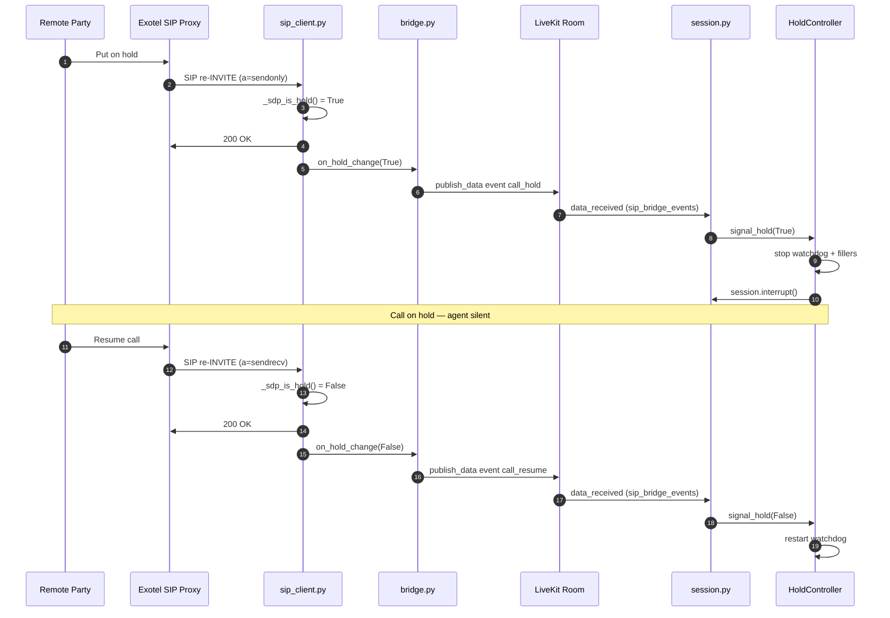
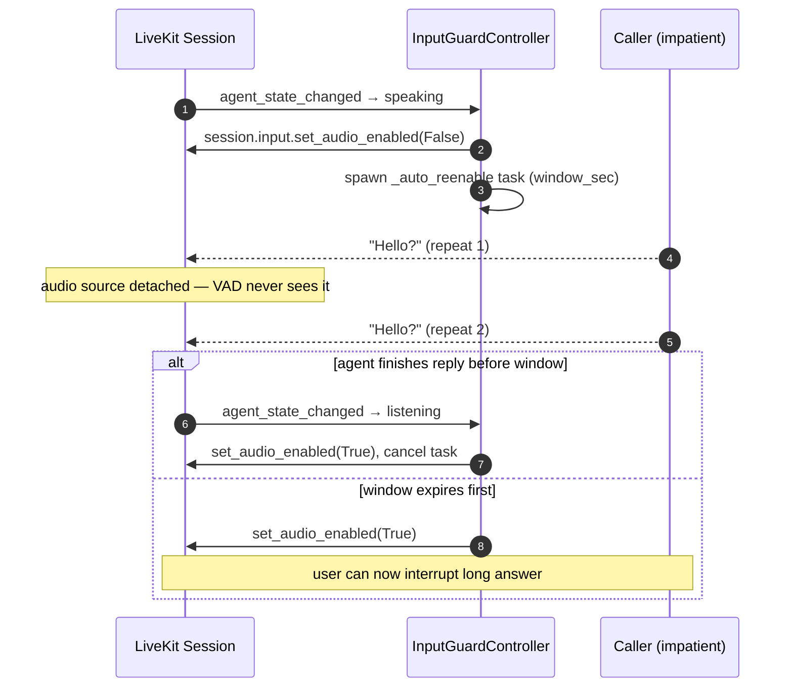

# Audio Pipeline

How phone audio is decoded, filtered, resampled, and pushed to the AI agent — and how agent audio is returned to the PSTN cleanly. Plus the hold/resume detector and the per-utterance input guard that prevent the "Hello? Hello?" fragment loop.

## Inbound RTP Audio Processing

Phone audio from PSTN arrives as **G.711 at 8 kHz**, narrow-band (300–3400 Hz). Feeding it raw to the STT model caused hallucinations — random scripts (Urdu, Hebrew) appearing in transcripts instead of the actual speech. The root causes were:

| Problem | Effect on STT |
|---------|---------------|
| `audioop.ratecv` linear interpolation (8 kHz → 48 kHz) | Creates aliasing harmonics every 8 kHz. STT sees a spectrally wrong signal and hallucinates. |
| Fixed 3× gain applied before resampling | Clips loud phone speech → heavy distortion → hallucination |
| No frequency filtering | DC offset + sub-bass hum from phone acoustics reaches STT as if it were speech |
| Bandpass upper cutoff at 3400 Hz (prior approach) | Redundant — `resample_poly` already low-passes at 4 kHz. The 4th-order IIR phase distortion near cutoffs made voices sound hollow/metallic. |
| `np.clip` hard-clipping after gain | Chops sample peaks → harmonic distortion → STT confused on loud speakers |
| Non-G.711 RTP payloads (PT=101 DTMF / RFC 2833) decoded blindly | Garbage PCM fed into the LiveKit pipeline → STT pollution |

The inbound decode pipeline in `rtp_bridge.py::_recv_loop` + `_decode_rtp_payload` now processes each G.711 packet as follows:

```
RTP packet
    ↓  parse seq number (data[2..3])
    ↓  gap == 0 → drop duplicate
    ↓  gap negative (high bit set after wrap) → drop reordered packet
    ↓  1 < gap ≤ SIP_PLC_MAX_GAP → replay _last_pcm48 × 0.7^i for each missing
       packet (Packet Loss Concealment)
    ↓  PT == 13 (RFC 3389 Comfort Noise) → _synth_cn_48k → push, continue
    ↓  early-return if payload type is not PCMA (8) or PCMU (0)
    ↓  audioop.alaw2lin / ulaw2lin
raw PCM int16 at 8 kHz
    ↓  Butterworth high-pass (80 Hz, order 2, stateful sosfilt zi)
DC offset and sub-bass hum removed; full speech band preserved
    ↓  one-pole RMS AGC (target SIP_AGC_TARGET_RMS, cap SIP_AGC_MAX_GAIN,
       attack α=0.5 / release α=0.04, envelope persisted as _agc_env)
quiet callers boosted toward target; loud callers attenuated below 1.0
    ↓  scipy.signal.resample_poly(samples, up=6, down=1)
PCM at 48 kHz — polyphase FIR handles low-pass anti-aliasing at 4 kHz
    ↓  per-sample np.tanh ONLY where |x| > 0.9 (peak-only soft limiter)
peaks rounded; body of speech stays linear, no constant harmonic distortion
    ↓
final PCM int16 at 48 kHz → _push_pcm48 → cache as _last_pcm48 →
LiveKit AudioSource → STT
```

Legacy gain mode (`SIP_LEGACY_GAIN=1`) skips AGC + peak-only limiter and restores the prior `np.tanh(samples × 1.5)` blanket clip, kept for one release as an instant rollback knob.

**Why 80 Hz high-pass only (not bandpass)?** Male voice fundamental frequency is 80–150 Hz. The original 300 Hz lower cutoff was silently stripping the root pitch of male voices, leaving only harmonics — audible as a hollow "telephone" sound. The 3400 Hz upper cutoff is redundant because `resample_poly`'s internal Kaiser-windowed FIR already band-limits at 4 kHz (Nyquist of 8 kHz input). A 4th-order Butterworth bandpass also introduces non-linear group delay at both cutoff edges, smearing consonants in time. The 2nd-order high-pass at 80 Hz has minimal phase distortion and only removes content that is never speech.

**Why stateful filter (`sosfilt zi`)?** The IIR filter carries its state (`zi`) across consecutive RTP packets. Without this, the filter restarts with zero initial conditions on each 20ms packet, producing a transient click at every packet boundary — audible as 50 Hz buzz on the STT side.

**Why `resample_poly` over `audioop.ratecv`?** `ratecv` uses linear interpolation, which for a 6:1 upsample creates images of the 8 kHz signal at multiples of 8 kHz throughout the 48 kHz spectrum. `resample_poly` uses a polyphase Kaiser-windowed FIR to reconstruct the correct band-limited signal before upsampling — the output looks like true 48 kHz narrowband audio.

**Why `tanh` soft-clip instead of `np.clip`?** Hard clipping at ±1.0 chops peaks into square-wave-like edges, generating high-frequency harmonics that STT models interpret as fricative consonants. `tanh` rounds peaks smoothly, behaving as an analog-style soft limiter: quiet speech (under ~0.5) passes near-linearly, loud peaks compress without harmonic spray.

**Why peak-only `tanh` instead of blanket `tanh × 1.5`?** The earlier blanket form applied `tanh` to every sample, which means even body-of-speech samples (where `|x| < 0.5`) picked up small but constant 2nd/3rd-harmonic distortion proportional to the curve's non-linearity. Sarvam Saras v3 and OpenAI `far_field` both transcribed loud callers fine but mis-segmented quiet callers — the static curve was the variable. Splitting the job into a level-tracking AGC (linear scaling only, spectrum preserved) plus a peak-only `tanh` keeps the body of speech mathematically linear and confines non-linearity to the rare samples that would otherwise clip.

**Why one-pole RMS AGC?** Phone caller loudness varies ~20 dB caller-to-caller (handset distance, mic gain, signal level on the trunk). A fixed 1.5× gain over-amplified loud callers (peaks clipped by `tanh`, body distorted by the curve) and still left quiet callers below Sarvam's effective threshold. The one-pole envelope follower with α=0.5 attack / α=0.04 release tracks each caller's RMS over ~30 ms / ~500 ms windows and scales toward `SIP_AGC_TARGET_RMS` (default 0.15), capped at `SIP_AGC_MAX_GAIN` (default 6×). Quiet callers ramp up smoothly without pumping; loud callers get attenuated below 1.0 (no floor on gain) so the peak limiter rarely needs to fire. AGC is pure linear scaling — the spectral signature `far_field` expects is preserved.

**Why Packet Loss Concealment?** Exotel's network occasionally drops a single 20 ms RTP packet. The prior code silently consumed the next packet, leaving a hard 20 ms hole that STT often hallucinated through. PLC replays the last successfully decoded 48 kHz frame with `0.7^i` energy decay across each missing slot — up to `SIP_PLC_MAX_GAP` (default 16, ≈ 320 ms). On a clean line PLC never fires (zero overhead). On a lossy line it converts clicks/dropouts into a brief, fading echo of the previous syllable, which both human listeners and STT models tolerate better than dead air. RFC 3551 §4.2 describes this as the reference behavior for PCM payloads. Reordered packets (rare on the Exotel path) are dropped rather than buffered, because a real jitter buffer would add 40–60 ms of mouth-to-ear latency for a problem that does not measurably occur.

**Why handle Comfort Noise (PT=13)?** Per RFC 3389, peers may stop sending audio during silence and instead send a single CN packet whose payload byte 0 is the noise level in `-dBov`. The earlier code dropped non-G.711 payload types blindly, so CN packets produced a hard cliff-edge silence in the middle of natural pauses. The new path generates 20 ms of matched-level white noise at 48 kHz instead, keeping `far_field`'s ambience anchor intact and preventing the STT model from interpreting the cliff edge as end-of-turn. Whether Exotel actually sends CN frames varies by trunk configuration; the `CN=` counter in the bridge's `stop()` log answers that empirically per call.

**Why no noise suppression in `rtp_bridge.py`?** An earlier experiment ran `webrtc_noise_gain.AudioProcessor` (Google's WebRTC NS) on inbound audio. It was removed because:

1. OpenAI Realtime's `gpt-realtime` model accepts an `input_audio_noise_reduction` setting that runs NS **inside the model**, trained on raw G.711 phone audio.
2. Pre-processing with WebRTC NS shifted the spectral signature OpenAI's `far_field` mode expects → STT accuracy degraded.
3. With AGC enabled, WebRTC AGC amplified the residual echo of the agent's own voice back into the room, triggering OpenAI's VAD as a false barge-in → the agent kept cutting itself off mid-sentence.

The current design lets the inbound bridge do only minimal, spectrum-preserving cleanup (DC removal, gain, soft-clip, resampling) and delegates all noise-reduction policy to OpenAI Realtime (see *STT Noise-Reduction Branching* below).

## Outbound RTP Audio Processing

Agent / TTS audio leaves LiveKit at 48 kHz and must be encoded to G.711 (8 kHz) for the PSTN. The outbound pipeline in `rtp_bridge.py::_send_frame`:

```
LiveKit AudioFrame (int16 PCM @ 48 kHz)
    ↓  np.tanh(samples × 0.7)
TTS soft-limited so loud peaks don't clip on the narrow-band SIP path
    ↓  scipy.signal.resample_poly(samples, up=1, down=6)
48 kHz → 8 kHz with built-in anti-aliasing FIR (no metallic artifacts)
    ↓  accumulate to 20 ms (320 bytes) per ptime=20 SDP
    ↓  audioop.lin2alaw / lin2ulaw
G.711 PCMA/PCMU payload (160 bytes)
    ↓  prepend RTP header, sendto(remote_addr)
RTP packet → Exotel → mobile phone
```

**Why `tanh × 0.7` on outbound?** TTS engines (OpenAI, ElevenLabs, Sarvam) normalise output close to 0 dBFS. Pumping that into G.711 causes companding-curve distortion at the loud edges and excessive perceived loudness vs. a normal phone call. The 0.7 scale leaves ~3 dB of headroom; `tanh` softly rounds anything that still approaches the rails.

**Why `resample_poly` instead of `audioop.ratecv` (downsample)?** Same reason as inbound: linear interpolation has no anti-aliasing — any TTS energy above 4 kHz folds back into the audible band as a metallic hiss on the caller's phone. Polyphase FIR low-passes at 4 kHz before decimation, so the caller hears a clean band-limited voice instead of an aliased one.

## STT Noise-Reduction Branching

In `session.py`, the OpenAI Realtime LLM is configured with `input_audio_noise_reduction` chosen based on the call origin:

| Call type | `input_audio_noise_reduction` | Rationale |
|-----------|-------------------------------|-----------|
| Web (`call_type == "web"`) | `near_field` | Browser mic is close to the speaker; default WebRTC-style NS profile applies. |
| Phone (Exotel SIP, all non-web `call_type`) | `far_field` | OpenAI's far-field model is trained on lossy PSTN / G.711 audio. Using `near_field` on phone calls degraded transcription. |

The same branching also prepends a short note to the STT prompt on phone calls ("Audio is from a live telephone call (G.711 narrowband, ~8 kHz, lossy). Expect static, line hum, codec artifacts...") so the transcription model is aware of the channel and refuses to fabricate words on unintelligible audio.

**Dependencies:** `scipy>=1.13.0`, `numpy>=1.26.0`. (`webrtc_noise_gain` is no longer used by the inbound pipeline; remove if not referenced elsewhere.)

**Inbound shaping env knobs** (all defined in `src/services/exotel/custom_sip_reach/config.py`):

| Variable | Default | Effect |
|---|---|---|
| `SIP_AGC_TARGET_RMS` | `0.15` | RMS the AGC aims the envelope at. Higher → louder STT-side audio. |
| `SIP_AGC_MAX_GAIN` | `6.0` | Upper bound on the gain multiplier so silence isn't amplified into noise. |
| `SIP_PLC_MAX_GAP` | `16` | Maximum sequential RTP packets the PLC will conceal (~320 ms). |
| `SIP_LEGACY_GAIN` | `0` | Set to `1` to bypass AGC + peak limiter and restore the prior `tanh × 1.5` path. One-release rollback escape hatch. |

**Latency cost.** Net per-packet overhead vs. the prior pipeline is ≈ zero — AGC adds ~15 µs (sqrt over 160 samples), peak-only `tanh` saves ~30 µs vs. blanket `tanh` over 960 samples, and PLC only runs on actual loss. Total added work is <0.1 % of the 20 ms packet interval. No new buffering, no new awaits, no jitter buffer — mouth-to-ear latency is unchanged.

**Bridge stop-log additions.** `RTPMediaBridge.stop()` now appends `PLC=N CN=N agc_env=…` to the existing `RX=N TX=N` line. `PLC=0 CN=0` on a clean call confirms both new branches were inert; non-zero values quantify network loss and CN frequency seen by the bridge.

## Hold & Resume Detection

When a party puts the call on hold, the platform detects it and suppresses all agent activity to prevent the agent from responding to hold music.

**Exotel (SIP re-INVITE — instant):**

1. Remote party sends a SIP re-INVITE with `a=sendonly` or `a=inactive` in the SDP body.
2. `sip_client.py` parses the SDP, detects the hold attribute, sends `200 OK`, and fires the `on_hold_change` callback.
3. `bridge.py` publishes a data packet (`{"event": "call_hold"}` or `{"event": "call_resume"}`) to the LiveKit room on topic `sip_bridge_events`.
4. `session.py` receives the event and activates `HoldController`, which:
   - Stops `SilenceWatchdogController` (no reprompts during hold)
   - Stops `FillerController` (no backchannel fillers during hold)
   - Calls `session.interrupt()` to kill any in-progress agent speech
5. On resume, the silence watchdog is restarted and normal agent behavior resumes.



**Suppression during hold:**

Three event handlers check `hold_controller.is_on_hold` and suppress activity:

| Event | Behavior during hold |
| :--- | :--- |
| `conversation_item_added` | Returns early; interrupts assistant speech; no transcript saved |
| `user_state_changed` | Returns early; no filler/silence watchdog triggers |
| `agent_state_changed` | Calls `session.interrupt()` if agent starts speaking |

!!! note "Provider coverage"
    Hold detection via SIP re-INVITE works for **Exotel** calls only. Twilio and other providers do not currently have hold detection — the agent may respond to hold music if the call is placed on hold for extended periods.

## Per-Utterance Input Guard

Phone callers frequently repeat themselves while the agent is producing its reply ("Hello… Hello?"). Each repeat is a legitimate ≥0.9 s word, so the standard `interruption.min_duration` gate cannot filter it — the framework correctly classifies it as a barge-in, the agent fragments its current sentence, the LLM generates an apology, and the cycle repeats. Observed in production as the "Sorry, I'm here / Yes, I'm…" loop.

`InputGuardController` (`src/core/agents/voice_features.py`) closes this loop by blanket-muting user audio at the source for the first N seconds of every agent utterance. Implementation uses the official LiveKit Agents API `session.input.set_audio_enabled(False/True)` — detaches the audio source from the VAD + STT pipeline without muting the caller's actual microphone.

**Lifecycle (per agent reply):**

| Event | Action |
|---|---|
| Agent state → `"speaking"` | `set_audio_enabled(False)` + schedule re-enable task (window = `input_guard_window_sec`, default 3.0 s) |
| Agent state leaves `"speaking"` before window expires | Cancel task, re-enable immediately (don't make user wait when agent finished early) |
| Window expires while still speaking | Re-enable anyway — user can interrupt long answers after the dead-time |
| Call teardown (`_flush_and_end_call`) | `aclose()` cancels task + force-enables audio |



**Skipped in realtime mode.** Constructor guard at `session.py`:

```python
input_guard = None if is_realtime else InputGuardController(
    session=session,
    logger=logger,
    window_sec=getattr(interaction_config, "input_guard_window_sec", 3.0),
)
```

Gemini full-realtime (`assistant_llm_mode="realtime"`, `provider="gemini"`) owns its own audio pipeline + internal VAD; detaching the input source would cut the audio feed the model relies on. Pipeline mode (OpenAI half-cascade + external TTS) is the only path where the fragment loop reproduces, so the guard is scoped accordingly. The field `input_guard_window_sec` is read with `getattr(..., 3.0)` so per-assistant tuning becomes possible the moment the field is added to `assistant_interaction_config` — no code change required.

**Interaction with the first-utterance VAD disable.** The existing greeting path (`session.py` lines 636–688) sets `llm._opts.turn_detection = None` for the full duration of `session.generate_reply()` when `allow_interruptions=False`. That VAD-level block fully covers the greeting end-to-end. `InputGuardController` *also* fires on the greeting (3 s source mute on top), but its window is redundant during the greeting because the VAD is already off. Subsequent replies, where the greeting code does not run, are the ones the guard actually protects.

**Trade-off.** Users cannot interrupt the agent in the first 3 s of any reply. Acceptable for phone UX: human callers rarely interrupt within sub-second of the agent starting to speak, and short replies (e.g., "Sure, one moment.") typically end before the window expires, at which point `on_speaking_end` re-enables audio immediately.
