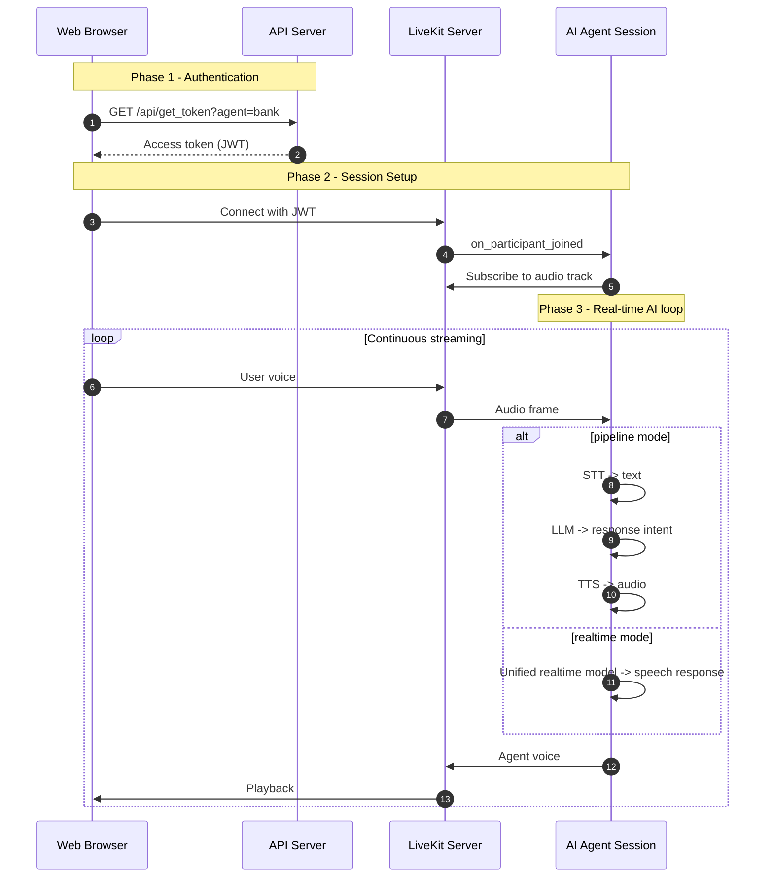
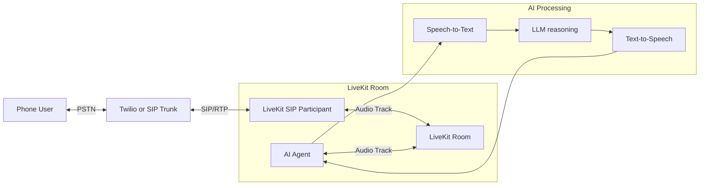
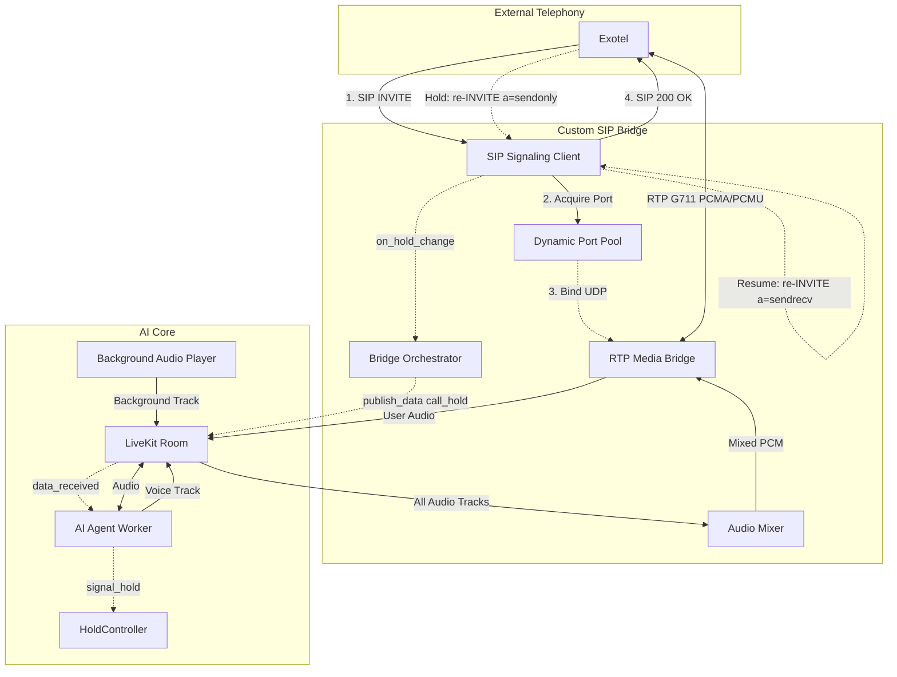
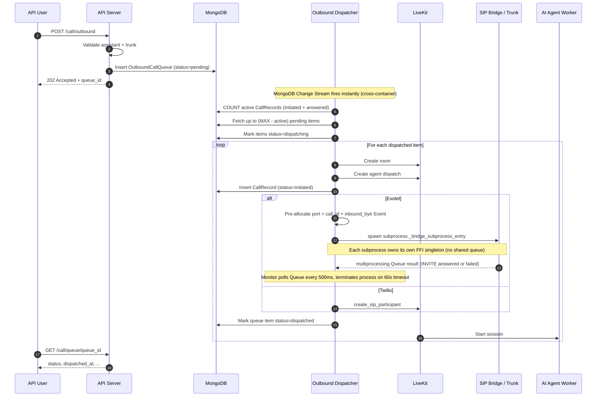
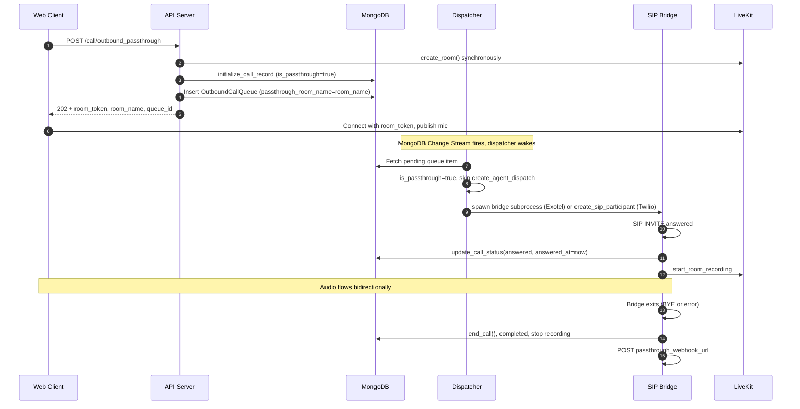

# Call Flows & Queueing

How web calls connect, how managed-SIP (Twilio) and custom-SIP (Exotel) calls bridge, how the outbound queue paces dispatch, and how passthrough reuses the same infrastructure without an AI agent.

## Web Integration

This flow shows how a web client authenticates, joins LiveKit, and exchanges audio with an AI agent session.



## Managed SIP Integration

This is the standard LiveKit SIP participant flow for providers such as Twilio.



## Custom SIP Reach (Exotel)

For Exotel custom SIP reach, a dedicated bridge handles SIP signaling, RTP relay, and LiveKit room connectivity.

### Bridge Concurrency Model

#### v1 — Thread-per-bridge (historical)

Each concurrent call ran in its own OS thread with a dedicated `asyncio.run()` event loop. This isolated asyncio scheduling across calls but did **not** isolate the native audio queue.

The LiveKit Python SDK uses a process-wide Rust FFI singleton (`livekit-ffi`) with a single internal frame queue. All `rtc.AudioStream` objects in all threads competed for the same native queue. Under load (>5–8 concurrent calls), the queue saturated, causing:

- `native audio stream queue overflow; dropped N queued frames` warnings
- `signal client closed: "ping timeout"` reconnect cycles
- `signal_event taking too much time` stalls
- `Bridge task cancelled after timeout` / `TX=0` on outbound calls

```
FastAPI process (single PID)
├── Thread: bridge-out-A  → rtc.AudioStream ──┐
├── Thread: bridge-out-B  → rtc.AudioStream ──┤── shared FFI queue ← OVERFLOW at scale
└── Thread: bridge-out-C  → rtc.AudioStream ──┘
```

#### v2 — Process-per-bridge (current)

Each outbound bridge runs in its own **OS process** spawned with `multiprocessing.get_context("spawn")`. Each process loads its own copy of the Rust FFI shared library — a completely separate native queue with no contention.

```
FastAPI process (PID 1234)
├── Process: bridge-out-A (PID 1235) → rtc.AudioStream → own FFI queue ✓
├── Process: bridge-out-B (PID 1236) → rtc.AudioStream → own FFI queue ✓
└── Process: bridge-out-C (PID 1237) → rtc.AudioStream → own FFI queue ✓
```

**Memory profile**: `spawn` starts a fresh Python interpreter per process (~30–50 MB new pages each). At 100 concurrent outbound calls, total bridge memory is ~3–5 GB. This is a known trade-off vs. the thread model's near-zero overhead.

**Why `spawn` not `fork`**: forking from inside an asyncio event loop is unsafe (inherited locks, stale loop state). `spawn` starts a clean interpreter with no inherited asyncio state. All arguments passed to the subprocess must be picklable (`str`, `dict`, `multiprocessing.Queue`, `multiprocessing.synchronize.Event` all are).

**Inbound bridges** still use `threading.Thread` (lower concurrent volume; typically 1–5 simultaneous inbound calls). The same FFI pressure does not arise at that scale.



### Outbound Exotel Lifecycle

- `POST /call/outbound` validates the request, inserts to `outbound_call_queue`, and returns `202 Accepted` with a `queue_id`. No LiveKit room is created at this point.
- The event-driven dispatcher wakes immediately on enqueue and creates the LiveKit room + starts the SIP bridge when a capacity slot is available.
- Before spawning the bridge subprocess, the dispatcher pre-allocates three resources in the parent process:
    - **RTP port** — acquired from `PortPool`; subprocess uses the number directly; parent monitor releases it on exit.
    - **`call_id`** — UUID pre-generated so the parent can register the inbound BYE event before the subprocess starts.
    - **`inbound_bye` event** — `multiprocessing.synchronize.Event` (OS shared memory); registered with the inbound SIP listener in the parent; subprocess polls it to detect BYE arriving on a new TCP connection.
- SIP setup outcome (`200 OK` / failure / timeout) is resolved out-of-band via a `multiprocessing.Queue` written by the bridge subprocess and polled every 500 ms by the dispatcher's monitor coroutine; the caller can poll `GET /call/queue/{queue_id}` for status.

    !!! note "Historical: thread-based IPC"
        In v1 (thread-per-bridge), a `concurrent.futures.Future` was shared in-memory between the bridge thread and the monitor task. The monitor used `asyncio.wrap_future()` to await it. This worked because threads share the same process address space. With subprocess isolation (v2), `Future` cannot cross process boundaries; `multiprocessing.Queue` is used instead.

- On SIP setup timeout, the dispatcher calls `bridge_process.terminate()` (SIGTERM). The parent monitor's `finally` block always releases the pre-allocated port and unregisters the `call_id` regardless of how the subprocess exits.
- Agent speech and recording are gated by bridge `call_answered` signaling to avoid recording before answer.
- After readiness is confirmed, start-instruction delivery applies to both runtime modes (`pipeline` and `realtime`).
- Terminal status finalization and webhook emission are handled through a single lifecycle path to reduce duplicate or conflicting terminal updates.
- If SIP returns `200 OK` but no RTP ever arrives (`no_rtp_after_answer`), lifecycle final status is treated as `failed`.

## Outbound Queueing and Capacity Control

All outbound calls go through a persistent MongoDB queue before being dispatched to LiveKit. This prevents server overload when users trigger many calls simultaneously.

### Outbound Call Flow



### Queue States

| State | Meaning |
| :--- | :--- |
| `pending` | Waiting for a free slot |
| `dispatching` | Slot reserved — room creation in progress |
| `dispatched` | LiveKit room created and SIP bridge started |
| `failed` | All retry attempts exhausted |

### Capacity Model

Capacity is calculated as:

```
available_slots = MAX_CONCURRENT_JOBS(12 default) - active_sessions

active_sessions = COUNT(CallRecord where status IN ["initiated","answered"])
                + _dispatching_count  ← in-memory reservation for mid-dispatch calls
```

The `_dispatching_count` in-memory counter bridges the gap between "room creation started" and "CallRecord written to MongoDB" (~100ms window), preventing double-dispatch under any timing.

Inbound calls reserve from the same pool: the inbound bridge calls `try_reserve_slot()` after assistant resolution and rejects with SIP `486 Busy Here` if the cap is reached. The reservation is released either after the inbound `CallRecord` is persisted (so subsequent counts come from the DB) or on any failure between reservation and persistence.

### Crash Recovery

Two mechanisms keep the slot pool consistent across crashes:

1. **Server crash → startup cleanup.** On boot, `_fail_all_active_calls()` marks every `CallRecord` in `initiated`/`answered` (inbound and outbound) as `failed` with reason `"Marked failed on server startup — agent process no longer running"`. The in-memory `_dispatching_count` resets to `0` naturally with the new process.
2. **Worker crash mid-dispatch → per-tick recovery.** `_recover_stuck_dispatching()` runs on every dispatcher wake and resets outbound queue items left in `dispatching` longer than `STUCK_DISPATCHING_MINUTES` (5 min) back to `pending`, or to `failed` once `MAX_RETRIES` is reached. Inbound has no queue item; its slot is freed by the in-process try/except path or by the startup cleanup above.

On the agent worker side, `load_threshold=0.65` provides a secondary CPU-based guard: the worker stops accepting new jobs when average CPU exceeds 65%, protecting against inbound call bursts that bypass the queue.

### Retry Behaviour

Failed dispatches (SIP error, LiveKit API error, trunk inactive) are retried up to `3` times automatically. The item is reset to `pending` and re-queued on the next dispatcher wake. After 3 failures, status becomes `failed` with the last error stored in `last_error`.

### Event-Driven Design

The dispatcher uses MongoDB Change Streams for cross-container, zero-latency notification:

```
New call enqueued (any container)
    → Change Stream on outbound_call_queue fires instantly
    → dispatcher wakes, processes queue immediately

Call finishes (agent container)
    → Change Stream on call_records (terminal status) fires
    → dispatcher wakes, chains next pending call immediately

No calls for hours
    → dispatcher sleeps (0 CPU)
    → 30s fallback poll as safety net (catches missed events during stream restart)
    → returns to sleep if queue empty

Server restart with pending items in MongoDB
    → startup recovery: _process_pending() runs on boot
    → all pending calls from before restart are dispatched
```

Both Change Stream watchers auto-restart on error with 5s backoff. No new infrastructure needed — MongoDB Atlas always runs replica sets.

### Module Layout

```
src/services/outbound_dispatcher/
├── __init__.py      # re-exports outbound_dispatcher_loop
└── dispatcher.py    # constants, capacity helpers, Change Stream watchers, dispatch logic, loop

src/services/exotel/custom_sip_reach/
├── bridge.py              # run_bridge() coroutine + _bridge_subprocess_entry() (spawn target)
├── inbound_bridge.py      # inbound SIP → LiveKit bridge (thread-per-call, low volume)
├── inbound_listener.py    # TCP SIP listener; BYE/OPTIONS handler; call-id → Event registry
├── rtp_bridge.py          # UDP RTP ↔ LiveKit AudioStream/AudioSource
├── sip_client.py          # SIP INVITE/BYE/auth over TCP
├── port_pool.py           # Thread-safe UDP port allocator
└── config.py              # Env-var constants
```

**Key IPC boundary (v2):**

| Resource | Owner | How shared |
|---|---|---|
| RTP port number | Parent (PortPool) | Passed as `int` arg to subprocess |
| `call_id` | Parent (pre-generated UUID) | Passed as `str` arg; used in SipClient + inbound listener |
| `inbound_bye` | Parent (registered in listener) | `multiprocessing.synchronize.Event` — OS semaphore, visible across processes |
| SIP result | Subprocess | `multiprocessing.Queue.put()` → parent monitor polls |
| Port release | Parent monitor `finally` | Always runs regardless of subprocess exit reason |

Consumers import from the package root:

```python
from src.services.outbound_dispatcher import outbound_dispatcher_loop # sip_dispatcher_run.py
```

## Passthrough Mode

Passthrough mode reuses the same outbound infrastructure but skips the AI agent entirely. A human web user's mic is bridged directly to the phone caller via SIP.

```
NORMAL AI OUTBOUND:
  Web/SIP ↔ RTP Bridge ↔ LiveKit Room ↔ AI Agent (STT → LLM → TTS)

PASSTHROUGH:
  Web User ↔ LiveKit Room ↔ RTP Bridge ↔ SIP ↔ Mobile
                 ↑
         No AI agent, no STT/LLM/TTS
```

### Key Differences from Normal Outbound

| Aspect | Normal AI Call | Passthrough Call |
| :----- | :------------- | :--------------- |
| Agent dispatch | `create_agent_dispatch()` called | Skipped entirely |
| Room creation | Dispatcher creates room | API endpoint creates room synchronously (web client needs token immediately) |
| Token returned | No token in API response | `room_token` returned in `POST /call/outbound_passthrough` response |
| Recording start | After bridge `call_answered` event in `session.py` | After SIP 200 OK in `_monitor_exotel_result` (Exotel) or after `create_sip_participant` (Twilio) |
| Call finalization | `session.py` calls `end_call()` | Dispatcher monitor calls `end_call()` after bridge exits |
| Transcript | STT produces full transcript | Always empty — no STT runs |
| Webhook trigger | `assistant_end_call_url` on assistant | `passthrough_webhook_url` on trunk |
| Analytics | Appears in all analytics endpoints | Excluded from `by-assistant`; use `GET /call/records?passthrough_only=true` |

### Passthrough Outbound Queue Flow



### Audio Routing in Passthrough

The `rtp_bridge.py` component does not need changes for passthrough. Its `on_track_subscribed` handler generically subscribes to **any** participant's audio track and feeds it into the RTP mixer. When the web user publishes their mic track, the bridge automatically routes it to SIP — exactly the same as it would route an AI agent's audio track.

```
Web user's mic track
      ↓
LiveKit room (web participant)
      ↓
on_track_subscribed (rtp_bridge.py) — same generic handler, no passthrough-specific logic
      ↓
AudioMixer → G.711 RTP → Exotel/Twilio SIP → Mobile phone
```

The mobile phone's audio comes back the same way in reverse, appearing as an audio track from the SIP bridge participant that the web user's LiveKit SDK plays back automatically.

## Provider Support Matrix

| Provider | Inbound | Outbound | Implementation path |
| :--- | :--- | :--- | :--- |
| `exotel` | Supported | Supported | Custom SIP bridge (`custom_sip_reach`) |
| `twilio` | Not implemented yet | Supported | LiveKit managed SIP participant |

!!! note "Current support status"

    Twilio inbound is planned but currently unsupported.
