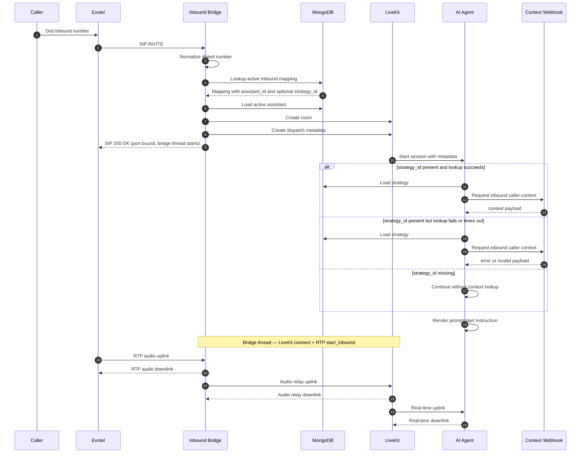

# Inbound Routing

How Exotel inbound calls reach an assistant: the bridge accepts `INVITE`, normalises the dialled number, resolves the assistant mapping in MongoDB, creates a LiveKit room, and dispatches the matched assistant — optionally enriching the prompt via a context-strategy webhook before the first reply.

Inbound Exotel calls do not use managed LiveKit SIP participants — the platform owns the bridge end-to-end.

## Inbound Components

- `/inbound` routes manage `inbound_sip` mappings.
- `/inbound_context_strategy` routes manage reusable caller-context lookup strategies.
- MongoDB stores normalized inbound numbers, provider config, and `assistant_id` mappings.
- Inbound mappings can optionally store `inbound_context_strategy_id`.
- Inbound bridge handles SIP signaling, RTP relay, and room setup.
- LiveKit dispatch metadata includes inbound and caller numbers plus mapping/strategy identifiers.
- Agent worker can optionally resolve inbound context via strategy webhook before prompt rendering.

## Inbound Call Sequence

## Inbound Failure Paths

- No active mapping or detached mapping returns `480 Temporarily Unavailable`.
- Missing or inactive assistant returns `480 Temporarily Unavailable`.
- Missing strategy attachment does not fail the call; context lookup is skipped.
- Strategy lookup failures (timeout/HTTP/payload issues) do not fail the call; worker falls back to default prompt behavior.
- Room creation or dispatch failure returns `500 Internal Server Error`.
- Call teardown is handled by SIP `BYE`, LiveKit disconnect, or RTP timeout.
