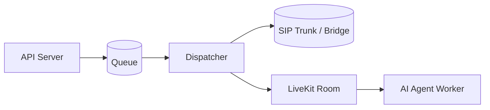

# Architecture

This section explains how the platform stitches an AI agent to a web client, a managed SIP trunk, or a custom Exotel SIP bridge — and how outbound calls flow through the queue and dispatcher.

Dive in:

- [Runtime Modes & Startup](runtime-modes.md) — startup services, pipeline vs realtime, latency & cost tricks (LLM truncation, Sarvam keepalive, parallel STT).
- [Call Flows & Queueing](call-flows.md) — web integration, managed SIP, custom Exotel bridge, outbound queue + dispatcher, capacity, crash recovery, passthrough mode.
- [Audio Pipeline](audio-pipeline.md) — inbound/outbound RTP processing, STT noise-reduction branching, hold/resume detection, per-utterance input guard.
- [Inbound Routing](inbound.md) — Exotel inbound components, sequence, and failure paths.
