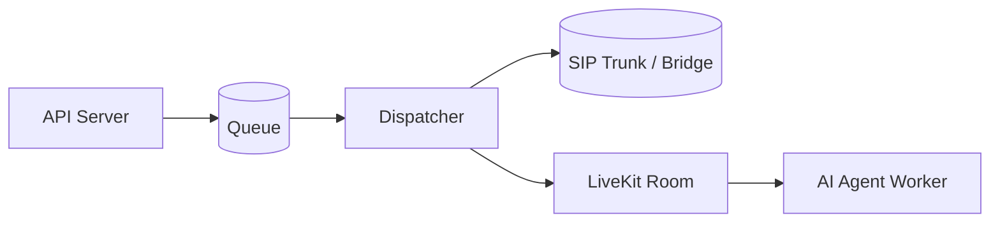

# Architecture

This section explains how the platform stitches an AI agent to a web client, a managed SIP trunk, or a custom Exotel SIP bridge — and how outbound calls flow through the queue and dispatcher.

```mermaid
flowchart LR
  API[API Server] --> Q[(Queue)]
  Q --> D[Dispatcher]
  D --> SIP[(SIP Trunk / Bridge)]
  D --> LK[LiveKit Room]
  LK --> Agent[AI Agent Worker]
```

## Where configuration is decided

Two packages exist purely so a bad configuration cannot reach a call, and they are worth knowing
before reading anything else in this section:

| Package | Holds |
|---|---|
| `src/core/model_support/` | **What each model and provider actually accepts.** Model sets per mode, which generation knob each model reads, the `service_tier` matrix, STT/TTS model sets, the Sarvam speaker roster, the Responses request body the runtime builds, and one tool document → one OpenAI function schema. Deliberately **dependency-free**: the control image has no `livekit-agents` and the agent image has no FastAPI, so both import it and the two halves of the platform cannot disagree about which configs are legal. |
| `src/api/validation/` | **The guards that need more than the request.** Rules re-checked against the stored row (a PATCH naming one field can still make an assistant unrunnable), and the two that call the provider (does it still serve this model; will it accept this exact request). |

The chain, and what each gate catches, is in
[Compatibility Matrix](../reference/compatibility.md); the failure it prevents — a call that
connects and then stays silent — and the commands that diagnose it are in
[Troubleshooting](../reference/troubleshooting.md).

Dive in:

- [Runtime Modes & Startup](runtime-modes.md) — startup services, pipeline vs realtime, latency & cost tricks (LLM truncation, Sarvam keepalive, parallel STT).
- [Call Flows & Queueing](call-flows.md) — web integration, managed SIP, custom Exotel bridge, outbound queue + dispatcher, capacity, crash recovery, passthrough mode.
- [Audio Pipeline](audio-pipeline.md) — inbound/outbound RTP processing, STT noise-reduction branching, hold/resume detection, per-utterance input guard.
- [Inbound Routing](inbound.md) — Exotel inbound components, sequence, and failure paths.
