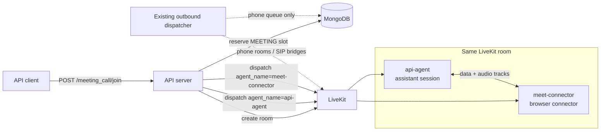
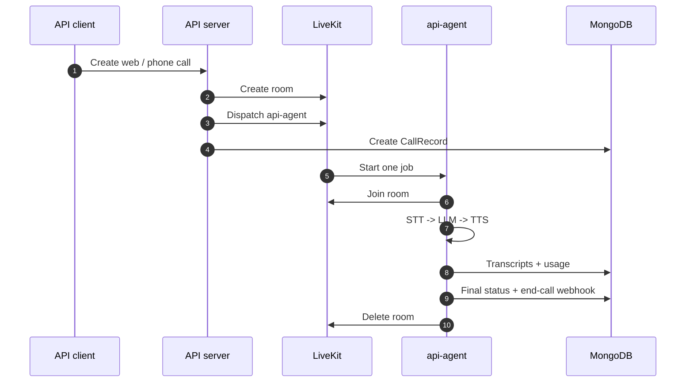
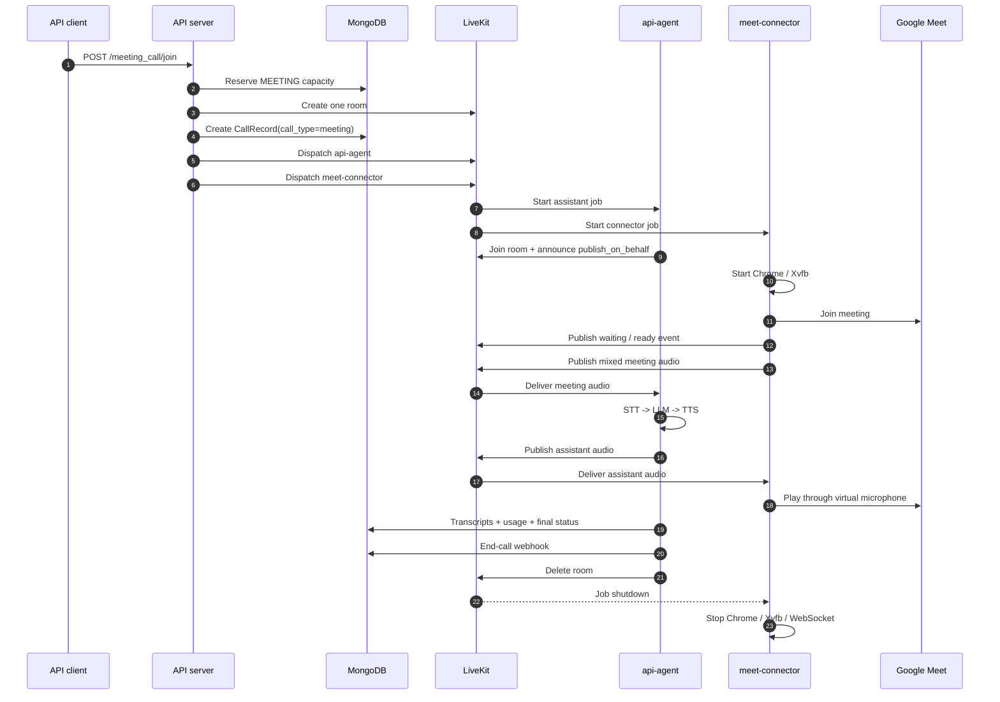
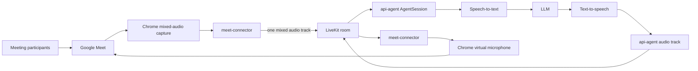

# Google Meet Call Architecture

Google Meet calls use one LiveKit room and two LiveKit jobs. They do **not** create a second
application-level outbound dispatcher.

- The existing **outbound dispatcher** remains the single queue processor for outbound phone calls.
- The `api-agent` LiveKit job runs the assistant conversation and owns call state, recording, usage,
  billing, webhooks, and room teardown.
- The `meet-connector` LiveKit job runs Chrome and acts as the bidirectional Google Meet audio
  bridge.

Normal web, inbound, and outbound assistant calls create only the `api-agent` job. A meeting call
creates both jobs in the same room because the assistant and the browser bridge have different
lifecycles and responsibilities.

## Dispatch topology



`agent_name` is a LiveKit worker routing key. The second dispatch is not a second queue processor,
and `outbound_dispatcher/dispatcher.py` is not duplicated for meetings.

### Normal assistant call



### Google Meet call



## Audio flow

The connector is a media bridge, not a second assistant. It does not run STT, LLM, TTS, usage
accounting, or conversation logic.



Google Meet audio is mixed before publication. The connector publishes one track containing the
meeting mix rather than one track per speaker. This matches the assistant's one-linked-participant
model, so the assistant hears all meeting participants. The trade-off is that transcripts do not
attribute each sentence to a specific meeting speaker.

The assistant announces itself with:

```text
lk.publish_on_behalf = <LiveKit room name>
```

The connector uses that attribute to select the assistant's output track without needing to know
the server-minted assistant participant identity.

## Lifecycle and readiness

The connector publishes JSON messages on the `meeting_connector_events` data topic:

```json
{"event": "waiting", "detail": "waiting for admission"}
{"event": "ready"}
{"event": "failed", "detail": "browser could not join meeting"}
{"event": "ended", "detail": "meeting ended"}
```

The connector also sets `lk.meeting_connector_status=ready` on its LiveKit participant. This
attribute is a recovery signal if the `ready` data packet was published before the assistant had
finished connecting; LiveKit data packets are not replayed to late subscribers.

The assistant registers the listener before `session.start()`, serializes event handling, and
persists connector state separately from the assistant's `agent_ready_at`:

| Field | Meaning |
|---|---|
| `agent_ready_at` | The assistant reached `session.start()` successfully. |
| `meeting_connector_status` | Connector state: `pending`, `waiting`, `ready`, `failed`, or `ended`. |
| `meeting_connector_ready_at` | The connector first became ready. |
| `meeting_connector_ended_at` | The connector entered a terminal state. |
| `meeting_connector_status_reason` | Optional connector failure or termination detail. |

The assistant waits for connector readiness before sending a configured greeting. Two separate
deadlines bound that wait, because they answer two different questions. The connector participant
must appear in the LiveKit room within `MEETING_CONNECTOR_JOIN_TIMEOUT_SECONDS` (default `120`),
which asks only whether the connector worker was dispatched and had capacity. It must then report
`ready` within `MEETING_CONNECTOR_READY_TIMEOUT_SECONDS` (default `360`), which includes a human
admitting the bot from the waiting room. That second default is coupled to the connector service:
it has to stay above that repository's own 300-second waiting-room budget so the connector's
`failed` event arrives first and carries a real reason. `tests/test_meeting_calls.py` pins the
contract.

Readiness reaches the assistant over two independent paths — the `ready` packet on the
`meeting_connector_events` data topic, and the `lk.meeting_connector_status` attribute the
connector sets on its own participant at the same moment. The assistant watches both, so a dropped
data packet does not strand the call. Handling is idempotent, so both arriving is harmless.

If either deadline expires, the assistant marks the call failed, finalizes it, sends the configured
end-call webhook, and deletes the LiveKit room.

## Ownership: recording, usage, billing, and teardown

There is exactly one owner for call accounting: `api-agent`.

| Responsibility | Owner | Explanation |
|---|---|---|
| Assistant conversation | `api-agent` | Loads the assistant and runs STT/LLM/TTS. |
| Meeting browser | `meet-connector` | Owns Chrome, Xvfb, WebSocket relay, and Google Meet. |
| LiveKit room | API creates; `api-agent` finalizes | Both jobs use the same room. |
| CallRecord | `api-agent` / core lifecycle | One record per meeting call. |
| Transcripts | `api-agent` | Stores assistant and mixed-meeting utterances. |
| UsageRecord | `api-agent` | Persists LLM, TTS, and STT usage. |
| Recording | `api-agent` lifecycle | The room recording includes tracks published by both jobs. |
| End-call webhook | `api-agent` | Sent once through the normal finalization path. |
| Browser cleanup | `meet-connector` | Job shutdown stops Chrome/Xvfb/WebSocket resources. |

The connector must not create another `CallRecord`, `UsageRecord`, recording, or webhook. That
would make two independent jobs race over the same call lifecycle.

## Capacity and dispatchers

There are two independent capacity concepts:

1. `MAX_CONCURRENT_MEETING_CALLS` is the core business cap. It limits how many meeting calls the
   deployment accepts and is counted from meeting `CallRecord` rows plus short-lived dispatch
   reservations.
2. The `meet-connector` worker's LiveKit `load_fnc` is the connector machine cap. It limits how
   many browser jobs that worker deployment can run.

The existing application-level outbound dispatcher still manages queued phone calls, SIP setup,
capacity reservations, retries, and stuck queue recovery. It does not start or stop meeting
connector jobs. The meeting route calls LiveKit's dispatch API directly, just as the web-call route
does for `api-agent`.

## Failure paths

### Assistant dispatch fails

The API abandons the newly created room, marks the setup record failed when possible, deletes the
room, and releases any in-memory meeting reservation still held.

### Connector dispatch fails

The assistant dispatch may already exist. The API uses the same abandon-room path, so the assistant
does not remain in an orphaned LiveKit room and the meeting capacity is not held indefinitely.

### Connector never joins

The assistant's bounded readiness wait fails the call and runs normal finalization. This is
different from a connector job merely being accepted by LiveKit: the browser must actually join and
publish its readiness signal.

### Connector fails after joining

The connector publishes `failed`. The assistant persists the event, marks the call failed, sends
the end-call webhook once, and tears down the room.

### Meeting ends normally

The connector publishes `ended` or its job shuts down. The assistant remains the accounting owner
and ends the room through the normal finalization path.

## Deployment boundary

The core API repository now expects a worker registered with LiveKit under
`MEETING_CONNECTOR_AGENT_NAME` (default `meet-connector`). The connector repository still needs
to:

- build an `AgentServer` worker;
- read `meeting_url`, `platform`, and `bot_display_name` from job metadata;
- use `ctx.room` for the LiveKit publisher;
- publish the mixed meeting track;
- emit the lifecycle events and readiness attribute;
- clean up Chrome, Xvfb, and WebSocket resources on job shutdown.

Until that worker exists and is registered, the core API can create the two dispatches but a meeting
call cannot complete end to end.
