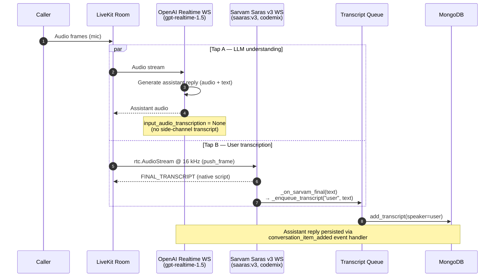

# Runtime Modes & Startup

How the API process boots, which background services it owns, and the three speech-generation paths an assistant can take at runtime.

## API Startup Services

When the FastAPI app starts, it initializes MongoDB and conditionally starts two long-running background services:

- **Exotel inbound SIP listener** — listens for incoming SIP INVITE/BYE from Exotel on boot (controlled by `ENABLE_SIP_LISTENER` env var, default `true`)
- **Outbound call dispatcher** — event-driven loop that drains the outbound call queue (controlled by `ENABLE_DISPATCHER` env var, default `true`)

In **single-container / dev** mode both services run inside the API process. In **production Docker** deployments a dedicated `sip_dispatcher` container runs `sip_dispatcher_run.py`, which owns both services exclusively. The `api` container sets `ENABLE_SIP_LISTENER=false` and `ENABLE_DISPATCHER=false` so it can scale to multiple Gunicorn workers without SIP port conflicts or duplicate dispatchers.

Outbound request acceptance and outbound call execution are fully decoupled. The API enqueues calls and returns immediately; the dispatcher handles pacing and retry independently.

### Two-Server Deployment Roles

For horizontal scaling without Kubernetes, run containers by role:

- **Server A (control plane):** `api` + `sip_dispatcher`
- **Server B (capacity node):** `agent`
- Optional: run extra `agent` on Server A if CPU headroom exists

The project `docker-compose.yml` uses service profiles:

- `control` profile: `api`, `sip_dispatcher`
- `agent` profile: `agent`

Dockerfile mode mapping:

- `control` deploys use `docker/Dockerfile.control`
- `agent` deploys use `docker/Dockerfile.agent`
- `full` deploys force all services to use the original `Dockerfile`

Commands:

```bash
# Server A
docker compose --profile control up -d --build

# Server B
docker compose --profile agent up -d --build

# Single host full stack (original Dockerfile)
./deploy.sh full
```

Critical singleton rule: only one `sip_dispatcher` instance should run across all servers.

## Assistant Runtime Modes

Speech generation has **two orthogonal axes**:

1. **Mode** (`assistant_llm_mode`) = output shape:
   - `pipeline` (half-cascade): the LLM emits **text**, an external TTS plugin speaks it.
   - `realtime`: the LLM speaks its own **audio** (no external TTS).
2. **Provider** (`assistant_llm_config.provider`) = LLM vendor: `openai` | `gemini`. Honored in **both** modes. Defaults to `gemini` in `realtime` mode and `openai` in `pipeline` mode when unset.

The 2×2 matrix:

| Mode | provider `openai` | provider `gemini` |
|---|---|---|
| `pipeline` (text + external TTS) | OpenAI `gpt-realtime-1.5` (text out) -> external TTS | Gemini realtime (TEXT out) -> external TTS |
| `realtime` (model speaks audio) | OpenAI realtime (audio out) | Gemini realtime (STT+LLM+TTS) |

In both `pipeline` combinations, user transcription runs **in parallel** via Sarvam Saras v3 by default — see [Sarvam Parallel STT](#sarvam-parallel-user-transcription) below; if Sarvam is disabled the LLM's own transcription tap is used instead.

All modes share the same room orchestration, call lifecycle, transcript flow, and tool execution framework.
All modes also support assistant-first openings when `speaks_first=true`, using `assistant_start_instruction` as the opening response text.

## Latency & Cost Reduction

Two techniques reduce latency and token cost in `pipeline` mode with OpenAI Realtime STT/LLM.

### LLM Context Truncation

**Problem.** The OpenAI Realtime API accumulates the full conversation history in a `RemoteChatContext` on its server-side session. By default there is no cap — a 2-minute call can accumulate 55,000+ tokens. This drives up both cost (billed per token) and TTFT (the model must attend to a longer context every turn).

**Solution.** `RealtimeTruncationRetentionRatio` (OpenAI Realtime API parameter) is configured on every `RealtimeModel` session:

```python
truncation=RealtimeTruncationRetentionRatio(
    type="retention_ratio",
    retention_ratio=0.75,
    token_limits=TokenLimits(post_instructions=8000),
)
```

- `post_instructions=8000` — hard cap on context tokens *after* the system prompt.
- `retention_ratio=0.75` — when the cap is hit, the model retains the most recent 75% of turns and discards the oldest 25%.

**Observed impact.** Token count dropped from ~55,000 to ~7,300 on a 2-minute call — an 87% reduction.

### Sarvam TTS WebSocket Keepalive

**Problem.** Sarvam TTS uses a WebSocket connection pool (`ConnectionPool`, `max_session_duration=3600`). However, the Sarvam server closes idle TCP connections after ~5 seconds of inactivity. Without intervention, every turn that has a gap longer than 5 seconds triggers a full TCP reconnect and Sarvam session handshake before audio synthesis can start — adding 300–800 ms of latency before the first audio frame.

**Solution.** `maintain_sarvam_connection` is spawned as a call-lifetime background task immediately after the participant joins (Sarvam assistants only):

```python
if isinstance(tts, sarvam_plugin.TTS):
    asyncio.create_task(maintain_sarvam_connection(tts, _sarvam_stop))
```

The function (`src/core/agents/tts/factory.py`):

1. Forces a fresh TCP connection at call start (`tts._pool.invalidate()` + `get()`).
2. Enters a loop that wakes every 3 seconds:
   - **Skips ping** if `current_ws not in tts._pool._available` — TTS is actively using the connection and must not be interrupted.
   - **Sends a WebSocket ping** to reset the server-side idle timer.
   - **Reconnects** if the server has already closed the connection (`current_ws.closed` or ping failure).
3. Exits cleanly when `_sarvam_stop` event is set at call teardown.

**Observed impact.** The reconnect log line now appears once at call start instead of between every turn.

## Sarvam Parallel User Transcription

**Problem.** In OpenAI pipeline mode (`assistant_llm_mode="pipeline"`, `provider="openai"`) with `user_stt_provider="native"`, the `input_audio_transcription` side channel uses `gpt-4o-transcribe`. On Indic mixed / code-switched speech (Hindi-English-Tamil-Urdu in one call) this model:

- Switches scripts mid-utterance (Devanagari → Tamil → Arabic → Spanish)
- Romanises words instead of using the speaker's native script
- Hallucinates entire phrases on noisy phone audio

Direct fix by swapping the transcription model is **not possible** — `input_audio_transcription.model` is a closed whitelist controlled server-side by OpenAI (`whisper-1`, `gpt-4o-transcribe`, `gpt-4o-mini-transcribe`, `gpt-4o-transcribe-diarize`). The field accepts no URL, callback, or third-party endpoint.

**Solution.** Run **Sarvam Saras v3** (`saaras:v3`, `codemix` mode, `language="unknown"`) as a parallel audio tap from the LiveKit room. Sarvam is trained on Indic + code-switched speech and outputs each word in its correct native script. The OpenAI Realtime LLM continues to consume the audio directly for understanding and reply generation — only the persisted user transcript is overridden.

Configured per assistant via `assistant_interaction_config.user_stt_provider`:

| Value | Effect |
|-------|--------|
| `sarvam` (default) | Sarvam parallel tap writes user transcripts. The LLM's own transcription is disabled (`None`). |
| `native` | The conversational LLM writes user transcripts itself (OpenAI `gpt-4o-transcribe`, or Gemini's own on a Gemini pipeline). No Sarvam tap. |

**Data flow per utterance:**



**Implementation details:**

- Module: `src/core/agents/stt/sarvam_parallel.py` — `run_sarvam_parallel_stt(...)` coroutine.
- Spawned once after `wait_for_participant()` returns, scoped to the caller's identity. Late-binds if the audio track was already published.
- Stop signal: re-uses the existing `_sarvam_stop = asyncio.Event()` that already gates the Sarvam TTS keepalive — both exit on the same teardown.
- Frame pump: `rtc.AudioStream(track, sample_rate=16000, num_channels=1)` upsamples 8 kHz G.711 phone audio in-process; frames pushed via `stream.push_frame(frame)`.
- Duplicate-write guard: `conversation_item_added` short-circuits when `event.item.role == "user" and _use_sarvam_stt`, so OpenAI's empty / stale user item never reaches the DB.
- Shared transcript helper: `_enqueue_transcript(speaker, text)` queues the DB write — used by both the Sarvam callback and the OpenAI assistant-role path. Single source of truth for the `add_transcript` call shape.
- Silence watchdog: Sarvam's `on_final` callback calls `silence_watchdog.on_user_message()` to reset the reprompt timer, preserving parity with the OpenAI-only path.

**Scope of fix.** Only the persisted user transcript is corrected. The OpenAI Realtime LLM still consumes raw audio embeddings — if the LLM itself misunderstands Indic input, the assistant reply will reflect that. To fix LLM understanding as well, switch the assistant to `pipeline` mode (Sarvam STT feeds a text LLM) or to `realtime` + `gemini`.
