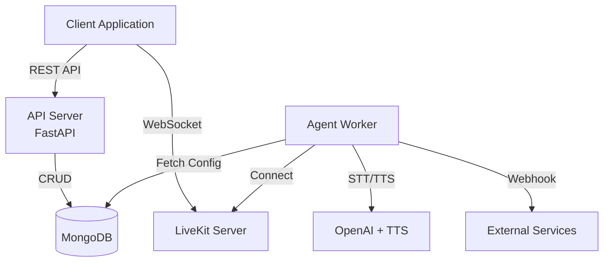

# LiveKit Agents API Documentation

---

## Build Real-Time Voice AI Agents in Minutes

A production-ready backend for deploying AI-powered voice agents with LiveKit, OpenAI, and enterprise-grade telephony integration.

[Get Started](getting-started.md){ .md-button .md-button--primary }
[View API Reference](api/authentication.md){ .md-button }

---

## :material-chart-timeline: Architecture Overview

For detailed architecture information, see the [Architecture](architecture.md) page.

---

**Ready to build?** [Start with the Getting Started guide :octicons-arrow-right-24:](getting-started.md)
