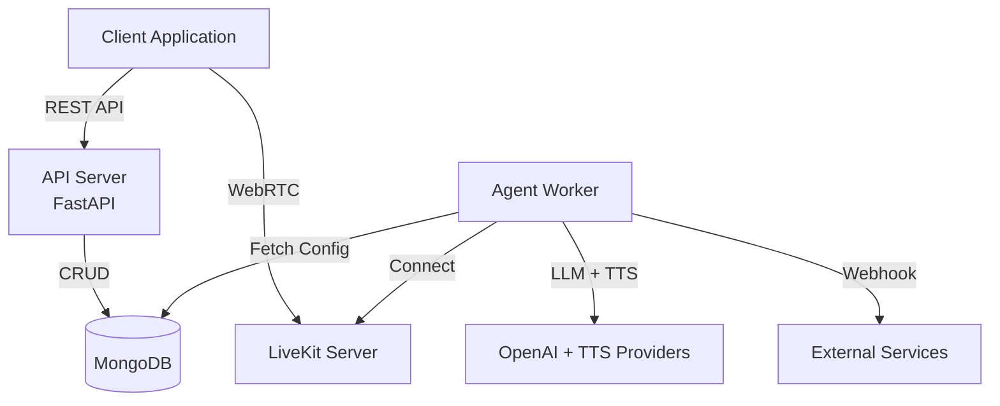

# LiveKit Agents API Documentation

## Overview

A production-ready backend for building and operating real-time voice AI agents with LiveKit, OpenAI, and SIP telephony integration.

Inbound calls can optionally fetch caller-specific context (for example CRM data) before the assistant speaks, while keeping the call flow non-blocking when lookup fails.

[Get Started](getting-started.md){ .md-button .md-button--primary }
[API Reference](api/authentication.md){ .md-button }

## Platform Summary

```mermaid
graph TD
    Client[Client Application] -->|REST API| API[API Server\nFastAPI]
    Client -->|WebRTC| LiveKit[LiveKit Server]

    API -->|CRUD| DB[(MongoDB)]

    Worker[Agent Worker] -->|Connect| LiveKit
    Worker -->|Fetch Config| DB
    Worker -->|LLM + TTS| AI[OpenAI + TTS Providers]
    Worker -->|Webhook| External[External Services]
```

See [Architecture](architecture.md) for full call-flow diagrams and integration modes.

For inbound caller-context setup and APIs, see [Inbound Context Strategies](api/inbound-context-strategy/index.md).
