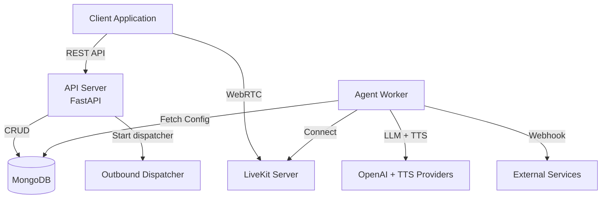

# LiveKit Agents API Documentation

## Overview

A production-ready backend for building and operating real-time voice AI agents with LiveKit, OpenAI, and SIP telephony integration.

[Get Started](getting-started.md){ .md-button .md-button--primary }
[API Reference](api/authentication.md){ .md-button }

## What You Can Build

- **Outbound SIP calls** — queue a phone call, let the dispatcher place it when capacity is available, receive a webhook when the call ends
- **Inbound SIP calls** — map a phone number to an assistant; incoming calls are routed automatically
- **Web calls** — embed a voice/chat widget in any browser or mobile app, no SIP required
- **Caller-context enrichment** — fetch live CRM or ticket data before the assistant speaks on inbound calls

## Key Concepts

| Concept | Description |
| :--- | :--- |
| **Assistant** | Defines the agent's behavior: system prompt, TTS voice (`cartesia`, `sarvam`, `elevenlabs`, `mistral`), interaction settings, and optional end-call tool |
| **Tool** | Extends assistant capabilities with webhook calls or static-return actions during a conversation |
| **SIP Trunk** | Stores your telephony provider credentials (Twilio or Exotel) for outbound dialing |
| **Outbound Queue Item** | Stores a queued outbound request until the dispatcher creates the LiveKit room and starts provider setup |
| **Inbound Mapping** | Links a phone number to an assistant for inbound call routing |
| **Inbound Context Strategy** | Optionally fetches caller-specific data (CRM, tickets) before prompt rendering on inbound calls |

## Supported Providers

| Provider | Inbound | Outbound | Integration |
| :--- | :--- | :--- | :--- |
| Twilio | Not yet | Supported | LiveKit managed SIP |
| Exotel | Supported | Supported | Custom SIP bridge |
| Web (WebRTC) | — | Supported | Browser/mobile, no SIP |

## Platform Architecture

```mermaid
graph TD
    Client[Client Application] -->|REST API| API[API Server\nFastAPI]
    Client -->|WebRTC| LiveKit[LiveKit Server]

    API -->|CRUD| DB[(MongoDB)]
    API -->|Start dispatcher| Queue[Outbound Dispatcher]

    Worker[Agent Worker] -->|Connect| LiveKit
    Worker -->|Fetch Config| DB
    Worker -->|LLM + TTS| AI[OpenAI + TTS Providers]
    Worker -->|Webhook| External[External Services]
```

See [Architecture](architecture.md) for full call-flow diagrams and integration modes.

See [Trigger Outbound Call](api/calls/trigger.md) and [Queue Status](api/calls/queue-status.md) for the queued outbound contract.

For inbound caller-context setup and APIs, see [Inbound Context Strategies](api/inbound-context-strategy/index.md).
